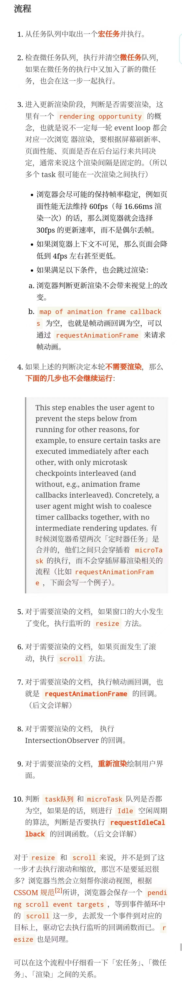

 # 浏览器渲染过程

前置：
- 浏览器架构
    - 公式 1： 浏览器 = 浏览器内核 + 服务（Chrome = Chromium + Google 服务集成）
    - 公式 2：内核 = 渲染引擎 + JavaScript 引擎 + 其他（Chrome：WebKit → BlinkV8）
- Chromium 进程模型（5 类进程，一般来说，当 Chrome 在强大的硬件上运行时，可能会将每项服务拆分为不同的进程，以提高稳定性；但如果是在资源有限的设备上，Chrome 会将各项服务合并为一个进程，从而节省内存占用量）
    
    - Browser Process：1 个
        - Render & Compositing Thread
        - Render & Compositing Thread Helpers
    - Utility Process（==还不知道是拿来干嘛的，但是确实是这样分==）：1 个
    - Viz Process：1 个
        - GPU main thread
        - Display Compositor Thread
    - Plugin Process（拓展插件相关）：多个
    - Render Process：多个
        - Main thread x 1
        - Compositor thread x 1
        - Raster thread x 1
        - worker thread x N
- Chromium 的进程模式
    - Process-per-site-instance：老版本的默认策略，如果从一个页面打开了另一个新页面，而新页面和当前页面属于同一站点（根域名与协议相同）的话，那么这两个页面会共用一个 Render Process。
    - Process-per-site
    - Process-per-tab：如今版本的默认策略，每个 Tab 起一个 Render Process。但注意站点内部的跨站 iframe 也会启动一个新的 Render Process。可看下文 Example。
    - Single Process：单进程模式，启动参数可控，用于 Debug。

渲染流水线：

0.  帧开始（Frame Start）-> Input event handlers（合成线程将输入事件传递给主线程）-> requestAnimiationFrame执行
1.  Parsing(bytes → characters → token → nodes → object model (DOM Tree))
    - Loading：Blink 从网络线程接收 bytes
    - Conversion: HTMLParser 将 bytes 转为 characters
    - Tokenizing: 将 characters 转为 W3C 标准的 token(需要注意的是，这一步中如果解析到 link、script、img 标签时会继续发起网络请求；同时解析到 script 时，需要先执行完解析到的 JavaScript，才会继续往后解析 HTML。因为 JavaScript 可能会改变 DOM 树的结构(如 document.write() 等)，所以需要先等待它执行完)
    - Lexing: 通过词法分析将 token 转为 Element 对象
    - DOM construction: 使用构建好的 Element 对象构建 DOM Tree
2.  Style（DOM Tree 输出 Render Tree）
3.  Layout（Render Tree 输出 Layout Tree）
4.  Pre-paint（生成 Property trees，供 Compositor thread 使用，避免某些资源重复 Raster，这里和网易文章中的Render Layer==似乎==是同一个东西）
5.  Paint（Blink 对接 cc 的绘制接口进行 Paint，生成 cc 模块的数据源 cc::Layer，Paint 阶段将 Layout Tree 中的 Layout Object 转换成绘制指令，并把这些操作封装在 cc::DisplayItemList 中，之后将其注入进 cc::PictureLayer 中||“生成绘制指令，这些绘制指令形成了一个绘制列表，在 Paint 阶段输出的内容就是这些绘制列表（SkPicture）。”）
6.  Commit（线程交换数据）
7.  Compositing（为什么需要 Compositor 线程？那我们假设下如果没有这个步骤，Paint 之后直接光栅化上屏又会怎样：如果直接走光栅化上屏，如果 Raster 所需要的数据源因为各种原因，在垂直同步信号来临时没有准备就绪，那么就会导致丢帧，发生 “Janky”。Graphics Layer(又称Compositing Layer)。在 DevTools 中这一步被称为 Composite Layers，主线程中的合成并不是真正的合成。主线程中维护了一份渲染树的拷贝（LayerTreeHost），在合成线程中也需要维护一份渲染树的拷贝（LayerTreeHostImpl）。有了这份拷贝，合成线程可以不必与主线程交互来进行合成操作。因此，当主线程在进行 Javascript 计算时，合成线程仍然可以正常工作而不被打断。
  在渲染树改变后，需要进行着两个拷贝的同步，主线程将改变后的渲染树和绘制列表发送给合成线程，同时阻塞主线程保证这个同步能正常进行，这就是 Composite Layers。这是渲染流水线中主线程的最后一步，换而言之，这一步只是生成了用于合成的数据，并不是真正的合成过程。）
8.  Tiling（根据不同的 scale 级别，不同的大小拆分为多个 cc::TileTask 任务给到 Raster 线程处理）
9.  Raster（位图填充，转化为像素值。这些图块的大小通常是 256256 或者 512512。光栅化可以分为软件光栅化（Software Rasterization）和硬件光栅化（Hardware Rasterization）， 区别在于位图的生成是在 CPU 中进行，之后再上传至 GPU 合成，还是直接在 GPU 中进行绘图和图像素填充）
10.  Activate（实现一个缓冲机制，确保 Draw 阶段操作前 Raster 的数据已准备好。具体而言将 Layer Tree 分成 Pending Tree 与 Active Tree，从 Pending Tree 拷贝 Layer 到 Activate Tree 的过程就是 Activate。）
11.  Draw（合成线程会收集被称为 draw quads 的图块信息用于创建合成帧（compositor frame）。合成帧被发送给 GPU 进程，这一帧结束）
12.  Aggregate（==图像显示，暂时看不懂，没细看==）
13.  Display（==图像显示，暂时看不懂，没细看==）


下面的是网易文章的简洁总结：
*   收到垂直同步信号（Frame Start）
*   处理输入事件（Input event handlers）
*   requestAnimiationFrame
*   HTML 解析（Parse HTML）
*   样式计算（Recalc Styles）
*   布局（Layout，RenderObject）
*   更新渲染树（Update Layer Tree，RenderLayer）
*   绘制（Paint，分两步）
*   合成（Composite）
*   光栅化（Raster Scheduled and Rasterize）
*   帧结束（Frame End，GraphicsLayer）
*   图像显示
*   window\.onload()是等待页面完全加载完毕后触发的事件，而\$(function(){})在DOM树
  构建完毕后就会执行


具体流程参考下面


参考：

*   [浏览器渲染详细过程：重绘、重排和 composite 只是冰山一角](https://juejin.cn/post/6844903476506394638)
*   [从浏览器渲染原理谈动画性能优化](https://juejin.cn/post/7054055447052943396/#heading-14)
*   [Chromium 渲染流水线——字节码到像素的一生](https://blog.ursb.me/posts/chromium-renderer/)
*   [深入了解现代网络浏览器](https://developer.chrome.com/blog/inside-browser-part1?hl=zh-cn)

# js中的==
1. 如果操作数具有相同的类型，则按如下方式进行比较：
    - 对象（Object）：仅当两个操作数引用同一个对象时返回 true。
    - 字符串（String）：只有当两个操作数具有相同的字符且顺序相同时才返回 true。
    - 数值（Number）：如果两个操作数的值相同，则返回 true。+0 和 -0 被视为相同的值。如果任何一个操作数是 NaN，返回 false；所以，NaN 永远不等于 NaN。
    - 布尔值（Boolean）：仅当操作数都为 true 或都为 false 时返回 true。
    - 大整形（BigInt）：仅当两个操作数值相同时返回 true。
    - 符号（Symbol）：仅当两个操作数引用相同的符号时返回 true。
2. 如果其中一个操作数为 null 或 undefined，另一个操作数也必须为 null 或 undefined 以返回 true。否则返回 false。
3. 如果其中一个操作数是对象，另一个是基本类型，按此顺序使用对象的 @@toPrimitive()（以 "default" 作为提示），valueOf() 和 toString() 方法将对象转换为基本类型。（这个基本类型转换与相加中使用的转换相同。）
4. 在这一步，两个操作数都被转换为基本类型（String、Number、Boolean、Symbol 和 BigInt 中的一个）。其余的转换是逐个进行的。
    - 如果是相同的类型，使用步骤 1 进行比较。
    - 如果其中一个操作数是 Symbol 而另一个不是，返回 false。
    - 如果其中一个操作数是布尔型而另一个不是，则将布尔型转换为数字：true 转换为 1，false 转换为 0。然后再次松散地比较两个操作数。
    - String to Number：使用与 Number() 构造函数相同的算法将字符串转换为数字。转换失败将导致 NaN，这将保证相等是 false。
    - Number to BigInt：按数值进行比较。如果数值为 ±∞ 或 NaN，返回 false。
    - String to BigInt：使用与 BigInt() 构造函数相同的算法将字符串转换为 BigInt。如果转换失败，返回 false。

其中
> js核心内置类，会尝试valueOf先于toString；例外的是Date，Date利用的是toString转换。非js核心的对象，令说（比较麻烦，我也不大懂） eg:[].toString() == '' ; [1,2].toString() == '1,2'


参考：

*   [相等（==）- MDN](https://developer.mozilla.org/zh-CN/docs/Web/JavaScript/Reference/Operators/Equality)
*   [JS 基础知识点及常考面试题（二）](https://zhuanlan.zhihu.com/p/508403469)

# eventloop
* 前置
    * Event Loop 在浏览器内也分几种：
        * window event loop
        * worker event loop
        * worklet event loop
    * 这是一种运行机制（有的教程还说是一种线程，那个是错误的...）
    * 主线程运行的时候，产生堆（heap）和栈（stack）还有"任务队列"（task queue）(任务队列不在主线程外，是运行时产生的，MDN有描述;数据结构上是一个集合，而不是队列；一个 Event Loop 有一个或多个 task queues)
    * 栈中的代码执行完毕，主线程就会去读取"任务队列"
* 顺序（浏览器）
  </img>
1. 执行全局Script同步代码，这些同步代码有一些是同步语句，有一些是异步语句（比如setTimeout等）；
2. 全局Script代码执行完毕后，调用栈Stack会清空；
3. 从微队列microtask queue中取出位于队首的回调任务，放入调用栈Stack中执行，执行完后microtask queue长度减1；
4. 继续取出位于队首的任务，放入调用栈Stack中执行，以此类推，直到直到把microtask queue中的所有任务都执行完毕。注意，如果在执行microtask的过程中，又产生了microtask，那么会加入到队列的末尾，也会在这个周期被调用执行；
5. microtask queue中的所有任务都执行完毕，此时microtask queue为空队列，调用栈Stack也为空；
6. 取出宏队列macrotask queue中位于队首的任务，放入Stack中执行；
7. 执行完毕后，调用栈Stack为空；
8. 重复第3-7个步骤；
9. 重复第3-7个步骤；
10. ......

注意：
- 宏队列macrotask一次只从队列中取一个任务执行，执行完后就去执行微任务队列中的任务；
- 微任务队列中所有的任务都会被依次取出来执行，知道microtask queue为空；
- 图中没有画UI rendering的节点，因为这个是由浏览器自行判断决定的(==这很重要，但是具体机制暂不清楚==)，但是只要执行UI rendering，它的节点是在执行完所有的microtask之后，下一个macrotask之前，紧跟着执行UI render

* Node环境
    ==占坑==


* 宏任务（macrotask，也叫task）
    - script
    - setTimeout
    - setInterval
    - setImmediate
    - I/O
    - UI rendering
* 微任务（microtask，也叫jobs）
    - MutationObserver
    - Promise.then()/catch()
    - 以 Promise 为基础开发的其他技术，例如 fetch API
    - V8 的垃圾回收过程
    - Node 独有的 process.nextTick
    - Object.observe


参考：

*   [带你彻底弄懂Event Loop](https://segmentfault.com/a/1190000016278115#item-2-1)
*   [JS 基础知识点及常考面试题（二）](https://zhuanlan.zhihu.com/p/508403469)


# requestAnimationFrame

1. ==疑惑==:60hz频率下不是应该等待硬件提供的16ms一次的机会来刷新吗？下面截图第二个输出是标准的
  

```javascript
function test() {
    var s = performance.now();
    requestAnimationFrame(() => {
        console.log(performance.now() - s, 'requestAnimationFrame do');
        requestAnimationFrame(() => {
            console.log(performance.now() - s, 'requestAnimationFrame2 do');
            requestAnimationFrame(() => {
                console.log(performance.now() - s, 'requestAnimationFrame3 do');
            });
        });
    });
}

test();

```
2. RAF是宏任务还是微任务还是有争议的，我认为应该单独拿出来算（就像上面的渲染管线流程图一样），对于运行时机需要考虑浏览器以及具体代码，不能简单约等于微任务
3. 浏览器新旧版本执行差异很大，很多文章的代码执行顺序已经发生变化了

==现在这段代码所有最新版浏览器都是从右往左移动了，是不是间接说明了现在主流浏览器执行 requestAnimationFrame 回调的时机是在 1 帧渲染之后，所以当前帧调用的 requestAnimationFrame 会在下一帧呈现==
```js
test.style.transform = 'translate(0, 0)';
document.querySelector('button').addEventListener('click', () => {
  const test = document.querySelector('.test');
  test.style.transform = 'translate(400px, 0)';

  requestAnimationFrame(() => {
    test.style.transition = 'transform 3s linear';
    test.style.transform = 'translate(200px, 0)';
  });
});
```
这位提出者直到今天仍然还在重复反馈这个缺陷


* 理论上，raf 是在微任务队列执行完之后，css计算之前或者说下一个宏任务前执行
  具体可以参考下面的截图，他是从规范中翻译过来的
  
  这个也可以
  </img>
   但是我在阅读文章中有很多例子颠覆我的看法（chrome125）
```js
setTimeout(() => {
  console.log("sto")
  requestAnimationFrame(() => console.log("rAF"))
})
setTimeout(() => {
  console.log("sto")
  requestAnimationFrame(() => console.log("rAF"))
})

queueMicrotask(() => console.log("mic"))
queueMicrotask(() => console.log("mic"))
```
作者认为这是[定时器合并（这文章的序号编排有问题，最好是去他微信公众号看）](https://zhuanlan.zhihu.com/p/142742003),我觉得和上文的解释有点出入，发现评论区有人指出

</img>
于是我改了一下案例，加入延迟参数1ms
</img>
如果想要说明会合并定时器，应该用下面这个
```html
<!DOCTYPE html>
<html lang="en">
<head>
<meta charset="UTF-8">
<meta name="viewport" content="width=device-width, initial-scale=1.0">
<title>Timer Callback Example</title>
</head>
<body>

<div id="output"></div>

<script>
  function logMessage(message) {
    const outputDiv = document.getElementById('output');
    const newMessage = document.createElement('p');
    newMessage.textContent = message;
    outputDiv.appendChild(newMessage);
  }

  // Simulate tasks that should be executed one after another
  function task1() {
    logMessage('Task 1 executed');
  }

  function task2() {
    logMessage('Task 2 executed');
  }

  function task3() {
    logMessage('Task 3 executed');
  }

  // Use setTimeout to schedule tasks
  setTimeout(() => {
    task1();
    task2();
    task3();
  }, 0);

  // Simulate an animation frame callback
  requestAnimationFrame(() => {
    logMessage('Animation frame callback executed');
  });

</script>

</body>
</html>

```
但又有个新的问题 ==“一个时间循环时间”浏览器怎么判断的呢==
参考：


==疑惑：下面多跑几次就发现执行结果顺序不一定，上面的则不会==

```js
setTimeout(() => {
    console.log('setTimeout');
}, 0);
Promise.resolve()
    .then(() => {
        console.log(2);
    })
    .then(() => {
        console.log(3);
    });
new Promise((resolve) => {
    console.log(4);
    resolve();
})
    .then(() => {
        console.log(5);
        return 6;
    })
    .then(Promise.resolve(7))
    .then((res) => {
        console.log(res);
    });
 setTimeout(() => {
     console.log('setTimeout2');
 });
requestAnimationFrame(() => {
    console.log('animation’');
});
```


```js
setTimeout(() => {
    console.log('setTimeout');
}, 0);
Promise.resolve()
    .then(() => {
        console.log(2);
    })
    .then(() => {
        console.log(3);
    });
new Promise((resolve) => {
    console.log(4);
    resolve();
})
    .then(() => {
        console.log(5);
        return 6;
    })
    .then(Promise.resolve(7))
    .then((res) => {
        console.log(res);
    });
requestAnimationFrame(() => {
    console.log('animation’');
});

```


</img>


* [为什么每次requestAnimationFrame的回调第一次都是立即执行？
  ](https://www.zhihu.com/question/456804188)
* [rAF在EventLoop的表现](https://www.cnblogs.com/zhangmingzhao/p/18028506)
* [requestAnimationFrame 执行机制探索](https://zhuanlan.zhihu.com/p/432195854)
* [深入解析 EventLoop 和浏览器渲染、帧动画、空闲回调的关系](https://zhuanlan.zhihu.com/p/142742003)
* [requestAnimationFrame回调时机](https://zhuanlan.zhihu.com/p/64917985)
* [html规范](https://html.spec.whatwg.org/multipage/webappapis.html#event-loop-processing-model)

#   requestIdleCallback

浏览器一帧内六个步骤的任务：

- 处理用户的交互
- JS 解析执行
- 帧开始。窗口尺寸变更，页面滚去等的处理
- rAF
- 布局
- 绘制

上面六个步骤完成后没超过 16 ms，说明时间有富余，此时就会执行 requestIdleCallback 里注册的任务。

* **对非高优先级的任务使用空闲回调**

* **空闲回调应尽可能不超支分配到的时间**（目前，[`timeRemaining()`](https://developer.mozilla.org/zh-CN/docs/Web/API/IdleDeadline/timeRemaining) 有一个 50 ms 的上限时间，但实际上你能用的时间比这个少，因为在复杂的页面中事件循环可能已经花费了其中的一部分，浏览器的扩展插件也需要处理时间，等等

* **避免在空闲回调中改变 DOM**（如果你的回调需要改变 DOM，它应该使用 Window.requestAnimationFrame() 来调度它。）

* **避免运行时间无法预测的任务**（避免做任何会影响页面布局的事情）

* **在你需要的时候要用 timeout，但记得只在需要的时候才用**（用 timeout 可以保证你的代码按时执行，但是在剩余时间不足以强制执行你的代码的同时保证浏览器的性能表现的情况下，timeout 就会造成延迟或者动画不流畅

  MDN中处理兼容提供的例子（非 polyfill）

  ```js
  window.requestIdleCallback =
    window.requestIdleCallback ||
    function (handler) {
      let startTime = Date.now();

      return setTimeout(function () {
        handler({
          didTimeout: false,
          timeRemaining: function () {
            return Math.max(0, 50.0 - (Date.now() - startTime));
          },
        });
      }, 1);
    };


  window.cancelIdleCallback =
    window.cancelIdleCallback ||
    function (id) {
      clearTimeout(id);
    };
  ```


参考：

- [MDN](https://developer.mozilla.org/zh-CN/docs/Web/API/Background_Tasks_API)

# setTimeOut最小延时问题

- 在浏览器中，`setTimeout` 大致符合 [HTML5 标准](https://link.zhihu.com/?target=https%3A//html.spec.whatwg.org/multipage/timers-and-user-prompts.html%23dom-settimeout)，**如果嵌套的层级超过了 5 层，并且 timeout 小于 4ms，则设置 timeout 为 4ms**

- 在 `nodejs` 中，如果设置的 `timeout` 为 0ms，则会被重置为 1ms，并且没有嵌套限制。

- 在 `deno` 中，也实现了类似 HTML5 标准 的行为，不过其底层是通过 Rust `tokio` 库实现的，该库的延时粒度取决于其执行的环境，某些平台将提供分辨率大于 1 毫秒的计时器。

- 在 `Bun` 中，如果设置的 `timeout` 为 0ms，则会被直接加入到任务队列中，所以 `bun` 中的循环次数会非常高。

  ​

  参考：

- [你真的了解 setTimeout 么？聊聊 setTimeout 的最小延时问题（附源码细节）](https://zhuanlan.zhihu.com/p/614819835)

  ​