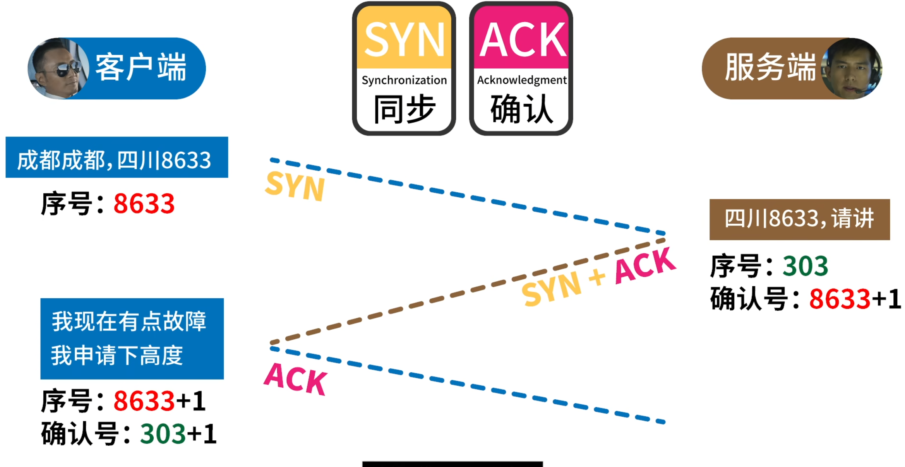
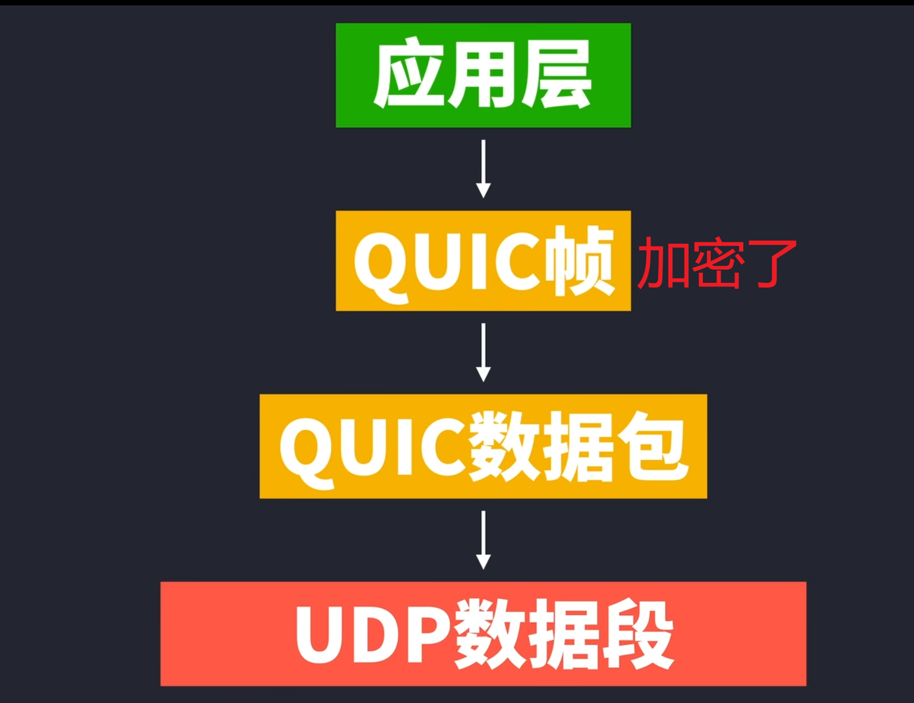

[TOC]


 # 浏览器渲染过程

前置：
- 浏览器架构
    - 公式 1： 浏览器 = 浏览器内核 + 服务（Chrome = Chromium + Google 服务集成）
    - 公式 2：内核 = 渲染引擎 + JavaScript 引擎 + 其他（Chrome：WebKit → BlinkV8）
- Chromium 进程模型（5 类进程，一般来说，当 Chrome 在强大的硬件上运行时，可能会将每项服务拆分为不同的进程，以提高稳定性；但如果是在资源有限的设备上，Chrome 会将各项服务合并为一个进程，从而节省内存占用量）
    
    - Browser Process：1 个
        - Render & Compositing Thread
        - Render & Compositing Thread Helpers
    - Utility Process（$ \textcolor{red}{还不知道是拿来干嘛的，但是确实是这样分）}$：1 个
    - Viz Process：1 个
        - GPU main thread
        - Display Compositor Thread
    - Plugin Process（拓展插件相关）：多个
    - Render Process：多个
        - Main thread x 1
        - Compositor thread x 1
        - Raster thread x 1
        - worker thread x N
- Chromium 的进程模式
    - Process-per-site-instance：老版本的默认策略，如果从一个页面打开了另一个新页面，而新页面和当前页面属于同一站点（根域名与协议相同）的话，那么这两个页面会共用一个 Render Process。
    - Process-per-site
    - Process-per-tab：如今版本的默认策略，每个 Tab 起一个 Render Process。但注意站点内部的跨站 iframe 也会启动一个新的 Render Process。可看下文 Example。
    - Single Process：单进程模式，启动参数可控，用于 Debug。

渲染流水线：

0.  帧开始（Frame Start）-> Input event handlers（合成线程将输入事件传递给主线程）-> requestAnimiationFrame执行
1.  Parsing(bytes → characters → token → nodes → object model (DOM Tree))
    - Loading：Blink 从网络线程接收 bytes
    - Conversion: HTMLParser 将 bytes 转为 characters
    - Tokenizing: 将 characters 转为 W3C 标准的 token(需要注意的是，这一步中如果解析到 link、script、img 标签时会继续发起网络请求；同时解析到 script 时，需要先执行完解析到的 JavaScript，才会继续往后解析 HTML。因为 JavaScript 可能会改变 DOM 树的结构(如 document.write() 等)，所以需要先等待它执行完)
    - Lexing: 通过词法分析将 token 转为 Element 对象
    - DOM construction: 使用构建好的 Element 对象构建 DOM Tree
2.  Style（DOM Tree 输出 Render Tree）
3.  Layout（Render Tree 输出 Layout Tree）
4.  Pre-paint（生成 Property trees，供 Compositor thread 使用，避免某些资源重复 Raster。 ）
5.  Paint（Blink 对接 cc 的绘制接口进行 Paint，生成 cc 模块的数据源 cc::Layer，Paint 阶段将 Layout Tree 中的 Layout Object 转换成绘制指令，并把这些操作封装在 cc::DisplayItemList 中，之后将其注入进 cc::PictureLayer 中||“生成绘制指令，这些绘制指令形成了一个绘制列表，在 Paint 阶段输出的内容就是这些绘制列表（SkPicture）。”）
6.  Commit（线程交换数据）
7.  Compositing（为什么需要 Compositor 线程？那我们假设下如果没有这个步骤，Paint 之后直接光栅化上屏又会怎样：如果直接走光栅化上屏，如果 Raster 所需要的数据源因为各种原因，在垂直同步信号来临时没有准备就绪，那么就会导致丢帧，发生 “Janky”。Graphics Layer(又称Compositing Layer)。在 DevTools 中这一步被称为 Composite Layers，主线程中的合成并不是真正的合成。主线程中维护了一份渲染树的拷贝（LayerTreeHost），在合成线程中也需要维护一份渲染树的拷贝（LayerTreeHostImpl）。有了这份拷贝，合成线程可以不必与主线程交互来进行合成操作。因此，当主线程在进行 Javascript 计算时，合成线程仍然可以正常工作而不被打断。
  在渲染树改变后，需要进行着两个拷贝的同步，主线程将改变后的渲染树和绘制列表发送给合成线程，同时阻塞主线程保证这个同步能正常进行，这就是 Composite Layers。这是渲染流水线中主线程的最后一步，换而言之，这一步只是生成了用于合成的数据，并不是真正的合成过程。）
8.  Tiling（根据不同的 scale 级别，不同的大小拆分为多个 cc::TileTask 任务给到 Raster 线程处理）
9.  Raster（位图填充，转化为像素值。这些图块的大小通常是 256256 或者 512512。光栅化可以分为软件光栅化（Software Rasterization）和硬件光栅化（Hardware Rasterization）， 区别在于位图的生成是在 CPU 中进行，之后再上传至 GPU 合成，还是直接在 GPU 中进行绘图和图像素填充）
10.  Activate（实现一个缓冲机制，确保 Draw 阶段操作前 Raster 的数据已准备好。具体而言将 Layer Tree 分成 Pending Tree 与 Active Tree，从 Pending Tree 拷贝 Layer 到 Activate Tree 的过程就是 Activate。）
11.  Draw（合成线程会收集被称为 draw quads 的图块信息用于创建合成帧（compositor frame）。合成帧被发送给 GPU 进程，这一帧结束）
12.  Aggregate（ $ \textcolor{red}{图像显示，暂时看不懂，没细看}$)
13.  Display（$ \textcolor{red}{图像显示，暂时看不懂，没细看}$）


下面的是网易文章的简洁总结：
*   收到垂直同步信号（Frame Start）
*   处理输入事件（Input event handlers）
*   requestAnimiationFrame
*   HTML 解析（Parse HTML）
*   样式计算（Recalc Styles）
*   布局（Layout，RenderObject）
*   更新渲染树（Update Layer Tree，RenderLayer）
*   绘制（Paint，分两步）
*   合成（Composite）
*   光栅化（Raster Scheduled and Rasterize）
*   帧结束（Frame End，GraphicsLayer）
*   图像显示
*   window\.onload()是等待页面完全加载完毕后触发的事件，而\$(function(){})在DOM树
  构建完毕后就会执行


下面是结合GPT的总结：

1. 解析（Parsing）

**输入**：HTML 字节码、CSS 字节码、JavaScript 字节码

**输出**：
- **DOM 树（Document Object Model）**：HTML 字节码解析生成的树状结构，表示文档的内容和结构。
- **CSSOM 树（CSS Object Model）**：CSS 字节码解析生成的树状结构，表示样式规则和它们的层叠顺序。
- **JavaScript 执行上下文**：JavaScript 字节码被解析和执行，可能会修改 DOM 和 CSSOM 树。

2. 样式计算（Style）

**输入**：DOM 树、CSSOM 树

**输出**：Styled DOM 树，其中每个节点包含样式信息。

浏览器将 CSS 样式应用到 DOM 树的各个元素上，计算每个元素的具体样式（例如颜色、字体、尺寸等）。

3. 布局（Layout）

**输入**：Styled DOM 树

**输出**：**布局树（Layout Tree）**

在布局阶段，浏览器根据已应用的样式信息计算每个元素在页面中的位置和尺寸，生成布局树。布局树是 DOM 树的几何表示，包含每个元素的尺寸和位置信息。

4. 生成 Property Trees（Transform、Clip、Effect、Scroll）

**输入**：布局树

**输出**：**Property Trees**

- **Transform Tree**：管理元素的变换属性（如 `transform`）。
- **Clip Tree**：管理元素的剪裁属性（如 `clip-path`）。
- **Effect Tree**：管理元素的效果属性（如 `opacity` 和 `filter`）。
- **Scroll Tree**：管理滚动信息。

这些树在布局完成之后生成，帮助优化后续的绘制和合成操作。

5. 预绘制（Pre-paint）

**输入**：布局树、Property Trees

**输出**：**图层树（Layer Tree）**

在预绘制阶段，浏览器会分析布局树和 Property Trees，生成图层树（Layer Tree）。图层树用于将页面内容划分为多个独立的图层（Render Layer），这些图层可以单独进行绘制和合成，从而提高渲染性能。

6. 绘制（Paint）

**输入**：图层树（Layer Tree）

**输出**：**绘制列表（Display List）**

浏览器会为每个图层生成绘制指令（绘制列表），这些指令描述了如何在屏幕上绘制每个元素（如背景、边框、文本等）。

7. 提交（Commit）

**输入**：绘制列表

**输出**：提交给合成器（Compositor）

绘制列表被提交给合成器，准备进入合成阶段。

8. 合成（Compositing）

**输入**：提交的绘制列表

**输出**：合成层列表（Composited Layer List）

合成器会将不同的图层组合在一起，生成合成层列表。

9. 平铺（Tiling）

**输入**：合成层列表

**输出**：平铺的图块（Tiles）

合成器将每个图层切分成多个小的图块，以便于更高效的渲染和更新。

10. 光栅化（Raster）

**输入**：平铺的图块

**输出**：光栅化的位图（Rasterized Bitmaps）

每个图块被光栅化，转换成实际的像素位图。

11. 激活（Activate）

**输入**：光栅化的位图

**输出**：准备绘制的图层（Ready-to-draw Layers）

光栅化的位图被激活，准备绘制到屏幕上。

12. 绘制（Draw）

**输入**：准备绘制的图层

**输出**：绘制命令（Draw Commands）

合成器生成绘制命令，这些命令将图层绘制到屏幕上。

13. 聚合（Aggregate）

**输入**：绘制命令

**输出**：最终显示的图像（Final Display Image）

所有的绘制命令被聚合，生成最终显示的图像。

14. 显示（Display）

**输入**：最终显示的图像

**输出**：用户看到的屏幕内容

最终的图像被显示到用户的屏幕上，完成整个渲染过程。


几个我关心的问题：

- **布局树（Layout Tree）**：在布局（Layout）阶段生成，包含每个元素的尺寸和位置信息。
- **Property Trees**：在布局完成后生成（布局和预绘制之间），管理各种渲染属性（变换、剪裁、效果、滚动）。
- **图层树（Layer Tree）**：在预绘制（Pre-paint）阶段生成，包含多个独立的图层，用于优化绘制和合成操作。


具体流程参考下面


参考：

*   [浏览器渲染详细过程：重绘、重排和 composite 只是冰山一角](https://juejin.cn/post/6844903476506394638)
*   [从浏览器渲染原理谈动画性能优化](https://juejin.cn/post/7054055447052943396/#heading-14)
*   [Chromium 渲染流水线——字节码到像素的一生](https://blog.ursb.me/posts/chromium-renderer/)
*   [深入了解现代网络浏览器](https://developer.chrome.com/blog/inside-browser-part1?hl=zh-cn)

# js中的==
1. 如果操作数具有相同的类型，则按如下方式进行比较：
    - 对象（Object）：仅当两个操作数引用同一个对象时返回 true。
    - 字符串（String）：只有当两个操作数具有相同的字符且顺序相同时才返回 true。
    - 数值（Number）：如果两个操作数的值相同，则返回 true。+0 和 -0 被视为相同的值。如果任何一个操作数是 NaN，返回 false；所以，NaN 永远不等于 NaN。
    - 布尔值（Boolean）：仅当操作数都为 true 或都为 false 时返回 true。
    - 大整形（BigInt）：仅当两个操作数值相同时返回 true。
    - 符号（Symbol）：仅当两个操作数引用相同的符号时返回 true。
2. 如果其中一个操作数为 null 或 undefined，另一个操作数也必须为 null 或 undefined 以返回 true。否则返回 false。
3. 如果其中一个操作数是对象，另一个是基本类型，按此顺序使用对象的 @@toPrimitive()（以 "default" 作为提示），valueOf() 和 toString() 方法将对象转换为基本类型。（这个基本类型转换与相加中使用的转换相同。）
4. 在这一步，两个操作数都被转换为基本类型（String、Number、Boolean、Symbol 和 BigInt 中的一个）。其余的转换是逐个进行的。
    - 如果是相同的类型，使用步骤 1 进行比较。
    - 如果其中一个操作数是 Symbol 而另一个不是，返回 false。
    - 如果其中一个操作数是布尔型而另一个不是，则将布尔型转换为数字：true 转换为 1，false 转换为 0。然后再次松散地比较两个操作数。
    - String to Number：使用与 Number() 构造函数相同的算法将字符串转换为数字。转换失败将导致 NaN，这将保证相等是 false。
    - Number to BigInt：按数值进行比较。如果数值为 ±∞ 或 NaN，返回 false。
    - String to BigInt：使用与 BigInt() 构造函数相同的算法将字符串转换为 BigInt。如果转换失败，返回 false。

其中
> js核心内置类，会尝试valueOf先于toString；例外的是Date，Date利用的是toString转换。


参考：

*   [相等（==）- MDN](https://developer.mozilla.org/zh-CN/docs/Web/JavaScript/Reference/Operators/Equality)
*   [JS 基础知识点及常考面试题（二）](https://zhuanlan.zhihu.com/p/508403469)

# eventloop
* 前置
    * Event Loop 在浏览器内也分几种：
        * window event loop
        * worker event loop
        * worklet event loop
    * 这是一种运行机制（有的教程还说是一种线程，那个是错误的...）
    * 主线程运行的时候，产生堆（heap）和栈（stack）还有"任务队列"（task queue）(任务队列不在主线程外，是运行时产生的，MDN有描述;数据结构上是一个集合，而不是队列；一个 Event Loop 有一个或多个 task queues)
    * 栈中的代码执行完毕，主线程就会去读取"任务队列"
* 顺序（浏览器）
  </img>
1. 执行全局Script同步代码，这些同步代码有一些是同步语句，有一些是异步语句（比如setTimeout等）；
2. 全局Script代码执行完毕后，调用栈Stack会清空；
3. 从微队列microtask queue中取出位于队首的回调任务，放入调用栈Stack中执行，执行完后microtask queue长度减1；
4. 继续取出位于队首的任务，放入调用栈Stack中执行，以此类推，直到直到把microtask queue中的所有任务都执行完毕。注意，如果在执行microtask的过程中，又产生了microtask，那么会加入到队列的末尾，也会在这个周期被调用执行；
5. microtask queue中的所有任务都执行完毕，此时microtask queue为空队列，调用栈Stack也为空；
6. 取出宏队列macrotask queue中位于队首的任务，放入Stack中执行；
7. 执行完毕后，调用栈Stack为空；
8. 重复第3-7个步骤；
9. 重复第3-7个步骤；
10. ......

注意：
- 宏队列macrotask一次只从队列中取一个任务执行，执行完后就去执行微任务队列中的任务；
- 微任务队列中所有的任务都会被依次取出来执行，知道microtask queue为空；
- 图中没有画UI rendering的节点，因为这个是由浏览器自行判断决定的($ \textcolor{red}{这很重要，但是具体机制暂不清楚}$)，但是只要执行UI rendering，它的节点是在执行完所有的microtask之后，下一个macrotask之前，紧跟着执行UI render

* Node环境

    - timers 阶段。

    在 timers 阶段会执行已经被 `setTimeout()` 和 `setInterval()` 的调度回调函数。

    - pending callbacks 阶段。

    上一次[循环队列](https://www.zhihu.com/search?q=%E5%BE%AA%E7%8E%AF%E9%98%9F%E5%88%97&search_source=Entity&hybrid_search_source=Entity&hybrid_search_extra=%7B%22sourceType%22%3A%22answer%22%2C%22sourceId%22%3A2398610293%7D)中，还未执行完毕的会在这个阶段进行执行。比如延迟到下一个 Loop 之中的 I/O 操作。

    - idle, prepare

    其实这一步我们不需要过多的关系，它仅仅是在 NodeJs 内部调用。我们无法进行操作这一步，所以我们仅仅了解存在 idle prepare 这一层即可。

    - poll

    这一阶段被称为[轮询](https://www.zhihu.com/search?q=%E8%BD%AE%E8%AF%A2&search_source=Entity&hybrid_search_source=Entity&hybrid_search_extra=%7B%22sourceType%22%3A%22answer%22%2C%22sourceId%22%3A2398610293%7D)阶段，它主要会检测新的 I/O 相关的回调，需要注意的是这一阶段会存在阻塞（也就意味着这之后的阶段可能不会被执行）。`setImmediate()`和`setTimeout()`不是一定先timer后check,可能提前执行，所以下图才会这么画。官方也存在描述

    - check

    check 阶段会检测 `setImmediate()` 回调函数在这个阶段进行执行。

    - close callbacks

    这个阶段会执行一系列关闭的[回调函数](https://www.zhihu.com/search?q=%E5%9B%9E%E8%B0%83%E5%87%BD%E6%95%B0&search_source=Entity&hybrid_search_source=Entity&hybrid_search_extra=%7B%22sourceType%22%3A%22answer%22%2C%22sourceId%22%3A2398610293%7D)，比如如：`socket.on('close', ...)`。

    **其实 NodeJs 中的事件循环机制主要就是基于以上几个阶段，但是对于我们比较重要的来说仅仅只有 timers、poll 和 check 阶段，因为这三个阶段影响着我们代码书写的执行顺序。**

    几个注意点：

    * node事件队列本质和浏览器中是类似的，虽然 NodeJs 下存在多个[执行队列](https://www.zhihu.com/search?q=%E6%89%A7%E8%A1%8C%E9%98%9F%E5%88%97&search_source=Entity&hybrid_search_source=Entity&hybrid_search_extra=%7B%22sourceType%22%3A%22answer%22%2C%22sourceId%22%3A2398610293%7D)，但是每次执行逻辑是相同的：**同样是执行完成一个宏任务后会立即清空当前队列中产生的所有微任务。**

      >  当然在 NodeJs < 10.0 下的版本，它是会清空一个队列之后才会清空当前队列下的所有 Micro。

    * `setImmediate()`和`setTimeout()`先后顺序执行取决于timer的延迟时间以及电脑性能（看参考文章中的知乎回答，写得非常好

    * 面试题：如何保证setImmediate()先于setTimeout()执行。（异步IO回调操作中肯定先check阶段才是timer

    ​

    </img>


* 宏任务（macrotask，也叫task）
    - script
    - setTimeout
    - setInterval
    - setImmediate
    - I/O
    - UI rendering
* 微任务（microtask，也叫jobs）
    - MutationObserver
    - Promise.then()/catch()
    - 以 Promise 为基础开发的其他技术，例如 fetch API
    - V8 的垃圾回收过程
    - Node 独有的 process.nextTick（这个其实官方并不是这么认为，但是可以这么理解）
    - Object.observe


参考：

*   [带你彻底弄懂Event Loop](https://segmentfault.com/a/1190000016278115#item-2-1)
*   [JS 基础知识点及常考面试题（二）](https://zhuanlan.zhihu.com/p/508403469)
*   [关于Node.js EventLoop的poll阶段该如何理解？ - WangHaoyu的回答 - 知乎](https://www.zhihu.com/question/330124623/answer/2398610293)
    ​


# requestAnimationFrame

1. ~~疑惑:60hz频率下不是应该等待硬件提供的16ms一次的机会来刷新吗？下面截图第二个输出是标准的~~
  

```javascript
function test() {
    var s = performance.now();
    requestAnimationFrame(() => {
        console.log(performance.now() - s, 'requestAnimationFrame do');
        requestAnimationFrame(() => {
            console.log(performance.now() - s, 'requestAnimationFrame2 do');
            requestAnimationFrame(() => {
                console.log(performance.now() - s, 'requestAnimationFrame3 do');
            });
        });
    });
}

test();

```
2. RAF是宏任务还是微任务还是有争议的，我认为应该单独拿出来算（就像上面的渲染管线流程图一样），对于运行时机需要考虑浏览器以及具体代码，不能简单约等于微任务,他有自己的执行时机
3. 浏览器新旧版本执行差异很大，很多文章的代码执行顺序已经发生变化了
4. RAF有自己的执行时机，和你的浏览器版本、硬件能力，屏幕刷新率都有关系，但是只要需要重绘帧，那么它一定会调用回调函数。所以你才看到有这么多执行诡异不稳定的例子（文章的例子保留下来，但是显示删除号就是提醒自己）
5. 对比timerd的时机上面已经说了，至于渲染时是在当前帧还是下一帧，看下面
$ \textcolor{red}{在这段代码所有最新版浏览器都是从右往左移动了，\\是不是间接说明了现在主流浏览器执行 requestAnimationFrame 回调的时机是在 1 帧渲染之后，\\所以当前帧调用的 requestAnimationFrame 会在下一帧呈现}$


```js
test.style.transform = 'translate(0, 0)';
document.querySelector('button').addEventListener('click', () => {
  const test = document.querySelector('.test');
  test.style.transform = 'translate(400px, 0)';

  requestAnimationFrame(() => {
    test.style.transition = 'transform 3s linear';
    test.style.transform = 'translate(200px, 0)';
  });
});
```
这位提出者直到今天仍然还在重复反馈这个缺陷


* 理论上，raf 是在微任务队列执行完之后，css计算之前或者说下一个宏任务前执行
  具体可以参考下面，是别人文章搬运过来（他从规范中翻译过来的

  1. 从任务队列中取出一个**宏任务**并执行。

  2. 检查微任务队列，执行并清空**微任务**队列，如果在微任务的执行中又加入了新的微任务，也会在这一步一起执行。

  3. 进入更新渲染阶段，判断是否需要渲染，这里有一个 `rendering opportunity` 的概念，也就是说不一定每一轮 event loop 都会对应一次浏览 器渲染，要根据屏幕刷新率、页面性能、页面是否在后台运行来共同决定，通常来说这个渲染间隔是固定的。（所以多个 task 很可能在一次渲染之间执行）

  4. - 浏览器会尽可能的保持帧率稳定，例如页面性能无法维持 60fps（每 16.66ms 渲染一次）的话，那么浏览器就会选择 30fps 的更新速率，而不是偶尔丢帧。
     - 如果浏览器上下文不可见，那么页面会降低到 4fps 左右甚至更低。
     - 如果满足以下条件，也会跳过渲染：

  5. 1. 浏览器判断更新渲染不会带来视觉上的改变。
     2. `map of animation frame callbacks` 为空，也就是帧动画回调为空，可以通过 `requestAnimationFrame` 来请求帧动画。

  6. 如果上述的判断决定本轮**不需要渲染**，那么**下面的几步也不会继续运行**：

     > This step enables the user agent to prevent the steps below from running for other reasons, for example, to ensure certain tasks are executed immediately after each other, with only microtask checkpoints interleaved (and without, e.g., animation frame callbacks interleaved). Concretely, a user agent might wish to coalesce timer callbacks together, with no intermediate rendering updates. 有时候浏览器希望两次「定时器任务」是合并的，他们之间只会穿插着 `microTask`的执行，而不会穿插屏幕渲染相关的流程（比如`requestAnimationFrame`，下面会写一个例子）。

  7. 对于需要渲染的文档，如果窗口的大小发生了变化，执行监听的 `resize` 方法。

  8. 对于需要渲染的文档，如果页面发生了滚动，执行 `scroll` 方法。

  9. 对于需要渲染的文档，执行帧动画回调，也就是 **requestAnimationFrame** 的回调。（后文会详解）

  10. 对于需要渲染的文档， 执行 IntersectionObserver 的回调。

  11. 对于需要渲染的文档，**重新渲染**绘制用户界面。

  12. 判断 `task队列`和`microTask`队列是否都为空，如果是的话，则进行 `Idle` 空闲周期的算法，判断是否要执行 **requestIdleCallback** 的回调函数。（后文会详解）

  对于`resize` 和 `scroll`来说，并不是到了这一步才去执行滚动和缩放，那岂不是要延迟很多？浏览器当然会立刻帮你滚动视图，根据CSSOM 规范[2]所讲，浏览器会保存一个 `pending scroll event targets`，等到事件循环中的 `scroll`这一步，去派发一个事件到对应的目标上，驱动它去执行监听的回调函数而已。`resize`也是同理。

  也可以参考下图：
  </img>
   ~~但是我在阅读文章中有很多例子颠覆我的看法（chrome125）~~
```js
setTimeout(() => {
  console.log("sto")
  requestAnimationFrame(() => console.log("rAF"))
})
setTimeout(() => {
  console.log("sto")
  requestAnimationFrame(() => console.log("rAF"))
})

queueMicrotask(() => console.log("mic"))
queueMicrotask(() => console.log("mic"))
```
作者认为这是[定时器合并（这文章的序号编排有问题，最好是去他微信公众号看）](https://zhuanlan.zhihu.com/p/142742003),我觉得和上文的解释有点出入，发现评论区有人指出（看那个叫Object的）

</img>
于是我改了一下案例，加入延迟参数1ms
</img>
如果想要说明会合并定时器，应该用下面这个
```html
<!DOCTYPE html>
<html lang="en">
<head>
<meta charset="UTF-8">
<meta name="viewport" content="width=device-width, initial-scale=1.0">
<title>Timer Callback Example</title>
</head>
<body>

<div id="output"></div>

<script>
  function logMessage(message) {
    const outputDiv = document.getElementById('output');
    const newMessage = document.createElement('p');
    newMessage.textContent = message;
    outputDiv.appendChild(newMessage);
  }

  // Simulate tasks that should be executed one after another
  function task1() {
    logMessage('Task 1 executed');
  }

  function task2() {
    logMessage('Task 2 executed');
  }

  function task3() {
    logMessage('Task 3 executed');
  }

  // Use setTimeout to schedule tasks
  setTimeout(() => {
    task1();
    task2();
    task3();
  }, 0);

  // Simulate an animation frame callback
  requestAnimationFrame(() => {
    logMessage('Animation frame callback executed');
  });

</script>

</body>
</html>
```
~~但又有个新的问题~~

~~“一个事件循环时间”浏览器怎么判断的呢，\\60hz频率下16ms?减去插件或者其他渲染相关，10ms左右一个事件循环??$~~

~~疑惑下面多跑几次就发现执行结果顺序不一定，上面的则不会 \\（我都点怀疑是不是和node 中timer和check的问题类似~~

```js
setTimeout(() => {
    console.log('setTimeout');
}, 0);
Promise.resolve()
    .then(() => {
        console.log(2);
    })
    .then(() => {
        console.log(3);
    });
new Promise((resolve) => {
    console.log(4);
    resolve();
})
    .then(() => {
        console.log(5);
        return 6;
    })
    .then(Promise.resolve(7))
    .then((res) => {
        console.log(res);
    });
 setTimeout(() => {
     console.log('setTimeout2');
 });
requestAnimationFrame(() => {
    console.log('animation’');
});
```


```js
setTimeout(() => {
    console.log('setTimeout');
}, 0);
Promise.resolve()
    .then(() => {
        console.log(2);
    })
    .then(() => {
        console.log(3);
    });
new Promise((resolve) => {
    console.log(4);
    resolve();
})
    .then(() => {
        console.log(5);
        return 6;
    })
    .then(Promise.resolve(7))
    .then((res) => {
        console.log(res);
    });
requestAnimationFrame(() => {
    console.log('animation’');
});
```


</img>

参考：


* [为什么每次requestAnimationFrame的回调第一次都是立即执行](https://www.zhihu.com/question/456804188)
* [rAF在EventLoop的表现](https://www.cnblogs.com/zhangmingzhao/p/18028506)
* [requestAnimationFrame 执行机制探索](https://zhuanlan.zhihu.com/p/432195854)
* [深入解析 EventLoop 和浏览器渲染、帧动画、空闲回调的关系](https://zhuanlan.zhihu.com/p/142742003)
* [requestAnimationFrame回调时机](https://zhuanlan.zhihu.com/p/64917985)
* [html规范](https://html.spec.whatwg.org/multipage/webappapis.html#event-loop-processing-model)
* [什么是 requestAnimationFrame](https://hentaicracker.github.io/2020/rAF.html#_3-event-loop-%E4%B8%8E-requestanimationframe)
* [从event loop规范探究javaScript异步及浏览器更新渲染时机 #5](https://github.com/aooy/blog/issues/5)
* [JavaScript的rAF，你掌握了吗？](https://juejin.cn/post/6884014516582613000?searchId=202407182344312EDBBA7773F813FDB4F7#heading-9)
* [制作60fps的高性能动画](https://juejin.cn/post/6844903669171748877?searchId=202407182344312EDBBA7773F813FDB4F7)

#   requestIdleCallback

浏览器一帧内六个步骤的任务：

- 处理用户的交互
- JS 解析执行
- 帧开始。窗口尺寸变更，页面滚去等的处理
- rAF
- 布局
- 绘制

上面六个步骤完成后没超过 16 ms，说明时间有富余，此时就会执行 requestIdleCallback 里注册的任务。

* **对非高优先级的任务使用空闲回调**

* **空闲回调应尽可能不超支分配到的时间**（目前，[`timeRemaining()`](https://developer.mozilla.org/zh-CN/docs/Web/API/IdleDeadline/timeRemaining) 有一个 50 ms 的上限时间，但实际上你能用的时间比这个少，因为在复杂的页面中事件循环可能已经花费了其中的一部分，浏览器的扩展插件也需要处理时间，等等

* **避免在空闲回调中改变 DOM**（如果你的回调需要改变 DOM，它应该使用 Window.requestAnimationFrame() 来调度它。）

* **避免运行时间无法预测的任务**（避免做任何会影响页面布局的事情）

* **在你需要的时候要用 timeout，但记得只在需要的时候才用**（用 timeout 可以保证你的代码按时执行，但是在剩余时间不足以强制执行你的代码的同时保证浏览器的性能表现的情况下，timeout 就会造成延迟或者动画不流畅

  MDN中处理兼容提供的例子（非 polyfill）

  ```js
  window.requestIdleCallback =
    window.requestIdleCallback ||
    function (handler) {
      let startTime = Date.now();

      return setTimeout(function () {
        handler({
          didTimeout: false,
          timeRemaining: function () {
            return Math.max(0, 50.0 - (Date.now() - startTime));
          },
        });
      }, 1);
    };

  window.cancelIdleCallback =
    window.cancelIdleCallback ||
    function (id) {
      clearTimeout(id);
    };
  ```


参考：

- [MDN](https://developer.mozilla.org/zh-CN/docs/Web/API/Background_Tasks_API)

# setTimeOut最小延时问题（setInterval也一样）

- 在浏览器中，`setTimeout` 大致符合 [HTML5 标准](https://link.zhihu.com/?target=https%3A//html.spec.whatwg.org/multipage/timers-and-user-prompts.html%23dom-settimeout)，**如果嵌套的层级超过了 5 层，并且 timeout 小于 4ms，则设置 timeout 为 4ms**

- 在 `nodejs` 中，如果设置的 `timeout` 为 0ms，则会被重置为 1ms，并且没有嵌套限制。

- 在 `deno` 中，也实现了类似 HTML5 标准 的行为，不过其底层是通过 Rust `tokio` 库实现的，该库的延时粒度取决于其执行的环境，某些平台将提供分辨率大于 1 毫秒的计时器。

- 在 `Bun` 中，如果设置的 `timeout` 为 0ms，则会被直接加入到任务队列中，所以 `bun` 中的循环次数会非常高。


  参考：

- [你真的了解 setTimeout 么？聊聊 setTimeout 的最小延时问题（附源码细节）](https://zhuanlan.zhihu.com/p/614819835)


# scorll和resize节流

> `resize`和`scroll`事件其实自带节流，它只在 Event Loop 的渲染阶段去派发事件到 `EventTarget` 上。

- 防抖动：防抖技术即是可以把多个顺序地调用合并成一次，也就是在一定时间内，规定事件被触发的次数（我只执行你最后一次停下后的操作回调，你一直给我就一直取消执行前面的）。
- 节流函数：只允许一个函数在 X 毫秒内执行一次，只有当上一次函数执行后过了你规定的时间间隔，才能进行下一次该函数的调用,一定时间内至少执行一次我们希望触发的事件 handler（我只执行你第一次操作，操作完了才接受新回调）。

scroll防抖

```js
// 防抖动函数
function debounce(func, wait, immediate) {
    var timeout;
    return function() {
        var context = this, args = arguments;
        var later = function() {
            timeout = null;
            if (!immediate) func.apply(context, args);
        };
        var callNow = immediate && !timeout;
        clearTimeout(timeout);
        timeout = setTimeout(later, wait);
        if (callNow) func.apply(context, args);
    };
};
 
var myEfficientFn = debounce(function() {
    // 滚动中的真正的操作
}, 250);
 
// 绑定监听
window.addEventListener('resize', myEfficientFn);
```

scroll 节流

```js
// 简单的节流函数
function throttle(func, wait, mustRun) {
    var timeout,
        startTime = new Date();
 
    return function() {
        var context = this,
            args = arguments,
            curTime = new Date();
 
        clearTimeout(timeout);
        // 如果达到了规定的触发时间间隔，触发 handler
        if(curTime - startTime >= mustRun){
            func.apply(context,args);
            startTime = curTime;
        // 没达到触发间隔，重新设定定时器
        }else{
            timeout = setTimeout(func, wait);
        }
    };
};
// 实际想绑定在 scroll 事件上的 handler
function realFunc(){
    console.log("Success");
}
// 采用了节流函数
window.addEventListener('scroll',throttle(realFunc,500,1000));
```

scroll 节流(raf版本)

```js
let lastKnownScrollPosition = 0;
let ticking = false;

function doSomething(scrollPos) {
  // 利用滚动位置完成一些事情
}

document.addEventListener("scroll", (event) => {
  lastKnownScrollPosition = window.scrollY;

  if (!ticking) {
    window.requestAnimationFrame(() => {
      doSomething(lastKnownScrollPosition);
      ticking = false;
    });

    ticking = true;
  }
});
// 滚动事件监听（类似上面的throttle(func, xx, 16.7) 
window.addEventListener('scroll', onScroll, false);

```

> 然而需要注意的是，输入事件和动画帧的触发速度大致相同，因此通常不需要下述优化。此示例使用 `requestAnimationFrame` 优化 `scroll` 事件。


resize(防抖)

```js
var timeout = false // holder for timeout id
var delay = 250 // delay after event is "complete" to run callback
   

// window.resize callback function
function doSomething() {
  console.log('yoo')
}

// window.resize event listener
window.addEventListener('resize', function() {
  // clear the timeout
  clearTimeout(timeout);
  // start timing for event "completion"
  timeout = setTimeout(doSomething, delay);
});


```


resize(节流)

```js

var delay = 250, // delay between calls
    throttled = false // are we currently throttled?
   

// window.resize callback function
function doSomething() {
  console.log('yoo')
}


// window.resize event listener
window.addEventListener('resize', function() {
  // only run if we're not throttled
  if (!throttled) {
    // actual callback action
    doSomething();
    // we're throttled!
    throttled = true;
    // set a timeout to un-throttle
    setTimeout(function() {
      throttled = false;
    }, delay);
  }  
});


```

参考：

- [Optimizing window.onresize](https://web.archive.org/web/20220714020647/https://bencentra.com/code/2015/02/27/optimizing-window-resize.html)
- [[【前端性能】高性能滚动 scroll 及页面渲染优化](https://www.cnblogs.com/coco1s/p/5499469.html)](https://www.cnblogs.com/coco1s/p/5499469.html)
- [Document：scroll 事件](https://developer.mozilla.org/zh-CN/docs/Web/API/Document/scroll_event)


# 原型链

没啥好说的，就是下图全概括了

</img>


控制台打印实例对象身上的`[[Prototype]]`似乎就是`__proto__`


# Javascript如何实现继承

- 原型链继承

  ```js
  function Parent(){
  		this.name ='parent1';
    		this.play=[1,2,3]
  }
  function child(){
    this.type ='child2'
  };
  child.prototype =new Parent();
  console.log(new child())
  ```

改变 s1 的 play 属性，会发现 s2 也跟着发生变化了，这是因为两个实例使用的是同一个原型对象，内存空间是共享的
  ```js

  var s1 = new child();
  var s2 = new child();
  s1.play.push(4);
  console.log(s1.play,s2.play);//[1,2,3,4]
  ```

  

- 构造函数继承(借助 call)

```js
function Parent(){
  this.name ='parent1'
};
Parent.prototype.getName=function(){
  return this.name
};
function Child(){
  Parent.call(this);
  this.type ='child'
}
let child = new Child();
console.log(child);
console.log(child.getName()); // 报错
```

可以看到，父类原型对象中一旦存在父类之前自己定义的方法，那么子类将无法继承这些方法相比第一种原型链继承方式，父类的引用属性不会被共享，优化了第一种继承方式的弊端，但是只能继承父类的实例属性和方法，不能继承原型属性或者方法

- 组合继承

```js
function Parent3 () {
 this.name = 'parent3';
 this.play = [1, 2, 3];
}
Parent3.prototype.getName = function () {
 return this.name;
}
function Child3() {
 // 第二次调用Parent3()
 Parent3.call(this);
 this.type = 'child3';
}
// 第一次调用Parent3()
Child3.prototype = new Parent3();
// 这一步不是必要，只是让结构看起来更规范
Child3.prototype.constructor = Child3;
var s3 = new Child3();
var s4 = new Child3();
s3.play.push(4);
console.log(s3.play, s4.play); //不互相影响 
console.log(s3.getName()); // 'parent3'
console.log(s4.getName()); // 'parent3'
```

这种方式看起来就没什么问题，方式一和方式二的问题都解决了，但是从上面代码我们也可以看到 Palent3 执行了两次，造成了多构造一次的性能开销

- 原型式继承

```js
let parent4 = {
 	name: "parent4",
 	friends: ["p1", "p2", "p3"],
 	getName: function() {
 		return this.name;
 	}
 };
 let person4 = Object.create(parent4);
 person4.name = "tom";
 person4.friends.push("jerry");
 let person5 = Object.create(parent4);
 person5.friends.push("lucy");
 console.log(person4.name); // tom
 console.log(person4.name === person4.getName()); // true
 console.log(person5.name); // parent4
 console.log(person4.friends); // ["p1", "p2", "p3","jerry","lucy"]
 console.log(person5.friends); // ["p1", "p2", "p3","jerry","lucy"]
```

这种继承方式的缺点也很明显，因为 0bject.create 方法实现的是浅拷贝，多个实例的引用类型属性指向相同的内存，存在篡改的可能

- 寄生式继承

```js
let parent5 = {
 	name: "parent5",
 	friends: ["p1", "p2", "p3"],
 	getName: function() {
 		return this.name;
 	}
};
function clone(original) {
 	let clone = Object.create(original);
 	clone.getFriends = function() {
 		return this.friends;
 	};
 	return clone;
}
let person5 = clone(parent5);
let person6 = clone(parent5);
 person6.friends.push("lucy");
console.log(person5.getName()); // parent5
console.log(person5.getFriends()); // ["p1", "p2", "p3", "lucy"]
```

寄生式继承在上面继承基础上进行优化，利用这个浅拷贝的能力再进行增强，添加一些方法(其实和上面的区别不大，我认为只是另一种写法罢了)，缺点还是和原型式一样

- 寄生组合式继承

```js
function clone (parent, child) {
 // Object.create 其实就是这里有区别而已，不用实例化一次，至于性能我不确定和直接实例化有什么优势
 child.prototype = Object.create(parent.prototype);
 child.prototype.constructor = child;
}
function Parent6() {
 this.name = 'parent6';
 this.play = [1, 2, 3];
}
Parent6.prototype.getName = function () {
 return this.name;
}
function Child6() {
 Parent6.call(this);
 this.friends = 'child5';
}
clone(Parent6, Child6);
Child6.prototype.getFriends = function () {
 return this.friends;
}
let person6 = new Child6();
console.log(person6); //{friends:"child5",name:"child5",play:[1,2,3],__pro
//to__:Parent6}
console.log(person6.getName()); // parent6
console.log(person6.getFriends()); // child5

```

* es6

  ```js
  class Person {
   constructor(name) {
   this.name = name
   }
   // 原型方法
   // Person.prototype.getName = function() { }
   // getName() {...}
   getName = function () {
   console.log('Person:', this.name)
   }
  }
  class Gamer extends Person {
   constructor(name, age) {
   // 子类中存在构造函数，则需要在使用“this”之前首先调用 super()
   super(name)
   this.age = age
   }
  }
  const asuna = new Gamer('Asuna', 20)
  asuna.getName() // 成功访问到分类
  ```

  利用 babel 工具进行转换，我们会发现 extends 实际采用的也是寄生组合继承方式，因此也证明了这种方式是较优的解决继承的方式

总结如下图：但是我觉得就三类，构造函数继承和原型链继承以及使用object.create 方案（所实话这种拷贝继承的我觉得也怪怪的

</img>


# 使用extends后的原型链

* 当需要extnes继承的时候,class lily(你可以理解为function liLy())的隐式原型会被指向到class people (你可以理解为function people())而不是传统的Function.prototype,那这样有什么作用呢，其实我觉得就是修正继承的显示而已

```js
  class People {
        constructor(name, age) {
            this.name = name;
            this.age = age;
        }
        say(){
            alert("yoo")
        }    
    }
    let test=new People("zz",'dd')
    console.log(test)

    class lily extends People{
        constructor(...arg){
            super(...arg)
        }
        happy(){
            alert('zggg')
        }
    }
    let test3=new lily('tt','yy')
    console.log(test3)

    function yoo(name,age){
        this.name=name
        this.age=age
    }
    yoo.prototype.say=function(){
        alert('ddd')
    }
    let test2=new yoo('haha','jiji')
    console.log(test2)
```


* 属性会给实例对象，方法会给上层原型身上

```js
	class People {
        constructor(name, age) {
            this.name = name;
            this.age = age;
        }
                test=22
        say(){
            alert("yoo")
        }    
    }
    let test=new People("zz",'dd')
    console.log(test)
```


# call、bind、apply

- 三者都可以改变函数的 this 对象指向
- 三者第一个参数都是 this 要指向的对象，如果如果没有这个参数或参数为 undefined 或 null，则默认指向全局 window
- 三者都可以传参，但是 apply 是数组，而call是参数列表，且 apply 和 call 是一次性传入参数，而 bind 可以分为多次传入

```js

 function foo() {
     console.log(this.value);
 };

 obj = {
     value: 10
 };
 obj1 = {
     value: 100
 };
 obj2 = {
     value: 1000
 };
 var p = foo.bind(obj).bind(obj1).bind(obj2);
 p();//10
```

多次绑定bind只是一直在改变this的指向，最终还是变回第一次绑定的this。所以bind多次绑定是无效，只有第一次有效果(从最右边往左看)

- bind 是返回绑定this之后的函数，apply、call 则是立即执行

# call 比apply 性能更优

- call 与apply 少两步解析过程，解析入参的数组


</img>


测试代码：

```js
let arr = [10,12,123,432,54,67,678,98,342]; // 随便定义一些参数
function fn () {}

const name = 'call'
// const name = 'apply'
 
console.time(name);
for (let i = 0; i < 99999999; i++) {
  fn[name](this, ...arr) // call
  // fn[name](this, arr) // apply
}
console.timeEnd(name)

```


参考：

- [ecma](https://tc39.es/ecma262/multipage/fundamental-objects.html#sec-function.prototype.apply)
- [JS 探究之 call 和 apply 到底哪个快？](https://juejin.cn/post/7137959904135872549)

# sort
旧版使用[插入排序（长度＜=10）和快排](https://github.com/v8/v8/blob/ad82a40509c5b5b4680d4299c8f08d6c6d31af3c/src/js/array.js)，但是自es2019起规范要求使用稳定算法，所以
新版使用[timsort排序算法](https://github.com/v8/v8/blob/main/third_party/v8/builtins/array-sort.tq)，如果你要看js版本放进浏览器测试那看这个[答案](https://stackoverflow.com/questions/15606290/how-to-use-timsort-in-javascript)

- 按照32的长度进行分块，我们直接看32时是怎么处理的（大于的没看怎么分）

```js
 
        function binarySort(a, lo, hi, start, compare) {
            if (start == lo) start++;
            for (; start < hi; start++) {
                var pivot = a[start];

                // Set left (and right) to the index where a[start] (pivot) belongs
                var left = lo;
                var right = start;
                /*
                * Invariants: pivot >= all in [lo, left). pivot < all in [right, start).
                */
                while (left < right) {
				//这个会找偏后点的，比如1234找3，为什么，因为默认第一位算法已经排好序的了
                    var mid = (left + right) >>> 1;
                    if (compare(pivot, a[mid]) < 0)
                        right = mid;
                    else
                        left = mid + 1;
                }

                var n = start - left; // The number of elements to move
                // Switch is just an optimization for arraycopy in default case
                switch (n) {
                    case 2:
                        a[left + 2] = a[left + 1];
                    case 1:
                        a[left + 1] = a[left];
                        break;
                    default:
                        arraycopy(a, left, a, left + 1, n);
                }
                a[left] = pivot;
            }
        }


        function countRunAndMakeAscending(a, lo, hi, compare) {
            var runHi = lo + 1;

            // Find end of run, and reverse range if descending
            if (compare(a[runHi++], a[lo]) < 0) { // Descending
                while (runHi < hi && compare(a[runHi], a[runHi - 1]) < 0) {
                    runHi++;
                }
                reverseRange(a, lo, runHi);
            } else { // Ascending
                while (runHi < hi && compare(a[runHi], a[runHi - 1]) >= 0) {
                    runHi++;
                }
            }

            return runHi - lo;
        }


```

 `countRunAndMakeAscending`函数负责找最小的转折点，就是升序和降序的转折点，（如果我传的对比函数是升序）降序时要反转成升序。

- `countRunAndMakeAscending`返回的值肯定大于等于2（看了代码就知道为什么了
- `binarySort`就是常见的二分插入了

我认为以上这是一种优化了的二分插入算法


参考：

- [tim排序](https://oi-wiki.org/basic/tim-sort/)
- [js实现](https://github.com/Scipion/interesting-javascript-codes/blob/master/timsort.js)

# addEventListener
 - 构造函数
     addEventListener(type, listener);
     addEventListener(type, listener, options);
     addEventListener(type, listener, useCapture);Gecko

     addEventListener(type, listener, wantsUntrusted ); // Gecko渲染引擎(Mozilla) 

     ​

 - 参数

     **type** : 字符串，表示事件的类型，例如 `'click'`、`'mouseover'` 等。

     **listener**: 事件触发时执行的函数。

     **options**  ：对象可以包含以下属性：

     - **capture**: 布尔值，表示事件是否在捕获阶段执行。如果为 `true`，事件在捕获阶段触发；如果为 `false`，事件在冒泡阶段触发。
     - **once**: 布尔值，表示事件监听器是否只执行一次执行后自动移除。如果为 `true`，事件监听器在触发一次后自动被移除。
     - **passive**: 布尔值，表示事件监听器是否`不会调用 preventDefault`。如果为 `true`，监听器不会调用 `preventDefault`，这对于提升滚动性能非常有用。
     - **signal**: `AbortSignal` 对象，用于取消事件监听器。

     ```js
     const button = document.getElementById('myButton');
     const cancelButton = document.getElementById('cancelButton');
     const controller = new AbortController();
     const signal = controller.signal;

     // 定义事件处理函数
     function handleClick(event) {
         console.log('Button clicked');
     }

     // 添加事件监听器，使用 signal 属性
     button.addEventListener('click', handleClick, { signal: signal });

     // 取消事件监听器
     cancelButton.addEventListener('click', () => {
         controller.abort();
         console.log('Event listener cancelled');
     });

     ```

     ​

     **useCapture**: 布尔值，表示事件是否在捕获阶段执行。如果为 `true`，事件在捕获阶段触发；如果为 `false`，事件在冒泡阶段触发（默认）。

     **wantsUntrusted**: 可选的布尔值，用于指定是否接收未被信任的事件。默认为 `false`。

     > wantsUntrusted参数的目的是指定是否应该接收和处理未被信任的事件。在早期的浏览器实现中，可能会区分受信任的事件（例如，由用户直接触发的事件）和未受信任的事件（例如，由脚本触发的事件）true为监听器会接收未被信任的事件。false为监听器只会接收受信任的事件。


- ### option 支持的安全检测

```js
let passiveSupported = false;

try {
  const options = {
    get passive() {
      // 该函数会在浏览器尝试访问 passive 值时被调用。
      passiveSupported = true;
      return false;
    },
  };

  window.addEventListener("test", null, options);
  window.removeEventListener("test", null, options);
} catch (err) {
  passiveSupported = false;
}


someElement.addEventListener(
  "mouseup",
  handleMouseUp,
  passiveSupported ? { passive: true } : false,
);

```

* 通过 `passive` 优化性能

在处理滚动事件时，例如：

```

window.addEventListener('scroll', function(event) {
    // 可能调用 event.preventDefault()
});
```

浏览器必须等待监听器执行完成，以确定是否调用 `preventDefault`。这种等待会导致滚动和渲染的延迟，从而影响页面的流畅性和响应速度。


* 参考：[MDN](https://developer.mozilla.org/zh-CN/docs/Web/API/EventTarget/addEventListener#%E8%AF%AD%E6%B3%95)


# 阻止事件冒泡和默认行为

- 代码

```js
//阻止事件冒泡
event.stopPropagation();

//阻止默认行为
event.preventDefault();

```


- HTML 元素的默认行为

1. `<a>` (锚点) 标签
   - 默认行为：导航到 `href` 属性指定的 URL。
2. `<form>` (表单) 标签
   - 默认行为：提交表单数据到 `action` 属性指定的 URL。
3. `<input>` 和 `<textarea>`
   - 默认行为：用户在输入字段中输入文本。
   - `<input type="checkbox">` 和 `<input type="radio">`：切换选中状态。
4. `<button>` 按钮
   - 默认行为：在表单中，点击按钮会提交表单（如果 `type="submit"`）。
5. `<select>` 元素
   - 默认行为：展开选项列表并允许用户选择选项。
6. `<video>` 和 `<audio>` 元素
   - 默认行为：播放媒体文件（当用户点击播放按钮时）。
7. `` 标签
   - 默认行为：加载并显示图像。

- 常见事件的默认行为

1. **click 事件**
   - 默认行为：在可点击元素上触发相应的动作，例如，导航到链接，提交表单。
2. **submit 事件**
   - 默认行为：提交表单数据。
3. **keydown 和 keypress 事件**
   - 默认行为：在文本输入字段中插入字符，触发快捷键操作。
4. **wheel 事件**
   - 默认行为：滚动页面或滚动容器内容。
5. **contextmenu 事件**
   - 默认行为：打开右键菜单。
6. **touchstart 和 touchmove 事件**
   - 默认行为：触摸设备上的触摸滑动和滚动行为。
7. **mousedown 和 mouseup 事件**
   - 默认行为：更新元素的激活状态（例如，按钮按下和释放）。
8. **input 事件**
   - 默认行为：更新表单控件的值。
9. **dblclick 事件**
   - 默认行为：选择文本或触发双击操作。
10. **focus 和 blur 事件**
  - 默认行为：元素获得或失去焦点。
11. **dragstart 和 dragend 事件**
    - 默认行为：开始和结束拖动操作。

- 阻止默认行为的示例

你可以通过 `event.preventDefault()` 方法来阻止这些默认行为。这允许你自定义事件处理逻辑。例如：

```html

<!DOCTYPE html>
<html>
<head>
    <title>Prevent Default Example</title>
</head>
<body>
    <!-- 阻止链接的默认导航行为 -->
    <a href="https://www.example.com" onclick="event.preventDefault(); alert('Default behavior prevented');">Click me</a>

    <!-- 阻止表单的默认提交行为 -->
    <form action="/submit" method="POST" onsubmit="event.preventDefault(); alert('Form submission prevented');">
        <input type="text" name="name">
        <button type="submit">Submit</button>
    </form>

    <!-- 阻止滚动的默认行为 -->
    <div style="width: 200px; height: 200px; overflow: scroll;" onwheel="event.preventDefault(); alert('Scroll prevented');">
        <div style="height: 1000px;">Scrollable content</div>
    </div>

    <!-- 阻止文本输入的默认行为 -->
    <input type="text" onkeydown="event.preventDefault(); alert('Key down prevented');">

    <!-- 阻止右键菜单的默认行为 -->
    <div oncontextmenu="event.preventDefault(); alert('Context menu prevented');">Right-click me</div>

    <!-- 阻止触摸滑动的默认行为 -->
    <div style="width: 200px; height: 200px; overflow: scroll;" ontouchmove="event.preventDefault(); alert('Touch move prevented');">
        <div style="height: 1000px;">Scrollable content</div>
    </div>
</body>
</html>
```


# defer和async

</img>

defer：脚本的加载是异步进行的，但是执行是按照它们在文档中的顺序进行的。换句话说，多个带有 defer 属性的脚本会按照它们在 HTML 中的顺序执行，且会在 DOMContentLoaded 事件之前执行。

   async：脚本的加载和执行都是异步的，不按照它们在文档中的顺序执行。脚本下载完毕后立即执行，不会阻塞 HTML 解析或其他脚本的加载和执行。


# instanceof 和 typeof

* 区别:

  * typeof 会返回一个变量的基本类型，instanceof 返回的是一个布尔值
  * instanceof 可以准确地判断复杂引用数据类型，但是不能正确判断基础数据类型
  * 而 typeof 也存在弊端，它虽然可以判断基础数据类型(null 除外)，但是引用数据类型中，除了 function 类型以外，其他的也无法判断

* typeof原理

  > 不同的对象在底层都表示为二进制，在Javascript中二进制前（低）三位存储其类型信息。
  >
  > - 000: 对象
  > - 010: 浮点数
  > - 100：字符串
  > - 110： 布尔
  > - 1： 整数
  >   typeof null 为"object", 原因是因为 不同的对象在底层都表示为二进制，在Javascript中二进制前（低）三位都为0的话会被判断为Object类型，null的二进制表示全为0，自然前三位也是0，所以执行typeof时会返回"object"。
  >   一个不恰当的例子，假设所有的Javascript对象都是16位的，也就是有16个0或1组成的序列，猜想如下：
  >
  > Array: 1000100010001000
  > null: 0000000000000000
  >
  > typeof [] // "object"
  > typeof null // "object"
  > 因为Array和null的前三位都是000。为什么Array的前三位不是100?因为二进制中的“前”一般代表低位， 比如二进制00000011对应十进制数是3，它的前三位是011。

  ​

* instanceof 实现原理

  ```js
  function myInstanceof(left, right) {
    // typeof false
    if(typeof left !== 'object' || left === null) return false;
    // getProtypeOf Object API
    let proto = Object.getPrototypeOf(left);
    while(true) {
        	if(proto === null) return false;
        	if(proto === right.prototype) return true;// true
        	proto = Object.getPrototypeof(proto);
        }
    
  }
  ```

  ​

参考：

- [2ality – JavaScript and more](https://2ality.com/2013/10/typeof-null.html)

# js 精度问题

- 前置

  - 科学计数法：`7.823E5 = 782300`这里`E5`表示10的5次方，再比如`54.3E-2 = 0.543`这里`E-2`表示10的-2次方

  - 十进制转二进制：整数除2余数逆序排列。小数部分乘2，直到小数部分为 0 或达到所需精度（存在无法精确表示的数，比如二进制中无法精确表示0.1）。
  - 只有分母是2的幂的小数才能精确地转换为有限的二进制小数(因为只有0.5*2才会为0，那只有0.25乘2才为0.5，以此类推而0.55这个小数就做不到，所以是无法精确表示的，也就是失精的)
  ```js
  
  0.5
  十进制: 0.5 = 1/2
  二进制: 0.1

  0.25
  十进制: 0.25 = 1/4 = 1/(2^2)
  二进制: 0.01

  0.75
  十进制: 0.75 = 3/4 = 3/(2^2)
  二进制: 0.11

  0.125
  十进制: 0.125 = 1/8 = 1/(2^3)
  二进制: 0.001
  ```
  - 在**二进制系统**中，只有那些能写成分母为2的幂次方的分数才能被精确表示，像0.1这样的数则会变成无限循环小数。在**十进制系统**中，只有那些能写成分母为10的幂次方的分数才能被精确表示，像1/3这样的数则会变成无限循环小数。以此类推。

  - 浮点型数据类型主要有：单精度`float`、双精度`double`。javascript以64位双精度浮点数存储所Number类型值 即计算机最多存储64位二进制数。

  - IEEE754标准下的单双精度存储对比

    </img>

  - 指数偏移量

    指数有正负之分，为了区分正负计算机可采用多种方案，其中IEEE 754采用的是偏移表示法。单精度下，8位指数位置可以表示 0 到 255，但是指数值 0 和 255 用于特殊用途，因此实际用于普通浮点数的有效指数范围是从 1 到 254。在十进制下，这对应于实际有效范围 [-126, 127]，共计 254 个不同的指数值。

  - 小数部分超出52位处理办法：

  > 在 IEEE 754 双精度浮点数中，舍入机制遵循“舍入到最近值（round to nearest, ties to even）”的规则。这意味着：
  >
  > 1. **当截断部分的首位是 0**：直接舍弃，不进位。
  > 2. 当截断部分的首位是 1：
  >    - 如果截断部分的其余位全为 0 或首位之后的位数与当前尾数位合起来是奇数（即尾数部分在舍入后的最后一位是 1），则进位。（0.1就是这样舍弃精度的
  >    - 如果截断部分的其余位全为 0 且尾数部分在舍入后的最后一位是 0，则舍弃。

  可以结合12345678901234567和123456789012345678去理解，他们小数部分都是超出了52位

- 如何转换存储的

  计算机存储一个27.5的数字 :

  - 首先把这个数字转换为二进制11011.1
  - 再把二进制转换为科学记数法 11011.1*2^4
  - 又因js存储数字用的是双精度浮点数【最多存储64位】 即 符号位【1】+指数位【4+1023(固定偏移量)=> 10000000011】+小数部分【10111(52位不够用0补齐)】
  - 即 0100 0000 0011 1011 1000 0000 0000 0000 0000 0000 0000 0000 0000 0000 0000 0000

  那小数点前面的整数位不用存储吗？不用 因为转化为二进制之后首位数都是1 ,计算机会自动处理

- 总结

  计算机存储双精度浮点数需要先把十进制数转换为二进制的科学记数法的形式，然后计算机以自己的规则{符号位+(指数位+指数偏移量的二进制)+小数部分}存储二进制的科学记数法,因为存储时有位数限制（64位），并且某些十进制的浮点数在转换为二进制数时会出现无限循环，会造成二进制的舍入操作(0舍1入)，当再转换为十进制时就造成了计算误差，所以0.1+0.2==0.30000000000000004 ，而.30000000000000004 ！=0.3，就出现了0.1+0.2！=0.3

- 如何解决


  - 现成的类库Math.js、BigDecimal.js
  - bigint类型(只能用于整数，不适用于小数)
  - 先扩大处理小数再缩小的方式（扩大时可能还是有精度问题，可以结合Math.round取整，具体代码实现见下面的参考文章，但这文章的实现中其实过小的小数也不能这么处理，可能会因为扩大成整数时造成精度溢出，只适合一般项目中使用，除非替换成bigInt 处理扩大）

- 引发的周边思考与问题

  - 但你看到的 `0.1` 实际上并不是 `0.1`。

  ```js
  0.1.toPrecision(21)=0.100000000000000005551
  ```

  存储二进制时小数点的偏移量最大为52位，最多可表示的十进制为9007199254740992，对应科学计数尾数是 9.007199254740992，这也是 JS 最多能表示的精度。它的长度是 16，所以可以使用 toPrecision(16) 来做精度运算，js自动做了这一部分处理，超过的精度会自动做凑整处理。于是就有：

  ```
  0.10000000000000000555.toPrecision(16) //0.1000000000000000 去掉末尾的零后正好为0.1
  ```


  - tofixed()对于小数最后一位为5时进位不正确的问题

  浮点数很容易有精度问题，而tofixed()往往需要四舍五入，所以小数最后一位是5时进位问题就会变得是一个很明显的问题。比如1.005.toFixed(2) 返回的是 1.00 而不是 1.01。因为1.005实际上并不是1.005，js里面其实是1.00499999999999989

  ```js
  1.005.toPrecision(21) //1.00499999999999989342
  1.00499999999999989342==1.005//true
  ```

  如何修复这个问题，一种是最后一位为5的，改成6，再调用toFixed,另一种是先扩大再缩小法（保留一位小数+0.5再缩小回去） ，具体代码可以看下面的参考文章,这里不罗列了

  - 误差检查函数（出自《ES6标准入门》-阮一峰）

  ```js
  function withinErrorMargin (left, right) {
      return Math.abs(left - right) < Number.EPSILON
  }
  withinErrorMargin(0.1+0.2, 0.3)

  ```

  - 选择 12 做为默认精度

  是一个经验的选择，一般选12就能解决掉大部分0001和0009问题(`0.0001` 在二进制中无法精确表示，只能近似表示。`0.0009` 也是类似。)，而且大部分情况下也够用了，如果你需要更精确可以调高。比如：当你拿到 1.4000000000000001 这样的数据要展示时，建议使用 toPrecision 凑整并 parseFloat 转成数字后再显示，如下

  ```js
  parseFloat(1.4000000000000001.toPrecision(12)) === 1.4  // true

  ```

- 0.1的ieee754标准下是失精的，为什么乘10 变成1 就正常，但是35.41*10却还是不准确？

搞懂这背后的计算原理就知道为什么了。0.1的二进制表示`0.00011001100110011001100110011001100110011001100110011010`

1为`1010`，相乘的话最终结果本质上相当于左移1位和左移3位的相加，得到1.00000...00100又因为尾数位过长，舍弃最后三位就刚好为1（套用上面的舍弃规则，不需要进位）。

- $ \textcolor{red}{既然17位的有效数字已经可能存在失精度，那为什么toPrecision参数可以设置到最大100}$

  问了gpt,但暂时没找到能现在理解并且有参考引用的答案


参考：

- [为什么偏移量是1023](https://segmentfault.com/q/1010000016401244/a-1020000016446375)

- [js精度丢失问题-看这篇文章就够了(通俗易懂)](https://zhuanlan.zhihu.com/p/100353781)


# DOM 事件模型

- 事件模型

  - 原始事件模型（DOM0级）
  - 标准事件模型（DOM2级）
  - IE事件模型

- 原始事件模型

  只支持冒泡，不支持捕获;同一个类型的事件只能绑定一次(后绑会覆盖前绑)

  - HTML直接绑定
  - JS直接绑定

- 标准事件绑定

  事件捕获->事件处理->事件冒泡

  - addEventListener和.removeEventListener（eventType 没有on,其他两个需要on）

- IE事件模型

  事件处理->事件冒泡

  - attachEvent和detachEvent

  ​

# 执行上下文生命周期


## 前置

  - 不同版本的js 对于执行上下文的结构是不一样的，网上多数的教程是es3和es5,甚至最新版的也在发生变化，但是其核心内容是不变的，我认为问题不大
  - 记住，js 的作用域是静态的，在解析阶段就已经确定下来了，而不是运行时。this的绑定规则也是如此。

## 什么是执行上下文

  运行js时，当代码执行进入一个环境时，就会为该环境创建一个执行上下文（js解析阶段

## js中执行环境和对应的上下文

  - 全局环境---> 全局执行上下文
  - 函数环境---> 函数执行上下文
  - eval函数环境--->eval函数执行上下文

## 过程(es3 版本)

1. 创建上下文阶段
   - 创建变量对象

     ```js
     // 创建上下文
     // fooExecutionContext={
     //   vo = {
     //     i:10
     //     arguments:{0:10,length:1},
     //     c:指向c那个函数
     //     a:undefined
     //     b:undefined
     //   }
     // }
     //上下文执行阶段
     //   vo = {
     //     i:10
     //     arguments:{0:10,length:1},
     //     c:指向c那个函数
     //     a:"Hello"
     //     b:privateB 函数
     //   }
     const foo = function(){
         //console.log(b)
         //console.log(c)
         var a = "Hello"
         var b = function privateB(){}
         function c(){}
     }
     foo(10)
     ```

     - 确定函数的形参（并赋值）
     - 函数环境会初始化创建 arguments 对象（并赋值）
     - 确定普通字面量形式的函数声明（并赋值）
     - 变量声明，函数表达式声明（未赋值）（如果已经存在不会重复声明）
   - 确定 this 指向（确定绑定规则：默认绑定、隐式绑定、显示绑定、new 绑定，具体值取决于函数调用时的上下文。）
   - 确定作用域（词法环境决定，哪里声明定义，就在哪里确定，解析阶段其实就已经确定作用域链，但是具体的值需要运行阶段才清楚）


2. 执行阶段
    - 变量对象赋值
      - 变量赋值		
      - 函数表达式赋值

    - 调用函数

    - 顺序执行其他代码

## 过程(es2018 版本)
不同版本之间可能就是this 或者 函数声明（multiply）的位置是在词法环境还是变量环境，我个人认为这些东西可能还会发生变化，也没有太大必要研究过细，所以知道个老版本的大概就好，这里就不展开详细总结，具体可以看参考链接的文章
```js
let a = 20;
const b = 30;
var c;
function multiply(e, f) {
  var g = 20;
  return e * f * g;
}
c = multiply(20, 30);
//创建阶段
GlobalExectionContext = {
  LexicalEnvironment: {
    EnvironmentRecord: {
      Type: "Object",
      // Identifier bindings go here
      a: < uninitialized > ,
      b: < uninitialized > ,
      multiply: < func >
    }
    outer: < null > ,
    ThisBinding: < Global Object >
  },
  VariableEnvironment: {
    EnvironmentRecord: {
      Type: "Object",
      // Identifier bindings go here
      c: undefined,
    }
    outer: < null > ,
    ThisBinding: < Global Object >
  }
}

//执行阶段
GlobalExectionContext = {
  LexicalEnvironment: {
      EnvironmentRecord: {
        Type: "Object",
        // Identifier bindings go here
        a: 20,
        b: 30,
        multiply: < func >
      }
      outer: <null>,
      ThisBinding: <Global Object>
    },
  VariableEnvironment: {
      EnvironmentRecord: {
        Type: "Object",
        // Identifier bindings go here
        c: undefined,
      }
      outer: <null>,
      ThisBinding: <Global Object>
    }
  }


```

 

参考：

- [ES2018 最新 【译】理解Javascript中的执行上下文和执行栈](https://juejin.cn/post/7129510217863299102)
- [[译] 理解 JavaScript 中的执行上下文和执行栈](https://juejin.cn/post/6844903682283143181?searchId=202407051344406D55004FCD0E4A29182F)
- [渡一教育]()

# css像素与viewport

这个话题是我认为是这几年来整理最频繁的，也是最抽象、最难的话题和最难定夺权威的，这次应该是第5次对笔记做补充和修改了。
这篇笔记中css像素的分类知识点主要来源于知乎问题下的一个回答并结合其他网上文章整理，不采用一般文章作为分类标准是因为他们说的东西根本没办法自圆其说或者含糊不清;至于外网文章我目前还在查阅，暂时也找不到解释得特别好的。viewport的理论采用ppk三窗理论。给出的几个中文参考，主观认为每个参考都有一定错误的地方。以下笔记仅当自己的结论，不具备百分百正确性（虽然我认为我才是正确的XD
## 前置
 - 设备独立像素并不是严格等于逻辑像素的（但是我还没有找到具体的权威文章）所以我下面还是将两个分开说
 - css像素就是设备独立像素
 - 逻辑像素就是ideal viewport所提及的像素，设备独立像素就是layout viewport 所提及的 像素（PC端没有ideal viewport，所以PC端逻辑像素等于设备独立像素）
 - 网上主流观点：设备像素约等于渲染像素，逻辑像素约等于设备独立像素（他们说的一般情况下，这个“一般情况”下没有具体的解释，主流文章理解为一类是硬件像素，一类是软件像素（逻辑像素、设备独立像素），MDN 中也是大概这么归类的，确实可以这么简单的理解不必要扣字眼，因为这块主要还是作用于后续的viewport 的meta 标签理解没什么太大的影响，只要知道dpr的含义是完全满足工作的。但是对于准确研究CSS像素底层到底是什么这个问题，还是有细分必要的，但是目前没有找到什么比较好的文章解释清楚）
  - 笔记虽然分类四个，但是由于还没有全部摸索清楚，所以面试还是按照主流的分类2个来说XD

## 像素分类
 - 设备像素（physical pixel）

 反映显示屏的硬件条件，反映的就是显示屏内部led灯的数量，可以简单理解，一组三色led代表一个物理像素，当然根据屏幕物理属性以及处理led的方法不一样。强调这是物理的，因为这是一个纯硬件指标。比如我把屏幕锯了一半，物理像素就只有一半

 - 渲染像素 （render pixel）
 
 是在系统内部对物理像素的分配进行再一次的调整，在pc上，渲染像素其实就是设置里边的分辨率。对于显示设备，系统为显示设备提供渲染尺寸，由显示设备的“缩放引擎”（带存储器阵列的数字视频处理器）处理。这种“缩放引擎”一般内部有一系列的合理分辨率和一个推荐分辨率。一般推荐分辨率就是最大渲染像素，也是设备的物理分辨率（为了最佳表现）。这是一个软硬件（偏硬）结合的缩放方案。由于部分设备不能设置渲染像素，所以下文部分场景为了简化模型，直接跳过渲染像素，直接等同于物理像素


 - 逻辑像素/点（device point / device pixel / point ）

 在win上，可以通过显示设置缩放比例来调整部分应用的逻辑像素。对于linux，可以通过x和wayland的缩放比例来调整，而苹果，众所周知的hidpi但是，由于这个是一个纯软件的方案，如果部分软件不遵循开发规则，或者使用老旧的api，就会导致逻辑像素不合理，导致缩放问题。例如win10中部分旧的软件在高分屏的设备会导致界面偏小。因为他们实际是使用的是渲染像素而不是逻辑像素。

 各种设备，手机，平板，笔记本等逻辑像素：
 
    手机：逻辑像素在3xx-4xx（短边）之间
        
    平板：10寸平板7xx-8xx（短边）

    笔记本：13寸 1280 （长边）

    24寸显示屏：1920（长边）

 - 设备独立像素
 是浏览器内部对逻辑像素进行再处理的结果，简单来理解就是调整逻辑像素的缩放来达到适应设备的一个中间层
## 衡量标准
DPR 和 PPI 都与设备的物理像素密度有关。DPR 是一个相对度量，用于描述设备独立像素和物理像素之间的比例，而 PPI 是一个绝对度量，用于描述每英寸的物理像素数量。
### ppi
ppi是物理像素的事情，指的是屏幕在每英寸（一英寸等于2.54厘米）的物理像素。所谓高分屏，其实就是指ppi大于同类设备的屏幕。比如对于桌面设备，大于96ppi。对于移动设备，大于160ppi所谓视网膜屏，其实就是指在该观看距离内超出人类的辨认能力的屏幕。比如对于桌面设备，大于192ppi。对于移动设备大于326ppippi，对于移动设备而言，一般来说ppi以160为一个档次。由于生产标准不一致，不可能做到绝对的160ppi作为标准，所以ppi的等级划分是动态的也不可控，所以前端开发更多的关注dpr做页面自适应。

### dpr
dpr 为渲染像素与逻辑像素的比例```window.devicePixelRatio```，这个值通过缩放浏览器或则改变系统设置里面的缩放比例都是可以改变的。（单纯改变设置里面的分辨率是不会对这个值有任何影响的，所以我才更相信渲染像素和逻辑像素的比例关系，而不是MDN说的物理像素分辨率与CSS 像素分辨率之比，因为我也认为这是一种软件的方案，他的物理像素是没变换的。但操作系统底层如何把纯硬件的1080p降低分辨率我就不清楚了，这不是我们研究的目的）
dpr为4，说明需要用4个渲染像素去进行渲染一个逻辑像素，所以同物理尺寸下，默认不处理的情况dpr越大，说明像素点越多，展示的东西肯定就显得越小。


由上一点得到工作中设计图纸与逻辑像素的转换：

>首先，你要读懂设计师给你设计图的意图，一般国内的设计师，给出手机版的设计图，一般是750px，注意这里的px，并不是我们的px（逻辑像素），其实是物理像素，因为设计师是根据iphone6或者同等设备来进行设计的，那么要知道iphone6的逻辑像素其实是 375，dpr是2，那么拿到手的设计稿，转换为逻辑像素，就得除以2，我们叫这种设计图，
叫两倍图
同理，如果是375 + 375 + 375大小，那么我们就得除以3，叫三倍图
如果设计团队有使用墨刀或者蓝湖，你可以在两者里边设置你的查看尺寸，得到我们需要的逻辑像素
如果设计师不用蓝湖等工具，给你的并不是375的倍数怎么办，我先说办法，原因你们自己琢磨，我不细致分析
最简单的方法，设计师给你的图的物理宽度w，除以一个数x，如果得的出来的商在360 - 414之间，那么你换算的公式为【你在设计图测量出来的物理像素数除以x】，那么dpr就是x，也就是x倍图

## viewport
 - MDN：认为只有两个视口。视口当前可见的部分叫做可视视口（visual viewport）。可视视口可能会比布局视口（layout viewport）更小，因为当用户缩小浏览器缩放比例时，布局视口不变，而可视视口变小了（也有可能他没有特地说明移动端，PC端PPK也认为是两窗）。
 - ppk理论：ppk认为，移动设备上有三个viewport。
 不管两窗理论还是三窗，对于理解viewport meta 标签本质其实不大（当然细节肯定还是有区别
### 分类
- layout viewport 

  html 原布局的大小
- visual viewport

  物理视口的大小
- ideal viewport
  逻辑大小，特别是移动端高分屏越来越多的情况下引申出来的一个概念，就有点像上面提到的逻辑像素
  
### 规则
以iphone12为例，idea viewport 宽度为390像素（以下规律只考虑目前主流浏览器，不考虑版本过低的手机浏览器或则IE）
- initial-scale 的值是直接和ideal viewport有关（MDN上说控制的值是visual viewport，这里需要看你认为是PPK的两窗口理论还是三窗口理论，我这里写的笔记都是基于三窗口的理论，两窗理论中，你只要将visual viewport等同于ideal viewport也并不影响笔记中的论点，因为三窗理论中，其实visual viewport几乎没什么存在感），设置的值和表现大小相反(默认值是1)
  - 小于1，说明要进行页面要缩小。视口的逻辑像素390相当于要进行放大，所以看起来小
  - 等于1，有点像width =device-width
  - 大于1，说明页面要页面放大，视口逻辑像素就变小，390相当于要缩小了
- width 设置的值与980px那个窗口（layout viewport）有关，但是不知道是哪个视口（也存在默认值，不同手机不一样，980px是常见的）
- initial-scale和width两个一起出现的话,layout viewport优先读取值大的。其实initial-scale比width大的时候，肯定是小于1的，也就是ideal viewport其实早就没拉大了，所以我个人认为rem方案的布局和vw 的布局方案本质根本区别就是在于initial-scale 的值是不是等于1。

所以width =device-width其实就是让layout viewport与ideal viewport直接相等，使得CSS像素与逻辑像素1比1对等，（有什么好处？以ip12为例，全屏终于可以稳定当它390个css像素来写了，至于dpr始终没有变化，因为很明显这个过程过中没有影响到公式的因子。）

### 拓展
- Flexible 自适应方案就是将idea viewport 按照dpr 拉大，然后将页面元素1/dpr 缩放显示，让他与别的dpr位1 物理尺寸相同的设备看起来是一样的，initial-scale值在高分屏下不是1。
- vm 方案是将initial-scale=1，width =device-width，按照厂家理想窗口进行百分比布局

参考：
 - [知乎-为什么很多web项目还是使用 px，而不是 rem？](https://www.zhihu.com/question/313971223/answer/628236155)
 - [移动前端开发之viewport的深入理解(和我自己测试结论很接近)](https://www.cnblogs.com/2050/p/3877280.html)
 - [与Viewport有关的理解](https://juejin.cn/post/6844904066443640845#heading-6)
 - [MDN-Viewport](https://developer.mozilla.org/zh-CN/docs/Glossary/Viewport)
 - [移动端适配问题解决方案](https://juejin.cn/post/6844903597264601102?searchId=2024070623222032B0C6798788580D3417)
 - [使用Flexible实现手淘H5页面的终端适配-大漠](https://fedev.cn/mobile/lib-flexible-for-html5-layout.html)
 - [再谈Retina下1px的解决方案-大漠](https://fedev.cn/css/fix-1px-for-retina.html)
 - [A tale of two viewports — part two](https://www.quirksmode.org/mobile/viewports2.html)

# JavaScript中的多种进制与进制转换
## 进制介绍
JavaScript 中提供的进制表示方法有四种：十进制、二进制、十六进制、八进制。
对于数值字面量，主要使用不同的前缀来区分：

- 十进制(Decimal)：
取值数字 0-9；不用前缀。
- 二进制(Binary)：
取值数字 0 和 1 ；前缀 0b 或 0B。
- 十六进制(Hexadecimal)：
取值数字 0-9 和 a-f ；前缀 0x 或 0X。
- 八进制(Octal)：
取值数字 0-7 ；前缀 0o 或 0O (ES6规定)。

>需要注意的是，非严格模式下浏览器支持：如果有前缀0并且后面只用到 0-7 八个数字的数值时，该数值视为八进制；但如果前缀0后面跟随的数字中有8或者9，则视为十进制。
严格模式下，如果数字加前缀0，则报错：Uncaught SyntaxError: Decimals with leading zeros are not allowed in strict mode。
各进制的数值，如果取值数字超过给定的范围，则会报错：Uncaught SyntaxError: Invalid or unexpected token

## 进制转换

- 特殊

在JavaScript内部的默认情况下，二进制、十六进制、八进制字面量数值，都会自动转为十进制进行运算(本质应该还是valueOf和toString方法被调用了，内部进行转换但是$ \textcolor{red}{直接字面量我没测试出来是先调用什么方法}$)。
```js
0x22 // 34
0b111 // 7
0o33 // 27
0x22 + 0b111 // 41
0o33 + 12 // 39
(0x33).toString() // 51
(0x33).valueOf() // 51

```
- parseInt(str, radix)
  - parseInt(string, radix) 函数将 string 转换为由 radix（进制）指定的整数。
  - radix 的有效值范围是 2 到 36。如果 radix 不是一个合法的数字，或者超出了这个范围，JavaScript 会默认使用 10 作为基数。
  - 如果 radix 被省略或者值为 0，JavaScript 会根据 string 的格式自动确定基数：
    - 如果 string 以 0x 或 0X 开头，则基数为 16（十六进制）。
    - 如果 string 以 0 开头（但不以 0x 或 0X 开头），则基数为 8（八进制）。但在一些 JavaScript 引擎中，八进制已经被弃用，并且它会被当作十进制。
    - 否则，基数为 10（十进制）。

```js
parseInt('1111', 2) // 15
parseInt('1234', 8) // 668
parseInt('18af', 16) // 6319
parseInt('1111') // 1111
parseInt('0x21') // 33
parseInt('0o21') // 0
parseInt('0b11') // 0
parseInt('111', 'add') // 111
parseInt('111', '787') // NaN
parseInt('88kk', 16) // 136，=== 0x88
parseInt('kk', 16) // NaN

```
- Number()
可以把字符串转为数字，支持其他进制的字符串，默认转成十进制数字。
字符串中如果存在无效的进制字符时，返回 NaN。
记住，需要使用进制前缀，0b，0o，0x。
```js
Number('0b11100') // 28
Number('0o33') // 27
Number('0x33') //51

Number('0x88kk') // NaN
```
- +(一元运算符)
与 Number() 一样，可以把字符串转为数字，支持其他进制的字符串，默认转成十进制数字。
字符串中如果存在无效的进制字符时，返回 NaN。
也需要使用进制前缀。
```js
+'0b11100' // 28
+'0o33' // 27
+'0x33' //51

+'0x88kk' // NaN
```
可以看到，基本和 Number() 是一样的，都在本质上是对数字的一种转换处理。

- Number.prototype.toString(radix)
它支持传入一个进制基数，用于将数字转换成对应进制的字符串，它支持转换小数。
未指定默认值为 10，基数参数的范围 2-36，超过范围，报错：RangeError。
```js
15..toString(2) // 1111
585..toString(8) // 1111
4369..toString(16) // 1111
(11.25).toString(2) // 1011.01
```

参考：
- [JavaScript中的多种进制与进制转换](https://www.cnblogs.com/jimojianghu/p/15624693.html)

# 递归溢出处理方案
查询GPT 给的答案，有些没听过（3,4,5），思路有点意思，这个问题更多的其实是开拓思维使用，能用的也就Trampoline，例子本身其实会在溢出前就精度就无法正确表示了。其他的使用方案要不支持，要不可能很难有使用场景。


## 1. 尾递归优化（Tail Call Optimization, TCO）

尾递归优化是一种将递归函数的最后一步操作改为直接返回自身调用结果的技术，这样可以让编译器或解释器优化为迭代形式，从而减少栈空间的使用。（其实没什么用，几乎没几个浏览器现在支持位尾调用优化，但是这种思想其实也在Trampoline中有所体现）

### 示例

```javascript
'use strict';
function fibonacciTailRec(n, a = 0, b = 1) {
    if (n === 0) return a;
    if (n === 1) return b;
    return fibonacciTailRec(n - 1, b, a + b);
}

console.log(fibonacciTailRec(1000)); // 尾递归优化有效
```

## 2. 循环替换递归（Loop）

将递归函数改写为等效的循环形式，消除递归调用，减少栈空间的使用。

### 示例

```javascript
function fibonacciIterative(n) {
    let a = 0, b = 1, temp;
    for (let i = 2; i <= n; i++) {
        temp = a + b;
        a = b;
        b = temp;
    }
    return n === 0 ? a : b;
}

console.log(fibonacciIterative(1000)); // 循环替换递归
```

## 3. 使用堆栈来管理状态（Manual Stack Management）

手动使用数组作为堆栈来保存需要的状态，模拟递归过程，从而避免栈溢出。

### 示例

```javascript
function fibonacciManualStack(n) {
    let stack = [[0, 0, 1]];
    let result = 0;
    while (stack.length > 0) {
        let [i, a, b] = stack.pop();
        if (i === n) {
            result = a;
        } else {
            stack.push([i + 1, b, a + b]);
        }
    }
    return result;
}

console.log(fibonacciManualStack(1000)); // 手动管理堆栈
```

## 4. 使用异步递归（Async Recursion）

通过将递归调用放在 `setTimeout`、`setImmediate` 或 `Promise` 中来异步执行，避免同步递归调用造成的堆栈溢出。

### 示例

```javascript
function fibonacciAsync(n, callback) {
    function next(i, a, b) {
        if (i === n) {
            callback(a);
        } else {
            setTimeout(() => next(i + 1, b, a + b), 0);
        }
    }
    next(0, 0, 1);
}

fibonacciAsync(1000, (result) => console.log(result)); // 异步递归
```

## 5. 节流递归（Throttling Recursion）

通过定期将递归调用事件推迟到下一个事件循环迭代中，避免堆栈溢出。

### 示例

```javascript
function fibonacciThrottling(n, callback) {
    function next(i, a, b) {
        if (i === n) {
            callback(a);
        } else {
            if (i % 100 === 0) {
                setTimeout(() => next(i + 1, b, a + b), 0);
            } else {
                next(i + 1, b, a + b);
            }
        }
    }
    next(0, 0, 1);
}

fibonacciThrottling(1000, (result) => console.log(result)); // 节流递归
```

## 6. Trampoline 函数（Trampoline Function）

Trampoline 是一种编程技巧，允许你改写递归函数，使其成为迭代的，而不需要占用新的调用栈帧。

### 示例

```javascript
function trampoline(fn) {
    return function(...args) {
        let result = fn(...args);
        while (typeof result === 'function') {
            result = result();
        }
        return result;
    };
}

function fibonacciTrampoline(n, a = 0, b = 1) {
    if (n === 0) return a;
    if (n === 1) return b;
    return () => fibonacciTrampoline(n - 1, b, a + b);
}

const fibonacci = trampoline(fibonacciTrampoline);

console.log(fibonacci(1000)); // Trampoline 技术
```

## 原始递归实现（未优化）

以下是一个没有进行尾调用优化的原始递归实现斐波那契数列的代码（其实例子有点刻意了，故意分开算：

### 示例

```javascript
function fibonacci(n) {
    if (n <= 1) return n;
    return fibonacci(n - 1) + fibonacci(n - 2);
}

console.log(fibonacci(10)); // 输出: 55
```

这个原始递归实现非常直观，但在计算较大的 `n` 时会非常慢，并且很容易导致栈溢出。例如：

```javascript
console.log(fibonacci(40)); // 可能会导致栈溢出，或者计算时间非常长
```

# css中各种百分比相对参考
- 父元素（包含块）：

  - width, height
  - padding, margin（所有方向都基于父元素的width）
  - top, right, bottom, left（对于非 static 定位的元素）
  - font-size


- 自身元素：

  - background-position
  - transform: translate()
  - line-height
      - 使用百分比值时，参考父元素的 font-size。
      - 使用数值时，将这个数值乘以元素的 font-size 得到实际的 line-height。
# CSS 级联优先级计算（只涉及开发者设置
## 选择器
一个选择器的优先级可以说是由三个不同的值（或分量）相加，可以认为是百（ID）+（类）十（元素）三个位数的三个数字：

- **ID**: 选择器中包含 ID 选择器则百位得一分。
- **类**: 选择器中包含类选择器、属性选择器或者伪类则十位得一分。
- **元素**: 选择器中包含元素选择器则个位得一分。

> **备注**: 通用选择器（`*`）、组合符（`+`、`>`、`~`、`''`）和伪元素选择器（`:where()`）不会影响优先级。is和where的区别是where 是0-0-0-0优先级

否定（`:not()`）和任意匹配（`:is()`）伪类本身对优先级没有影响，但它们的参数则会带来影响。参数中，对优先级算法贡献的各数的优先级的最大值将作为该伪类选择器的优先级。


| 选择器                          | ID | 类 | 元素 | 优先级 |
|---------------------------------|----|----|------|--------|
| h1                              | 0  | 0  | 1    | 0-0-1  |
| h1 + p::first-letter            | 0  | 0  | 3    | 0-0-3  |
| li > a[href="en-US"] .inline-warning | 0  | 2  | 3    | 0-2-3  |
| #identifier                     | 1  | 0  | 0    | 1-0-0  |
| button:not(#mainBtn, .cta)      | 1  | 1  | 1    | 1-1-1  |

## 内联样式
style 属性内的样式声明，优先于所有普通的样式，无论其优先级如何。这样的声明没有选择器，但它们的优先级可以理解为 1-0-0-0；即无论选择器中有多少个 ID，它总是比其他任何优先级的权重都要高。
## !important
开发者能接触到的，跳级联唯一方式
## @Layer
@layer 这个 CSS at-rule（AT规则）的语法如下：
```css
@layer layer-name {rules};//为了优先级
@layer layer-name;//为了覆盖声明
@layer layer-name, layer-name, layer-name;//为了调整优先级，配合第一个用的基本
@layer {rules};//最纯粹的用法
```
使用起来类似这样，这里不打算讲解太细，可以去看张鑫旭的文章或者MDN，下面的代码因为加了important，导致浏览器渲染有BUG，实测最新版的chrome和safari理论上是正确的，但是渲染有问题，而火狐则和理论向相反,目前还是个实验性的特性，而且不同浏览器的实现也有差异
```html
<!DOCTYPE html>
<html lang="en">
<head>
    <meta charset="UTF-8">
    <meta name="viewport" content="width=device-width, initial-scale=1.0">
    <title>Transition and Animation Cascade Example</title>
    <style>
        @layer base {
            .example {
                color: red !important;
               
            }
        }

        @layer theme {
            .example {
                color: green !important;
            }
        }


        @layer base, theme;
    </style>
</head>
<body>
    <div class="example">This is a test.</div>
</body>
</html> 
```


## 书写顺序
同优先权的情况下，后的覆盖前的

参考：
- [MDN](https://developer.mozilla.org/zh-CN/docs/Learn/CSS/Building_blocks/Cascade_and_inheritance#%E4%BC%98%E5%85%88%E7%BA%A7_2)
- [详解日后定会大规模使用的CSS @layer 规则](https://www.zhangxinxu.com/wordpress/2022/05/css-layer-rule/)
- []()

# 级联规则
一图胜千言（源于张鑫旭，MDN参考的链接也有类似的）


文字版本总结:

1. transition 过渡声明（ $\textcolor{red}{这个我一直找不到也想不出可以测试验证的例子} $）；

2. 设置了 !important 的浏览器内置样式；

3. 设置了 !important 的用户设置的样式；
4. 前端开发者在 @layer 规则中设置的包含 !important 的样式；

5. 前端开发者平常设置的包含 !important的样式；
6. animation 动画声明(目前优先级确实已经是这样了，不存在张老师文章中的问题了)；
7. 前端开发者设置的 CSS 样式。
8. @layer 规则中的样式；
9. 用户在浏览器中设置的样式；
10. 浏览器自身内置的样式；

参考：
- [MDN英文站](https://developer.mozilla.org/en-US/docs/Web/CSS/@layer)
- [CSS必学基础：理解CSS中的级联规则](https://www.zhangxinxu.com/wordpress/2022/05/deep-in-css-cascade/)
- [CSS规范](https://drafts.csswg.org/css-cascade-4/#cascading)

# 服务器SSR原理（占坑,还不够详细
其实我在项目中还没有用过SSR，之前更多的是知道个大概（毕竟也是经历过PHP的年代），考虑到经验还是欠缺，所以占坑以后详细更新，可以参考下面的文章进行学习。
## 大概流程
SSR的基本原理可以概括如下：

1. 初始化Vue实例：

在服务器端，Vue实例会根据请求初始化。Vue.js与客户端渲染类似，但在服务器端渲染时，会使用专门的SSR工具库，如vue-server-renderer。

2. 生成HTML字符串：

使用Vue的renderToString方法将Vue实例渲染成HTML字符串。这涉及到组件的生命周期钩子，如beforeCreate和created会在服务器端执行，但不会触发DOM相关的钩子，如mounted。

3. 处理路由和状态管理：

服务器端需要处理客户端的路由请求，并根据请求路径初始化相应的路由组件。此外，如果应用使用了Vuex进行状态管理，需要在服务器端预取和初始化应用状态，以确保客户端和服务器端状态的一致性。

4. 注入客户端所需的初始状态：

将预取的数据和状态注入到HTML中，以便客户端在接收HTML时能正确地初始化Vue实例和Vuex状态。这可以通过在模板中插入一个```<script>```标签，将服务器端的状态序列化并嵌入到页面中。

5. 发送HTML给客户端：

服务器将生成的HTML发送给客户端。客户端接收到HTML后，会进行静态内容的展示，同时加载Vue.js库并初始化客户端Vue实例。

6. 客户端激活（Hydration）：

客户端Vue实例会接管服务器端渲染的HTML，并根据注入的状态和数据进行激活。这个过程称为“Hydration”。在激活过程中，Vue会复用服务器生成的DOM，而不是重新生成，以提高性能。
## 注意
- 只能首屏ssr
- 基本都是基于 vue-server-renderer 去实现的，所以文章中的深度也就只到这里了，暂时还没打算去剖析 vue-server-renderer 的源码


参考：

 - [彻底理解服务端渲染 - SSR原理](https://github.com/yacan8/blog/issues/30)
 - [哈默聊前端](https://www.bilibili.com/video/BV1qz4y1d7Lr?p=3&vd_source=dbd4e06376cfe7144e0331f427521399)


# webpack热更新原理（占坑,有时间再详细整理，但其实里面说得算详细了
参考
 - [轻松理解webpack热更新原理](https://juejin.cn/post/6844904008432222215)
 - [Webpack HMR 原理解析](https://zhuanlan.zhihu.com/p/30669007)
 - [Webpack 热更新实现原理分析](https://zhuanlan.zhihu.com/p/30623057)

# js的位运算（待补充完全
## 前置
- 会将位舍弃到32位然后进行常规位运算
比如：17179869183（34个1）无符号>>>1 和4294967295（32位1）>>>1是一样的，-8>>>1（1000）其实就是原码、反码和补码再进行右移1位得到（1111111111111111111111111111100）转换成十进制就是结果
- ieee754 标准下正负数其实就只是符号位不一样而已

参考：
- [硬核基础二进制篇（二）位运算](https://juejin.cn/post/6942291040044843038)


# 计算机网络相关
总结来源于B站技术蛋老师以及gpt回答，并不是很深的研究，更多的其实是为了理解含义，所以并不是太适合过于硬核的面试
## osi模型（7层）
1. **应用层**：

   - 提供用户和应用程序的网络服务接口，直接面向用户或应用程序。
   - 处理具体的应用数据交换，如文件传输、电子邮件、远程登录、网页浏览等。

2. **表示层**：
   - 负责数据的格式化、编码和解码，以确保不同计算机系统之间的数据兼容性。
   - 处理数据加密（如HTTPS）和数据压缩，以提高传输效率。

3. **会话层**：
   - 管理和控制会话（Session），即建立、维护和终止通信会话。
   - 提供同步功能，如在播放视频时支持暂停和继续播放。
   - 会话层也可能涉及身份验证和会话恢复功能。

4. **传输层**：
   - 实现端到端的通信，负责将数据段（Segment）从发送方传输到接收方。
   - 提供可靠传输（如TCP）和不可靠传输（如UDP）。
   - 负责流量控制（慢启动）、错误检测与纠正（如序列号、确认ACK、重传机制）。

5. **网络层**：
   - 负责逻辑地址（IP地址）的寻址和路由选择，将数据包（Packet）从源端传输到目的端。
   - 使用路由器在不同网络之间进行数据转发，实现跨网络的端到端传输。

6. **数据链路层**：
   - 负责在同一网络内的节点之间传输数据帧（Frame），提供物理地址（MAC地址）寻址。
   - 处理帧的差错检测和差错纠正（如CRC校验），以及基本的流量控制。
   - 使用二层交换机在同一网络内的设备之间转发数据。

7. **物理层**：
   - 将数据比特（0和1）转换为物理信号，通过不同的传输媒介（如电缆、光纤、无线电波）进行传输。
   - 处理物理设备（如中继器、集线器）的操作，确保信号能够在物理介质上传输。

### 关于数据链路层的差错检测、差错纠正和流量控制

虽然传输层也提供了类似的功能，但数据链路层的这些功能是局部的，针对同一网络内的链路进行优化：
- **差错检测**：数据链路层使用循环冗余校验（CRC）来检测帧在传输过程中的错误。
- **差错纠正**：一些数据链路层协议可能包括简单的重传机制，要求重新发送出错的帧。
- **流量控制**：数据链路层可能使用简单的流量控制机制（如XON/XOFF），确保发送和接收设备之间的速度匹配。
### https 是应用层还是表示层?如果是应用层，为什么表示层也处理加密

在OSI模型中，一个协议或服务可以跨多个层次工作，但HTTPS的主要作用是提供应用层服务，并利用表示层的功能来确保传输的安全性。因此，HTTPS主要归类为应用层协议。（$\textcolor{red}{这是gpt4回答的，我暂时没有深究，反正osi5层协议就不会细分这个了，都是应用层协议}$）

### 总结版OSI模型描述

- **应用层**：提供用户和应用程序的网络服务接口，处理应用数据交换，常见协议包括HTTP、FTP、SMTP、DNS等。
- **表示层**：数据格式化、编码/解码、加密和压缩。
- **会话层**：会话管理、同步、身份验证和会话恢复。
- **传输层**：端到端传输、流量控制、错误控制，协议如TCP、UDP。
- **网络层**：IP寻址、路由选择、跨网络端到端传输。
- **数据链路层**：帧传输、MAC寻址、局部差错检测/纠正、流量控制。
- **物理层**：比特传输、物理信号转换、传输媒介操作。


## 数据流通过程
- 应用数据一层一层封装
- 因为目标ip地址不是同一网络下，所以先要发送到默认网关，但是无法知道默认网关的MA C地址，所以无法封装成帧
- arp协议进行广播（发送一个帧，包是客户端IP和网关IP，帧是客户端MAC 和广播MAC ），找到网关IP对应的MAC地址
- 二层交换机（记录不同接口对应的MAC地址），交换机收到广播后帮忙发送出去，人手一份，
- 默认网关收到后拆帧查看包数据，发现IP是给自己的，就会把客户端MAC地址和IP地址关联为一台主机同时默认网关会把自己的IP地址和MAC放入包和帧，作出响应给客户端
- 客户端终于可以封装数据链路层，发送给默认网关，默认网关发现是给自己的，解包发现目标IP是另一个网络的，会进行路由转发。源MAC地址为网关的MAC地址，目标MAC地址为下一跳设备的MAC地址。
- 下一跳设备重复上述过程，直到数据包到达目标网络。

##  通信模式
- 单播：点对点通信，数据包从一个源传送到一个特定目标。（浏览网页，发信息）
- 组播：一对多通信，数据包从一个源传送到一个特定组的多个接收者。（会议）
- 广播：一对所有通信，数据包从一个源传送到网络上的所有设备。（ARP）
- 任播：一对最接近通信，数据包从一个源传送到离源最近的一个目标。IPv4 本身并没有原生实现任播（CDN）

## 网络层相关

### IPV4地址和子网掩码
- IPV4地址一共32位，分四组
- IP：网络号（所有属于同一网络的设备都具有相同的网络号）+主机号（网络内的每个设备都具有唯一的主机号）
- 分类，使得不同的IP类型主机数量和网络数量不同划分
- 区分主机号和网络号需要使用子网掩码（CIDR写法），子网掩码只是解决网络分配IP的浪费而已，不能解决IPV4不足的问题
 

### IPV6 和IPV4 的区别
- IPV6 使用128位，分8组，每组使用4个16进制数表示 
- 然后还可以继续基于上面简写（这个自己看视频了，不太好描述）

- IPV6和IPV4 的首部区别（有增加也有减少，减少比较多）
- 网络号和主机号一人一半，各64bits,但是主机部分不叫主机部分了，叫接口ID，网络号前48位只能互联网服务商给我们，后16位是子网，用于划分
- 没有子网掩码了，但是有类似的CIDR的写法，那个是区分网络号和主机号
- 分类（$\textcolor{red}{不同的分类划分，没看懂}$）
- IPsec（$\textcolor{red}{太具体的不知道是什么}$）
- 虽然IPV6里IPsec是必选项，但并不一定像网上说的比IPV4安全

### IPsec
 - 加密的是网络层，ssl/tls加密的是应用层 
 - vpn的站点到站点的安全实现核心


## 传输层相关
IP地址+端口号＝套字节socket
TCP报文里面有SYN、ACK、FI字段，设置1为开启，0为关闭；Seq（序列号）
### 三次握手


### 四次挥手
- 客户端和服务端都能主动发送关闭请求，下面以客户端发送关闭为例子
- 随着http请求和响应的时候，tcp数据里面呢的序号和确认号都不断递


### QUIC


### 握手过程
很像TLS1.3,毕竟是整合了，就不截图了
### 流控和重传
$\textcolor{red}{说得太浅了，浅到不知道怎么做笔记，有时间再补充}$
## 应用层相关
### http
（emm...讲得一般


### dhcp
(还没空整理)

### SSH
(还没空整理)

### https
- SSL 是TSL 的前身，目前基本都在用TSL
- 非对称加密也叫公钥加密

### TLS1.2的握手过程
1. 客户端发送一Client Hello，包含支持的加密算法、TLS 版本和随机数（第一个）等信息。
2. 服务器发送一个Server Hello，选择加密算法和TLS版本，和随机数（第二个）。
3. 服务器发送Certificate出示服务器证书
4. 服务器发送Server Key Exchange ,把公钥发送给客户端（如果服务器需要客户端的证书请求也会在这里，比如登录网银）。dh算法的参数在这里给
5. 服务器发送Server Hello Done 表示完毕
6. 客户端发送一个回复，包含：

    - Client Key Exchange，客户端生成第三个随机数（也叫预组密钥），用公钥加密（在请求的Pubkey字段），如果是ECDH算法客户端的参数在这里发送
    - Change Cliper Spec,告诉服务器协商好的算法和密钥加密
    - Encrypted Handshake Message,表示客户端的TLS协商没有问题，加密开始
7. 服务器发送回Encrypted Handshake Message，表示服务器也没问题了（前面还有三个步骤）（第1随机数+第二随机数+预主密钥等于会话密钥）


#### 为什么不直接使用预主密钥，而是需要第1 2随机数呢?
每次会话必须使用不同的随机数，即使有人截获随机数也无法二次使用，而篡改随机数就无法复现之前的会话密钥


### 数字证书和数字签名（详解上面TSL过程中服务器发送证书客户端如何验证）
公钥和私钥并不一定是某一个用来解密，另一个用来加密，他们是相对的。反正就是用了另一把加密，另一把只能解密。
公钥解密，私钥加密的作用就是为了告诉别人：这份文件是我的。
私钥解密，公钥加密的作用是用来加密信息。
数字证书和数字签名（给数字证书签名）是为了防止会话密钥协商过程中要就已经被中间人介入的问题
- 服务器把网站信息和公钥给CA
- CA会把上面信息和公钥进行哈希运算得到哈希字符
- CA 用自己的私钥（专门为这个网站生产一对公钥和私钥）给哈希字符加密得到数字签名，然后把含有CA“数字签名”的证书发给网站

这样当客户端收到服务器的CA证书时，可以使用CA的公钥给数字证书里面呢的“数字签名”进行解密。这样得到的哈希字符和CA本身的明文内容进行同样的哈希算法，判断一致性。这样中间人因为没有私钥，所以只要改了证书，解密出来的哈希字符串并不一样。所以中间人没办法正确的改动哈希字符串


至于客户端CA公钥哪里来？这就涉及证书链，这样也解决了服务器和CA中间可能出现中间人干扰的问题


中间CA的证书可以通过服务器提供整个完整的证书链条（下载了的会进行缓存避免重新下载），如果不提供的话浏览器也会自行下载。


在证明没有纂改的前提下，在核对“主题背景”的公用名“CN”是否和域名一致，因此这也可以判断是不是官网。不一致的情况下还会查看“拓展程序”——>“证书主题背景的备用名称”，接着浏览器还需要查看检查证书的有效期以及“CRL分发点”看下载文件，在里面查看是否存在证书的序列号（服务器私钥泄露而发起证书吊销等原因）。又因为“CRL”可能不是实时的而且有的浏览器并不会访问这份文件，就有了“在线证书状态协议OCSP”作为替补（但是也出现过安全事故）

### http/1.1  http/2和http/3区别
#### http/1.1
- 虽然有持久链接，但是会出现头部阻塞（ 规定请求和响应必须按顺序处理，一个长时间处理的请求会阻塞后续请求的处理。如果前一个请求处理速度较慢，或者响应内容较大，那么后续的请求和响应也会被阻塞，直到前一个请求的响应完全发送完毕）
- 各家浏览器允许的持久连接数是不同的，chrome 是最多6个并发的tcp链接（对tcp内http请求没限制），太多可能会引起ddos攻击
- http1.1 存在头部阻塞，1.1提出管道化的解决方案，允许客户端在一个 TCP 连接上发送多个请求，而无需等待前一个请求的响应。然而，服务器仍然需要按照请求的顺序处理响应。由于响应的处理是串行的，一个请求的长响应会阻塞后续请求的响应，造成延迟;另一方面，网络情况很难预测，第一个响应可能丢包了，第二个就变成第一个的响应。所以实现难度过大，并没有什么浏览器会用这个技术（网络协议上解决不了这个问问题，开发方面就出现了很多优化操作，雪碧图，DATAURL,网站分域避开TCP并发限制）
- 如果需要上https的话，握手成本再次增加
- TCP 机制的慢启动（用于控制网络中数据包的发送速率，以避免网络拥塞）
- http 首部重复，而且http本身因为就是首部明文，大部分也都没有压缩（报文主体压缩，首部不压缩）

#### http/2
- 多路复用（因为有了流标识符，把http报文拆分成帧（二进制帧，利于解析），使得帧不需要按照顺序到达，也可以在帧类型设置优先级）
- 首部压缩（HPACK算法，http3是QPACK。要求服务器和浏览器都保存一张静态只读的表，$\textcolor{red}{太具体的我也不懂}$）
- 服务器推送
- 只解决了应用层的头部阻塞，没有解决tcp层面的队头阻塞（http虽然变成帧，但是下一层还是tcp端，它不知道那个帧和那个帧是一起的，丢失的话还是要重传，后面的还是需要等待。quic包就不需要等待）
- 流控制（$\textcolor{red}{他视频里面没说，不过我也暂时也不懂 }$。用于管理在一个 TCP 连接上多个流之间的数据传输，以确保每个流得到公平的带宽分配，避免某个流过度占用资源。至此应用层也有流控制）

#### http/3
- 把tcp 和TLS 握手过程整合到了一起（QUIC握手），如果是恢复的握手甚至可以实现0-rtt。所以默认就是使用加密传输。QUIC其实是因为要广泛部署才只能用UDP的，但实际上的机制大部分采用TCP的。

- 应用层过来的数据会被封装成QUIC帧（所以应用层是没有帧的，这个是和http2的区别），相当于在传输层才有了帧，从源头解决队头阻塞的问题，真正实现多路复用。
- 数据帧还会加一个连接ID成为QUIC数据包（虽然叫这个名字，还是传输层），这样保证切换网络时虽然IP变了，但是连接ID没变，避免再次握手。



### TLS/1.2和TLS/1.3的核心区别 | HTTPS有哪些不安全因素
- TLS/1.2两个最核心的分别是RSA和DH算法，上面提到的TLS1.2的握手过程就是使用DH算法
- RSA算法和DH的区别就是不需要双方的随机数
- RSA算法本身不涉及交换协商参数，多用于身份验证和数字签名（公钥加密，私钥解密）
- DH算法用于安全地交换会话密钥，然后使用对称加密算法（如AES）进行数据加密
这两个算法本身的公式我就不打算深究了，证明过程估计也要看很久

- RSA算法存在前向保密问题，静态的DH算法也有这个问题，所以在TSL1.3中删除了
- DH算法的静态和非静态就是相当于经常改密码和不经常改密码

- TSL1.2协议是支持版本降级的+DH算法参数是由服务器来决定的（p和g，有很多选择，但是不是所有组合都是安全的），如果服务器配置不正确或者没有及时升级=给黑客机会中间人发起降级使用512-bit参数【参数P】然后强行破解
- TSL1.3针对DH参数的弱组合进行放弃
- TSL1.3放弃了大量密码套件，从37种变成5种，因为TSL1.3只支持三种密钥交换算法，其中两种都涉及DH算法，所以以至于客户端握手一开始就可以直接发送协商参数【随机数和DH参数（如果是选ECDH算法的话）】出去，大概率是不会说不支持的，因此1.3能实现1-RTT就能生产对称加密的私钥

- TSL1.3在握手的最后，服务器生成一个会话票据（Session Ticket），并将其发送给客户端。这个票据包含加密后的会话状态信息，可以用于后续会话恢复。基于如此实现了恢复会话的0-RTT，但是0-RTT给了黑客机会
- 分组密码是对称加密的一种实现，比如DES、AES
- 分组加密的CBC工作模式可以通过网络请求返回时间来测试出其加密的内容（TSL1.3删除）
- 分组密码的RC4工作模式也被在TSL1.3中移除（视频没说原因）
- TLS1.3 使用的是AEAD加密模式，是先验证再解密
- 上面分组密码的漏洞也反应在TSL1.2使用RSA算法使用（PKCS#1 V1.5进行填充）进行密钥交换的过程（长度不足，然后填充完再加密，服务器就会变成先解密再判断）。
- TLS 1.3甚至还可以给证书加密后再传输


### 会话票据超时后的处理
- 客户端行为：

客户端在发送新的“ClientHello”消息时会包含它认为仍然有效的会话票据。
如果会话票据已经过期，客户端会自动进行完整的握手过程（1-RTT）。

- 服务器行为：

服务器在接收到客户端的“ClientHello”消息后，会验证会话票据的有效性。
如果票据有效，服务器会进行0-RTT或会话恢复过程。
如果票据无效或已过期，服务器会忽略该票据并要求客户端进行完整的握手过程。


## cdn
 - cdn 即内容分发网络，由多台边缘服务器提供服务（靠近用户的服务器就是边缘服务器）
 - cdn 既可以提供动态内容也可以提供静态内容，但是对于动态内容是有限制的（比如提供时间），原理是CDN部署接口，用户从CDN中取。
 - 文件缓存
 - 使用任播来部署，用户最近的服务器做响应，加速资源访问
 - cdn可以提供压缩文件
 - 流量分担，减少CDN到源服务器的带宽占用（通常，CDN的成本可以通过减少云服务器的带宽费用来抵消，甚至节省更多）
 - DDOS攻击的分担

 ## dns
  - dns 没有设置或者设置为空，会出现部分软件能上网但是浏览网页不正常，这是因为软件内部是使用IP进行发送，不是域名。
  - dns 使用udp传输的
  - 那些文章里面呢说的递归不是我们开发里面那个递归。。。。

  

## vpn
 - 分为站点到站点（两边IP固定，同一公司但是不同办公地点，使用的是vpn集线器）和客户端到站点（远程办公，客户端软件或者浏览器扩展或插件，可全隧道和半隧道）
 - 三个职责：保密（AES、3DES），完整性（Hash）,认证（PSK、RSA）
 - VPN 使用到了IPsec 和 SSL/TLS,一般客户端到站点类型就是使用SSL/TLS,IPsec 两个都可以，多数是用在站点到站点
 - 防范ARP攻击（因为核心是加密，访问https的网页也不需要担心）
 
# 类型转换

## 对象到原始值的转换
- 当尝试将对象转换为原始值时：
  - 首先调用 `valueOf` 方法。
  - 如果 `valueOf` 返回的仍然是对象，则再次调用 `toString` 方法。（有些是特别的，比如Date）

## 原始值到字符串的转换
- `null`: `"null"`
- `undefined`: `"undefined"`
- 数字 (`number`): `"数字"`
- `true`: `"true"`
- `false`: `"false"`

## 原始值到布尔值的转换
- `null`: `false`
- `undefined`: `false`
- 数字 (`0`): `false`
- 数字（其他）:`true`
- 字符串 (`""` 空字符串): `false`
- 字符串 (其他): `true`
- 对象: `true`

## 原始值到数字的转换
- `true`: `1`
- `false`: `0`
- `null`: `0`
- `undefined`: `NaN`
- 空字符串（包括只含空白字符的字符串）: `0`
- 字符串: 去除引号后，如果内容是数字则转换为该数字，否则为 `NaN`


# 运算规则
# css属性值的计算过程
1. 确定声明值（找到没有冲突的样式，直接作为计算后的样式）
2. 层叠（冲突的属性进入优先级判断）
3. 继承（对于仍然没有值的属性，如果可以继承就使用继承）
4. 使用默认值（如果还没有值可以用就直接使用默认值）
开发所写的东西只在直接影响前两步，第三第四步只是间接影响。
- initial读取的是默认值，比如颜色的默认值是透明色
- inherit用于把父元素的值粘贴过来
这两个值都是可以用在继承和非继承属性的，但是在实践中，我们需要重置浏览器默认样式时，往往是非继属性用initial,继承属性使用inherit,这是因为取决于我们开发时想达到的目的。
- unset相当于告诉浏览器前面两部没有设置，属性该继承继承，该使用默认值使用默认值，配合all选择器达成浏览器重置默认样式
- revert对于可继承样式是和unset表现是一样的，对于非继承的样式是使用浏览器(观察section 的display属性计算值)
```html
<style>
main {
  color: steelblue;

}
section {
  background-color: rgb(215, 215, 250);
  color: darkgreen;
  display: block;
}
p {
  color: red;
}
section.with-revert {
  color: revert;
  display: revert;
  
}
section.with-unset{
  color: unset;
  display: unset;
}


</style>
<body>

  <main>
    <section>
      <h3>This h3 will be dark green</h3>
      <p>Text in paragraph will be red.</p>
      This stray text will also be dark green.
    </section>
    <section class="with-revert">
      <h3>This h3 will be steelblue</h3>
      <p>Text in paragraph will be red.</p>
      This stray text will also be steelblue.
    </section>
    <section class="with-unset">
      <h3>This h3 will be steelblue</h3>
      <p>Text in paragraph will be red.</p>
      This stray text will also be steelblue.
    </section>
  </main>

</body>
```

# 父子通讯大总结
## 父子组件通信
- prop：用于父组件向子组件传递数据。
- event：子组件通过 $emit 向父组件发送事件，父组件通过监听这些事件来执行操作。
- style 和 class：父组件可以通过绑定 style 和 class 属性向子组件传递样式，Vue 会自动合并这些样式。
- attribute：父组件可以通过普通属性向子组件传递数据。
- native 修饰符：在父组件中使用 v-on 绑定子组件的原生事件时，使用 .native 修饰符。
- $listeners：子组件可以通过 $listeners 对象访问父组件传递的所有事件监听器。
- v-model：用于实现双向绑定，父组件和子组件共享一个数据模型。
- sync 修饰符：简化父组件向子组件传递数据的过程，并允许子组件直接修改父组件的数据。
- $parent 和 $children：子组件可以通过 $parent 访问父组件实例，父组件可以通过 $children 访问子组件实例。
- $slots 和 $scopedSlots：用于父组件向子组件传递插槽内容。
- ref：用于访问组件实例或 DOM 元素。
## 跨组件通信
- Provide 和 Inject：用于祖先组件向后代组件传递数据，适用于深层嵌套的组件结构。
- router：使用 Vue Router 实现组件间的导航和参数传递。
- vuex：使用 Vuex 进行全局状态管理，实现跨组件的数据共享和状态管理。
- store 模式：通过将状态存储在全局对象中，实现组件间的数据共享，就是普通的js暴露对象，然后组件中变成响应式使用而已，但是大家都可以改，很难跟踪是谁改变了状态
- eventbus：通过事件总线实现非父子关系组件间的通信。

# VUE的MVVM实现原理
这部分我不打算写很详细，具体的还是要靠自己去看文章和视频或源码自己总结。
vue2部分我主要是看染陌同学一个开源的框架结合尚硅谷视频以及文章的讲解。vue3部分主要看minivue的实现。
## vue1
- 使用Object.defineProperty进行数据劫持
- 每一个表达式就对应一个watcher，和vue2的组件为单位不同（这是的vue 也还没实现Vnode 和H函数）
## vue2
- 先使用Object.defineProperty进行数据劫持，调用的是observe方法，这个方法主要做的就是一件事，实例化一个Observer类，这个类的内部会调用walk方法去进行defineReactive方法递归的数据劫持，其中只有遇到对象才会这个处理
- defineReactive的方法内有一个dep类，所以实例化的每一个 observe都有对应的一个Dep类进行依赖收集watcher
- Dep进行依赖收集和订阅发布，watcher就是每一个依赖
- 怎么解决调用数据getter时触发搜集依赖，因为并不知道当前的依赖是谁。Vue2中使用了一个全局的变量，叫Dep.target。做法就是触发watcher时，先将这个全局变量指向类的本身this,然后触发数据getter时就能拿到。所以parsePath或则渲染函数都会通过watcher这个API主动执行，然后会在执行过程中完成依赖收集。

## vue3
- vu3和vue2其实依赖收集的原理其实是差不多的，只不过将数据劫持换成了Proxy，watcher 替换成了effect 
- 不管是Vue2还是Vue3,在render 方法中嗲调用Patch方法内部肯定会主动调用依赖收集的API，所以在根组件的vnode 渲染时就能完成收集，在收集的过程中又递归的调用render函数，所以就完成了全数据的依赖收集
参考：
- [剖析Vue实现原理 - 如何实现双向绑定mvvm](https://github.com/DMQ/mvvm?tab=readme-ov-file)
- [0年前端的Vue响应式原理学习总结1：基本原理](https://juejin.cn/post/6932659815424458760)
- [剖析 Vue.js 内部运行机制](https://juejin.cn/book/6844733705089449991?enter_from=course_center&utm_source=course_center)
- [【尚硅谷】Vue源码解析之数据响应式原理](https://www.bilibili.com/video/BV1G54y1s7xV/?spm_id_from=333.999.0.0&vd_source=dbd4e06376cfe7144e0331f427521399)

# vue中的diff算法
## vue2
- 头尾指针：在新旧子节点列表的头尾各设置一个指针，从头开始（新头和旧头）和从尾开始（新尾和旧尾）进行比较。
- 四种情况：
  - 新头与旧头相比较：如果相同，则移动指针到下一个节点。
  - 新尾与旧尾相比较：如果相同，则移动指针到前一个节点。
  - 新头与旧尾相比较：如果相同，则需要将旧尾节点移动到新头位置，并更新指针。
  - 新尾与旧头相比较：如果相同，则需要将旧头节点移动到新尾位置，并更新指针。

- 其他情况：如果上述情况都不满足，则通过新头节点在旧节点列表中查找匹配项。如果找到，则将该节点移动到新头位置；如果没有找到，则创建新节点。
## vue3
- 自前向后比对
- 自后向前比对
- 新节点多于旧节点，挂载多的新节点
- 新节点少于旧节点，卸载多的旧节点
- 乱序：使用Map，是新节点构成的。存在就用最长递增子序列算法移动，不存在就删除
## 区别
- Vue3 的vnode key 是编译时添加的，开发人员呢不需要自己添加了
- Vue2的是双端对比（新旧一共4个指针），Vue3是3个指针
- 移动时算法处理不同，Vue2是直接查找下标然后进行移动，Vue3针对乱序是使用最长递增子序列进行移动
- 乱序时查找是否存在时算法也不同，Vue使用的就是for循环[findIdxInOld](https://github.com/vuejs/vue/blob/main/src/core/vdom/patch.ts#L48),Vue使用了Map 结构减少查询次数

参考：
- [diff算法](https://juejin.cn/column/7302367564839469082)
- [minivue288行（放心，这库是按照Vue3实现的）](https://github.com/pilipala233/minivue3/blob/main/src/runtime-core/render.ts)

# 为什么vue2 的Object.defineProperty不处理数组
- Object.defineProperty不能监听数组长度的动态变化
- Object.defineProperty能监听数组，但是必需是提前指定好下标这就需要对于数据只要一有变动就必需重新全部进行重新劫持，性能严重浪费
参考：
- [vue2为什么不用Object.defineProperty劫持数组](https://juejin.cn/post/7116433294006157319)


# vue生命周期
这里是为了方便串联依赖收集，所以只列举常见的，其他的比如错误的捕获、服务端渲染、keep-alive不列举
## vue2

### 创建 Vue 实例和创建组件的流程基本一致

1. **首先做一些初始化的操作**，主要是设置一些私有属性到实例中

2. **运行生命周期钩子函数 `beforeCreate`**

3. **进入注入流程**：处理属性、`computed`、`methods`、`data`、`provide`、`inject`，最后使用代理模式将它们挂载到实例中

4. **运行生命周期钩子函数 `created`**

5. **生成 `render` 函数**：如果有配置，直接使用配置的 `render`，如果没有，使用运行时编译器，把模板编译为 `render`

6. **运行生命周期钩子函数 `beforeMount`**

7. **创建一个 `Watcher`，传入一个函数 `updateComponent`，该函数会运行 `render`，把得到的 `vnode` 再传入 `_update` 函数执行**
   - 在执行 `render` 函数的过程中，会收集所有依赖，将来依赖变化时会重新运行 `updateComponent` 函数
   - 在执行 `_update` 函数的过程中，触发 `patch` 函数，由于目前没有旧树，因此直接为当前的虚拟 DOM 树的每一个普通节点生成 `elm` 属性，即真实 DOM
   - 如果遇到创建一个组件的 `vnode`，则会进入组件实例化流程，该流程和创建 Vue 实例基本相同，最终会把创建好的组件挂载 `vnode` 的 `componentInstance` 属性中，以便复用

8. **运行生命周期钩子函数 `mounted`**
### 重渲染

1. **数据变化后，所有依赖该数据的 `Watcher` 均会重新运行**，这里仅考虑 `updateComponent` 函数对应的 `Watcher`

2. **`Watcher` 会被调度器放到 `nextTick` 中运行**，也就是微队列中，这样是为了避免多个依赖的数据同时改变后被多次执行

3. **运行生命周期钩子函数 `beforeUpdate`**

4. **`updateComponent` 函数重新执行**
   - 在执行 `render` 函数的过程中，会去掉之前的依赖，重新收集所有依赖，将来依赖变化时会重新运行 `updateComponent` 函数
   - 在执行 `_update` 函数的过程中，触发 `patch` 函数。新旧两棵树进行对比。
     - 普通 `html` 节点的对比会导致真实节点被创建、删除、移动、更新
     - 组件节点的对比会导致组件被创建、删除、移动、更新
     - 当新组件需要创建时，进入实例化流程
     - 当旧组件需要删除时，会调用旧组件的 `$destroy` 方法删除组件，该方法会先触发生命周期钩子函数 `beforeDestroy`，然后递归调用子组件的 `$destroy` 方法，然后触发生命周期钩子函数 `destroyed`
     - 当组件属性更新时，相当于组件的 `updateComponent` 函数被重新触发执行，进入重渲染流程，和本节相同

5. **运行生命周期钩子函数 `updated`**

## Vue 3 （组合式 API）

- 如果选项式 API 和组合式 API 钩子函数重复了，组合式 API 会先执行，比如 `onMounted` 会比 `mounted` 先执行。
- setup 早于beforeCreate
### 生命周期钩子函数

- `onMounted()`
- `onUpdated()`
- `onUnmounted()`
- `onBeforeMount()`
- `onBeforeUpdate()`
- `onBeforeUnmount()`
- `onErrorCaptured()`
- `onRenderTracked()`
- `onRenderTriggered()`
- `onActivated()`
- `onDeactivated()`
- `onServerPrefetch()`

## Vue 3 （选项式 API）


### 生命周期钩子函数

- `beforeCreate`
- `created`
- `beforeMount`
- `mounted`
- `beforeUpdate`
- `updated`
- `beforeUnmount`（替代 `beforeDestroy`）
- `unmounted`（替代 `destroyed`）
- `errorCaptured`(子组件的错误)
- `renderTracked`（响应式收集）
- `renderTriggered`（响应式收集）
- `activated`（keep-alive）
- `deactivated`（keep-alive）
- `serverPrefetch`（服务端渲染）


# webpack4 打包原理
 ## 下面的是视频里的讲解思路总结
 - 打包的本质就是将多个js文件合并成一个入口，引入一个自执行函数，每个模块都是通过传参进入。然后函数体里面就只有两件事，一是定义一个require函数（函数内部是会递归执行的），另一个是执行require(0)
 - 合并后有两个问题，一个是如何处理import 语法，另一个是如何解决变量冲突，
 - 针对第一个问题，需要将es 模块 转换成 cjs（工具从AST 树上进行替换和处理） 然后我们自己实现一个require函数，其的本质就是执行传入对应路径模块的函数而已。
 - 针对第二个问题，需要将每个模块变成一个函数，这样就不会引起变量冲突。这时又有新的问题，函数名是什么，不然没办法执行。这时可以以当前的文件路径作为key,函数体作为value。这时还有问题，如果使用相对路径可能会有重复的问题，这时解决方案就是key改为序号，然后传入的fn后附加一个mapping,mapping 里面包含的了所依赖模块的id值(这一步会在构建依赖图时进行mapping 的id绑定)
参考：
- [手摸手带你实现打包器 仅需 80 行代码理解 webpack 的核心](https://www.bilibili.com/video/BV1oL411V7BQ/?spm_id_from=333.999.0.0&vd_source=dbd4e06376cfe7144e0331f427521399)

# vite比webpack 快的原因（这一版是gpt给的，待详细深入
# Vite 与 Webpack 性能对比

Vite 和 Webpack 都是现代前端构建工具，但 Vite 在许多方面表现出比 Webpack 更快的性能。以下是 Vite 比 Webpack 更快的原因：

## 1. 开发模式下的即时代码加载

- **Vite**：在开发模式下，Vite 使用浏览器的原生 ES 模块支持，直接通过 HTTP 请求加载和转换模块。这意味着 Vite 不需要进行整个应用的打包，而是只加载和转换发生变化的模块。结果是，Vite 启动速度更快，热模块替换（HMR）更迅速。
  
- **Webpack**：Webpack 在开发模式下需要对整个应用进行构建，即使是增量构建也需要一定的时间来处理所有模块的依赖关系和打包。这会导致启动速度较慢和热更新不够迅速。

## 2. 资源处理和构建流程

- **Vite**：Vite 在开发模式下不进行打包，而是直接服务源文件。只有在生产模式下，Vite 才使用 Rollup 进行打包和优化。由于开发模式中省略了打包步骤，Vite 能够提供更快的启动速度和更快的热更新。

- **Webpack**：Webpack 在开发模式下也需要进行打包，尽管它会尝试进行增量构建，但整体构建速度仍然受到影响，尤其是在大型项目中，构建时间可能较长。

## 3. 热模块替换（HMR）

- **Vite**：Vite 的热模块替换（HMR）非常迅速，因为它只需更新发生变化的模块，而不需要重新构建整个应用。Vite 利用浏览器的原生模块热替换功能，减少了更新时的开销。

- **Webpack**：Webpack 的 HMR 机制虽然功能强大，但在开发过程中需要重新打包变更的模块，这会增加热更新的时间，特别是在大型应用中。

## 4. 构建缓存

- **Vite**：Vite 利用 ES 模块的缓存机制，加快了开发过程中的模块加载速度。浏览器可以缓存已经加载的模块，进一步提高了性能。

- **Webpack**：Webpack 在开发过程中会进行整个应用的构建，尽管它尝试使用缓存来加速构建，但整体构建和更新速度仍然受到影响。

## 5. 生产构建优化

- **Vite**：Vite 在生产模式下使用 Rollup 进行打包。Rollup 专注于高效的模块打包和树摇（Tree Shaking），能够生成更小的输出文件，提高了生产构建的效率。

- **Webpack**：Webpack 的生产构建过程可能涉及更多的插件和配置，虽然功能强大，但有时可能导致构建时间较长。Webpack 的优化也需要较复杂的配置。

## 总结

Vite 在开发模式下表现出比 Webpack 更快的性能，主要是因为它利用了浏览器的原生 ES 模块支持，避免了不必要的打包步骤，并提供了更迅速的热模块替换。虽然 Webpack 在生产构建中提供了丰富的功能和灵活性，但在开发体验和速度方面，Vite 更具优势。


# vuex 原理实现（占坑
- 参考[1.1.4 vuex原理源码实现](https://www.bilibili.com/video/BV12k4y1C7mq/?spm_id_from=333.999.0.0&vd_source=dbd4e06376cfe7144e0331f427521399)
# vue-router 原理实现（占坑
- 参考[1.1.3一步一步带你弄懂vue-router核心原理及实现](https://www.bilibili.com/video/BV14y4y1C7F2/?spm_id_from=333.999.0.0&vd_source=dbd4e06376cfe7144e0331f427521399)

# vue-router守卫流程

- 导航被触发。

- 在失活的组件里调用 beforeRouteLeave 守卫。
- 调用全局的 beforeEach 守卫。
- 在重用的组件里调用 beforeRouteUpdate 守卫(2.2+)。
- 在路由配置里调用 beforeEnter。
- 解析异步路由组件。
- 在被激活的组件里调用 beforeRouteEnter。
- 调用全局的 beforeResolve 守卫(2.5+)。
- 导航被确认。
- 调用全局的 afterEach 钩子。
- 触发 DOM 更新。
- 调用 beforeRouteEnter 守卫中传给 next 的回调函数，创建好的组件实例会作为回调函数的参数传入。


# BFC
## 规则理解
1. 内部的 Box 会在垂直方向一个接着一个地放置（对内）

2. Box 垂直方向上的距离由 margin 决定。属于同一个 BFC 的两个相邻的 Box 的 margin 会发生重叠（对内，所以包裹一个BFC块可以让margin不重叠）


3. 每个盒子的左外边框紧挨着包含块的左边框，即使浮动元素也是如此（对内）


4. BFC 的区域不会与浮动 Box 重叠（对外，所以让不浮动的元素开启BFC就能防止被覆盖）


5. BFC 就是页面上的一个隔离的独立容器，容器里面的子元素不会影响到外面的元素，反之亦然


6. 计算 BFC 的高度时，浮动子元素也参与计算（对内，清楚浮动原理依据）


## 如何开启
| 元素或属性 | 属性值 |
| -------- | ------ |
| 根元素    |        |
| `float`   | `left`, `right` |
| `position`| `absolute`, `fixed` |
| `overflow`| `auto`, `scroll`, `hidden` |
| `display` | `inline-block`, `table-cell` |

上面只记录了一些常见的方式，完整的 BFC 触发方式可以参阅：  
[MDN - Block formatting context](https://developer.mozilla.org/zh-CN/docs/Web/Guide/CSS/Block_formatting_context)
## 清除浮动，解决父元素高度塌陷问题（对应规则的第六点）
```html
<!DOCTYPE html>
<html lang="en">
<head>
    <meta charset="UTF-8">
    <title>Height Collapse Solution</title>
    <style>
        .container {
            border: 1px solid black;
            overflow: hidden; /* 触发 BFC */
        }
        .float-child {
            float: left;
            width: 100px;
            height: 100px;
            background: red;
        }
    </style>
</head>
<body>
    <div class="container">
        <div class="float-child"></div>
    </div>
</body>
</html>

```
## 处理被浮动元素覆盖问题，完成两列布局（对应规则的第四点）
```html
<!DOCTYPE html>
<html lang="en">
<head>
    <meta charset="UTF-8">
    <title>Overlap Solution</title>
    <style>
        .container {
            border: 1px solid black;
        }
        .float-child {
            float: left;
            width: 100px;
            height: 50px;
            background: red;
        }
        .non-float-child {
            height: 50px;
            width: 50px;
            background: blue;
            overflow: hidden; /* 触发 BFC */
        }
    </style>
</head>
<body>
    <div class="container">
        <div class="float-child"></div>
        <div class="non-float-child"></div>
    </div>
</body>
</html>

```
## 外边距重叠问问题（对应规则的第二点）
```html
<!DOCTYPE html>
<html lang="en">
<head>
    <meta charset="UTF-8">
    <title>Margin Collapse Solution</title>
    <style>
        .wrapper {
            overflow: hidden; /* 触发 BFC */
        }
        .element1 {
            margin-bottom: 20px;
            background: red;
            height: 50px;
        }
        .element2 {
            margin-top: 20px;
            background: blue;
            height: 50px;
        }
    </style>
</head>
<body>
    <div class="wrapper">
        <div class="element1"></div>
        <div style="overflow: hidden">
          <div class="element2"></div>
        </div>
        
    </div>
</body>
</html>

```
## 拓展
- **BFC**: 块级格式上下文，指的是一个独立的布局环境，BFC 内部的元素布局与外部互不影响。
- **IFC**: 行内格式化上下文，将一块区域以行内元素的形式来格式化。
- **GFC**: 网格布局格式化上下文，将一块区域以 `grid` 网格的形式来格式化。
- **FFC**: 弹性格式化上下文，将一块区域以弹性盒子的形式来格式化。


# DOMContentLoaded 与 load 以及document.onreadystatechange事件
- DOMContentLoaded 事件在 HTML 文档完全解析并且所有延迟脚本（如 ```<script defer>``` 和 ```<script type="module">```）下载和执行完毕后触发
- load 事件在整个页面（包括图片、样式表、子框架等所有资源）加载完成后触发
- document.onreadystatechange（interactive）要先于DOMContentLoaded，MDN中是这样描述的`文档已被解析，正在加载状态结束，但是诸如图像，样式表和框架之类的子资源仍在加载。`,没有明确说明会等待defer 这类异步脚本，而且下面的例子也可以佐证（那个普通js 的脚本不用理会，因为文件比较小，所以放的位置会有一点先后顺序影响，可能会出现比defer 快的情况）
```html
<!DOCTYPE html>
<html lang="en">
<head>
    <meta charset="UTF-8">
    <title>Event Order Example</title>
    <link href="https://s1.hdslb.com/bfs/static/jinkela/long/font/medium.css" rel="stylesheet"> <!-- 假设style.css需要时间加载 -->
    <script src="./test1.js" defer></script>
 
    <script src="./test3.js" async ></script>
     <script src="./test2.js"></script>  

</head>
<body>
    <h1>Hello, world!</h1>
    


</body>
</html>
    <!-- 监听 DOMContentLoaded 事件 -->
    <script>
        document.addEventListener('DOMContentLoaded', function() {
            console.log('DOMContentLoaded event triggered');
        });
 


        window.addEventListener('load', function() {
            console.log('Load event triggered');
        });

          // 监听 document.onreadystatechange 事件
          document.onreadystatechange = function() {
              console.log('ReadyState:', document.readyState);
          };
      </script>
```
## 注意
- 虽然DOMContentLoaded不会等待css 的解析，但是js 的加载（所有，不管包不包括异步）都是需要等待cssom的构建的，所以会有可能出现DOMContentLoaded间接也等待css 的可能
- JQuery中的$(function(){})的实现就是DOMContentLoaded、然后document.onreadystatechange和onload 是它的兼容性处理的备选


# 文档声明
## 历史背景

- [SGML、HTML、XML、XHTML、HTML5](https://www.cnblogs.com/huanqna/p/8178057.html)
## 分类
- 严格模式（标准模式）
- 混杂模式（怪异模式）
- 接近标准模式
## 严格触发条件
- 严格的文档声明
- 有URI的过渡声明

## 混杂模式的触发条件
- 没有URI的过渡声明
- 声明不存在或者格式不正确

## 两个模式下的css处理区别（部分）
1. 盒模型是否包含padding以及border
2. 是否可设置行内元素的高宽
3.  在standards模式下，一个元素的高度是由其包含的内容来决定的，如果父元素没有设置高度，子元素设置一个百分比的高度是无效的
4.  用margin:0 auto设置水平居中在IE下会失效
5.  quirk模式下设置图片的padding会失效
6.  quirk模式下Table中的字体属性不能继承上层的设置
7.  quirk模式下white-space:pre会失效

## html5
html5不是基于SGML所以不需要DTD，没有DTD自然就没有所谓的严格和怪异之分

参考：
- [怪异模式和标准模式](https://developer.mozilla.org/zh-CN/docs/Web/HTML/Quirks_Mode_and_Standards_Mode)
- [不同模式下的区别](https://hsivonen.fi/doctype/)
- [渡一教育]()


# 无障碍实践(todo)
参考：
- [MDN无障碍](https://developer.mozilla.org/zh-CN/docs/Web/Accessibility)
- [渡一教育]()
# SEO
## 内部优化
- 合理的 title、description、keywords：搜索对着三项的权重逐个减小，title 值强调重点即可，重要关键词出现不要超过2次，而且要靠前，不同页面 title 要有所不同；description 把页面内容高度概括，长度合适，不可过分堆砌关键词，不同页面 description 有所不同；keywords 列举出重要关键词即可。

- 语义化的 HTML 代码，符合 W3C 规范：语义化代码让搜索引擎容易理解网页。

- 重要内容 HTML 代码放在最前：搜索引擎抓取 HTML 顺序是从上到下，有的搜索引擎对抓取长度有限制，保证重要内容肯定被抓取。

- 重要内容不要用 js 输出：爬虫不会执行 js 获取内容

- 少用 iframe：搜索引擎不会抓取 iframe 中的内容

- 非装饰性图片必须加 alt

- 提高网站速度：网站速度是搜索引擎排序的一个重要指标

## 外部优化
- 友情外链
- 搜索引擎提交你自己的网站（比如百度站长平台
- 给百度交钱XD

参考：
- [前端SEO优化](https://blog.csdn.net/yanyihan16/article/details/89209436)

# 微格式（todo）

# 页可见性API
- document.hidden：一个布尔值属性，指示页面是否对用户隐藏。如果页面被最小化或切换到其他标签页，document.hidden 将为 true；否则为 false。（已废弃）
- document.visibilityState：一个字符串属性，表示当前页面的可见性状态。它的值可以是：
  - "visible"：页面对用户可见。
  - "hidden"：页面对用户不可见（例如，用户切换到了其他标签页或最小化了浏览器）。
  - "prerender"：页面正在预渲染中（这通常是为了提高页面加载速度）。
- visibilitychange 事件：当页面的可见性状态发生变化时触发。你可以通过监听这个事件来处理页面可见性状态的变化。

# 如何处理 HTML5 新标签的浏览器兼容问题(TODO)

# 移动端1px/0.5px边框的问题
## 背景
这两个其实都是同一个道理，本质就是UI想要在DPR2的高分屏下绘制1px,对于开发来说就是要绘制0.5的线。本文的部分探讨有时效性，就好比我自己的部分结论和别人不同（比如viewport那个方案）。

## 方案
- 直接画（不完美，绘制不均匀）
- border-image（苹果不显示）
- background-image（都不均匀）
- box-shadow（苹果不均匀）
- svg（完美）
- transform（完美）
- 调整viewport（测试不出来，因为本身就能区分0.5和1，更不要提动态设置缩放）

## 测试(ios 17.5.1&安卓via 5.7.1) 
- 两台设备都是dpr3,其实肉眼都能区分0.5px和1px的区别
- 完美和不完美主要是某一条边绘制并不均匀，感觉就像0.5px和0.6px 的感觉
- 完美方案其实就只有两个

## 测试代码
```html

<!DOCTYPE html>
<html lang="en">

<head>
  <meta charset="UTF-8">
  <meta name="viewport"  content="width=device-width, initial-scale=1.0">
  <title>Mobile 0.5px Border Examples</title>
  <style>
    /* 17.5.1 （其实都可以区分）*/
    /* 方法1: 直接绘制 （完美）*/
    canvas {
      display: block;
      margin: 10px auto;
      border: 0.5px solid #ccc;
    }

    /* 方法2: border-image *，苹果不显示*/

    .border-image-example {
      width: 200px;
      height: 100px;
      border: .5px solid;
      border-image: linear-gradient(to right, black, black 50%, black 50%) .5;
      margin: 10px auto;
    }

    /* 方法3: background-image（都不均匀） */
    .background-image-example {
      width: 200px;
      height: 100px;
      background-image:
        linear-gradient(to right, black, black 50%, black 50%),
        /* top */
        linear-gradient(to left, black, black 50%, black 50%),
        /* bottom */
        linear-gradient(to bottom, black, black 50%, black 50%),
        /* left */
        linear-gradient(to top, black, black 50%, black 50%);
      /* right */
      ;
      background-size: 100% 0.5px, 100% 0.5px, 0.5px 100%, 0.5px 100%;
      /* 注意这里的背景大小 */
      background-repeat: no-repeat;
      background-position: top, bottom, left, right;
      margin: 10px auto;
    }

    /* 方法4: box-shadow（苹果并不均匀） */
    .box-shadow-example {
      width: 200px;
      height: 100px;
      margin: 10px auto;
      position: relative;
      box-shadow:
        inset 0 0 0 0.5px black,
        /* top border */
        inset 0 0 0 0.5px black,
        /* bottom border */
        inset -0.5px 0 0 0 black,
        /* left border */
        inset 0.5px 0 0 0 black;
      /* right border */
    }

    /* 方法5: SVG（完美） */
    .svg-example {
      width: 200px;
      height: 100px;
      margin: 10px auto;
    }

    .svg-example rect {
      stroke: black;
      stroke-width: 0.5;
      fill: none;
    }

    /* 方法6: transform （完美）*/
    .transform-example {
      position: relative;
      width: 200px;
      height: 100px;
      margin: 10px auto;
    }

    .transform-example::before,
    .transform-example::after {
      content: '';
      position: absolute;
      background-color: black;
    }

    /* Top border */
    .transform-example::before {
      top: 0;
      left: 0;
      width: 100%;
      height: 1px;
      transform: scaleY(0.5);
      transform-origin: top;
    }

    /* Bottom border */
    .transform-example::after {
      bottom: 0;
      left: 0;
      width: 100%;
      height: 1px;
      transform: scaleY(0.5);
      transform-origin: bottom;
    }

    /* Left border */
    .transform-example .border-left {
      position: absolute;
      top: 0;
      left: 0;
      width: 1px;
      height: 100%;
      background-color: black;
      transform: scaleX(0.5);
      transform-origin: left;
    }

    /* Right border */
    .transform-example .border-right {
      position: absolute;
      top: 0;
      right: 0;
      width: 1px;
      height: 100%;
      background-color: black;
      transform: scaleX(0.5);
      transform-origin: right;
    }

    /* 方法7: 调整viewport（都不均匀，而且没试出来，因为加载时就能区分了） */
    .viewport-adjust-example {
      width: 200px;
      height: 100px;
      margin: 10px auto;
      position: relative;
      background-color: #f0f0f0;
    }

    .viewport-adjust-example::before,
    .viewport-adjust-example::after,
    .border-left,
    .border-right {
      content: '';
      position: absolute;
      background-color: black;
    }

    .viewport-adjust-example::before,
    .viewport-adjust-example::after {
      width: 100%;
      height: 0.5px;
      background-color: black;
    }

    /* Top border */
    .viewport-adjust-example::before {
      top: 0;
      /* transform: scaleY(0.5);
    transform-origin: top; */
    }

    /* Bottom border */
    .viewport-adjust-example::after {
      bottom: 0;
      /* transform: scaleY(0.5);
    transform-origin: bottom; */
    }

    /* Left border */
    .border-left {
      top: 0;
      left: 0;
      width: 0.5px;
      height: 100%;
      /* transform: scaleX(0.5);
    transform-origin: left; */
    }

    /* Right border */
    .border-right {
      top: 0;
      right: 0;
      width: 0.5px;
      height: 100%;
      /* transform: scaleX(0.5);
    transform-origin: right; */
    }

/* 对比，1px */
.viewport-adjust-example1 {
      width: 200px;
      height: 100px;
      margin: 10px auto;
      position: relative;
      background-color: #f0f0f0;
    }

    .viewport-adjust-example1::before,
    .viewport-adjust-example1::after,
    .border-left1,
    .border-right1 {
      content: '';
      position: absolute;
      background-color: black;
    }

    .viewport-adjust-example1::before,
    .viewport-adjust-example1::after {
      width: 100%;
      height: 1px;
      background-color: black;
    }

    /* Top border */
    .viewport-adjust-example1::before {
      top: 0;
      /* transform: scaleY(0.5);
    transform-origin: top; */
    }

    /* Bottom border */
    .viewport-adjust-example1::after {
      bottom: 0;
      /* transform: scaleY(0.5);
    transform-origin: bottom; */
    }

    /* Left border */
    .border-left1 {
      top: 0;
      left: 0;
      width: 1px;
      height: 100%;
      /* transform: scaleX(0.5);
    transform-origin: left; */
    }

    /* Right border */
    .border-right1 {
      top: 0;
      right: 0;
      width: 1px;
      height: 100%;
      /* transform: scaleX(0.5);
    transform-origin: right; */
    }


    .hr {
      width: 300px;
      background-color: #000;
    }

    .hr.half-px {
      height: 0.5px;
    }

    .hr.one-px {
      height: 1px;
    }
  </style>
</head>

<body>
  <p>0.5px</p>
  <div class="hr half-px"></div>
  <p>1px</p>
  <div class="hr one-px"></div>
  <!-- 方法1: 直接绘制 -->
  <canvas id="canvasExample" width="200" height="100"></canvas>

  <!-- 方法2: border-image -->
  <div class="border-image-example"></div>

  <!-- 方法3: background-image -->
  <div class="background-image-example"></div>

  <!-- 方法4: box-shadow -->
  <div class="box-shadow-example"></div>

  <!-- 方法5: SVG -->
  <svg class="svg-example" viewBox="0 0 200 100" xmlns="http://www.w3.org/2000/svg">
    <rect x="0" y="0" width="200" height="100" fill="none" stroke="black" stroke-width="0.5" />
  </svg>

  <!-- 方法6: transform -->
  <div class="transform-example">
    <!-- Left Border -->
    <div class="border-left"></div>
    <!-- Right Border -->
    <div class="border-right"></div>
  </div>

  <!-- 方法7: 调整viewport -->


  <div class="viewport-adjust-example">
    <div class="border-left"></div>
    <div class="border-right"></div>
  </div>
  <!-- 下面这个作为对比 -->
  <div class="viewport-adjust-example1">
    <div class="border-left1"></div>
    <div class="border-right1"></div>
  </div>
  <button onclick="setScale()" id="button">Scale </button>

  <script>
    // 方法1: 直接绘制
    const canvas = document.getElementById('canvasExample');
    const ctx = canvas.getContext('2d');
    ctx.beginPath();
    ctx.moveTo(50, 50);
    ctx.lineTo(200, 50);
    ctx.strokeStyle = 'black';
    ctx.lineWidth = 0.5;
    ctx.stroke();


    function setScale() {
      var dpr = window.devicePixelRatio; // 2

      document.getElementById("button").innerText = dpr
      console.log(dpr, 'dpr+++');
      //比例              // 0.5
      var scale = 1 / dpr;
      var width = document.documentElement.clientWidth; //375
      //3.通过dpr让元素进行缩放，initial-scale=0.5
      var metaNode = document.querySelector('meta[name="viewport"]');
      metaNode.setAttribute(
        'content',
        'width=device-width,initial-scale=' + scale + ','
      );


    }
  </script>
</body>

</html>

```


参考：
- [怎么画一条0.5px的边（更新）](https://zhuanlan.zhihu.com/p/34908005)
- [7 种方案解决移动端1px边框的问题](https://juejin.cn/post/7372765277459857418?searchId=202408022220554CA42CA194253ECFF043#heading-8)


# 清除浮动办法
这里主要是结合渡一视频里面的例子和方法
```html
<!DOCTYPE html>
<html lang="en">
<head>
    <meta charset="UTF-8">
    <meta name="viewport" content="width=device-width, initial-scale=1.0">
    <title>Document</title>
    <style>
        * {
            margin: 0;
            padding: 0;
        }

        li {
            width: 100px;
            height: 20px;
            background-color: pink;
            float: left;
        }
    </style>
</head>
<body>
    <ul>
        <li>导航1</li>
        <li>导航2</li>
        <li>导航3</li>
    </ul>
    <ul>
      <li>导航3</li>
      <li>导航4</li>
      <li>导航5</li>
  </ul>
</body>
</html>

```
- 父元素给高度(高度一定要大于子元素)

- 单纯的clear 属性（但是margin会失效）

- 隔墙法（就是中间加个元素,然后应用clear。这样就能处理目标元素margin属性）
- 内墙法（把中间属性放到目标元素底部，没这么突兀，看起来会舒服点而已）
- BFC方法（比如ul设置overflow）

- 伪类清楚法（内墙的最终进化版）
```css
.clearfix:after {
    display: table;
    content: " ";
    clear: both;
}

// 全浏览器通用的clearfix方案【推荐】
// 引入了zoom以支持IE6/7
// 同时加入:before以解决现代浏览器上边距折叠的问题
.clearfix:before,
.clearfix:after {
    display: table;
    content: " ";
}
.clearfix:after {
    clear: both;
}
.clearfix{
    *zoom: 1;
}
```

## 补充
IE6/7不支持BFC，也不支持:after，所以IE6/7清除浮动要靠触发hasLayout,
- 在 IE6 和 IE7 中，给元素设置 zoom: 1 可以触发 hasLayout。
```css
.clearfix{
    *zoom: 1;
}
```
- 设置元素的 width 或 height 属性也可以触发 hasLayout()。
- 设置元素的 overflow 属性为 hidden 或 auto 也可以触发 hasLayout。

## 水平居中/垂直居中/垂直水平居中（todo）

参考：
- [干货!各种常见布局实现+知名网站实例分析](https://juejin.cn/post/6844903574929932301#heading-0)
## css文件如何确定字符编码
- 文件的开头的 Unicode byte-order 字符值。
- 由 Content-Type：HTTP header 中的 charset 属性给出的值或用于提供样式表的协议中的等效值。
- CSS @规则 @charset。
- 使用参考文档定义的字符编码：<link> 元素的 charset 属性。该方法在 HTML5 标准中已废除，无法使用。
- 假设文档是 UTF-8。
参考：
- [MDN](https://developer.mozilla.org/zh-CN/docs/Web/CSS/@charset)

# 层叠上下文
## 层叠上下文、层叠等级与层叠顺序
- 层叠上下文就类似与普通元素得到了升官的机会，高人一等
- 层叠等级就是升官后的权利大小
- 层叠上下文和层叠水平是概念，而这里的层叠顺序是规则，体现了层叠上下文中如何计算层叠等级


## 如何成为层叠上下文

- HTML 中的根元素 HTML 本身就具有层叠上下文，称为“根层叠上下文”
- 普通元素设置 position 属性为非 static 值并设置 z-index 属性为具体数值，会产生层叠上下文
- CSS3 中的新属性也可以产生层叠上下文
  - position 值为 fixed（固定定位）或 sticky（粘滞定位）的元素（沾滞定位适配所有移动设备上的浏览器，但老的桌面浏览器不支持）；
  - flex (flex) 容器的子元素，且 z-index 值不为 auto；
  - grid (grid) 容器的子元素，且 z-index 值不为 auto；
  - opacity 属性值小于 1 的元素（参见 the specification for opacity）；
  - mix-blend-mode 属性值不为 normal 的元素；
  - 以下任意属性值不为 none 的元素：
    - transform
    - filter
    - backdrop-filter
    - perspective
    - clip-path
    - mask / mask-image / mask-border
  - isolation 属性值为 isolate 的元素；
  - will-change 值设定了任一属性而该属性在 non-initial 值时会创建层叠上下文的元素（参考这篇文章）；
  - contain 属性值为 layout、paint 或包含它们其中之一的合成值（比如 contain: strict、contain: content）的元素。
## 如何计算层叠等级

1.首先先看要比较的两个元素是否处于同一个层叠上下文中:

  如果是，谁的层叠等级大，谁在上面(判断层叠等级大小参阅上面的“层叠顺序“图)。

  如果两个元素不在同一层叠上下文中，请先比较他们所处的层叠上下文的层叠等级。

2.当两个元素层叠等级相同、层叠顺序相同时，在 DOM 结构中后面的元素层叠等级在前面元素之上。
### 举例
```html
<div style="position:relative; z-index:auto;">
        <-- 横妹子 -->
</div>
<div style="position:relative; z-index:auto;">
        <-- 竖妹子 -->
</div>
```
1. 不要看比较元素本身，而是看他们处于哪个层叠上下文。
2. img看他们看父元素 ,父元素都只是个普通元素，所以img 都处于html的层叠上下文.
3. 这时由于都是同一个上下文，按照层叠顺序表进行对比，z-index大的覆盖小的

```html

<div style="position:relative; z-index:0;">
        <-- 横妹子 -->
</div>
<div style="position:relative; z-index:0;">
        <-- 竖妹子 -->
</div>
```
1. 不要看比较元素本身，而是看他们处于哪个层叠上下文。
2. img看他们看父元素 ,父元素来自不同层叠上下文，比较其父级层叠上下文元素的层叠顺序.
3. 由于其父级层叠上下文元素的层叠顺序一样，所以DOM结构在后面的覆盖前面的


参考：
- [深入理解CSS中的层叠上下文和层叠顺序](https://www.zhangxinxu.com/wordpress/2016/01/understand-css-stacking-context-order-z-index/)

# 定义核心网页指标阈值(TODO)
参考：
- [定义核心网页指标阈值](https://web.dev/articles/defining-core-web-vitals-thresholds?hl=zh-cn)

参考：
- [你了解你的前端页面性能吗-LCP](https://juejin.cn/post/7385025044730150951?searchId=2024080315312319A6E1A32C40758E0E22#heading-9)


# fetchpriority 属性（TODO）
- 兼容性目前问题不大了
- 主要还是拿来针对图片的场景比较多
- Fetch Priority API 用于向浏览器指示资源的相对优先级。可以通过向 ``````、```<link>```、```<script>``` 和 ```<iframe>``` 元素添加 fetchpriority 属性或通过 ```Fetch API ```上的 priority 属性来配置优先级。


early 和later 那个还没看懂(晚点问一下gpt4)

- [浏览器之资源获取优先级(fetchpriority)(说实话朋友，没有浏览量无非就是你写的东西太像机翻了)](https://juejin.cn/post/7251181090395275323)
- [mdn](https://developer.mozilla.org/en-US/docs/Web/API/HTMLImageElement/fetchPriority)
- [聊聊Web网页中资源加载的优先级](https://www.zhangxinxu.com/wordpress/2023/10/img-js-preload-fetch-priority/)
- [“web资源加载优先级”原来能这么精准控制](https://mp.weixin.qq.com/s?__biz=MzkzMjIxNTcyMA==&mid=2247489311&idx=1&sn=2b32aae5c0d4a3041f3cb7141db64d4d&scene=21#wechat_redirect)
- [油管、BBC 都在用的优化技术：fetchPriority](https://juejin.cn/post/7268070933893005370?searchId=20240803151737EDDA3C12694183889224)
- [Chrome Resource Priorities and Scheduling](https://docs.google.com/document/d/1bCDuq9H1ih9iNjgzyAL0gpwNFiEP4TZS-YLRp_RuMlc/edit?pli=1)

# css 的经典布局(TODO)

# CSS的值
- 初始值：默认值，分继承和非继承
- 计算值：通常包括将相对值转换成绝对值 (如 em 单位或百分比)。然而，对于有些属性 (这些元素的百分比与需要布局确定后才能知道的值有关，如 width, margin-right, text-indent, 和 top)，它们的“百分比值”会转换成“百分比的计算值”。另外，line-height 属性值如是没有单位的数字，则该值就是其计算值。这些计算值中的相对值会在 应用值 确定后转换成绝对值。
- 解析值：是 getComputedStyle()返回的值。对于大多数属性，它是计算值computed value，但对于一些旧属性（包括宽度和高度），它是使用值used value（这一步感觉是没有参与运算的，只是getComputedStyle返回值的解释）
- 指定值：开发没指定就该继承继承该默认就默认
- 应用值：计算布局 (尺寸比如 auto 或 百分数 换算为像素值 )，完成所有计算后最终使用的值
- 实际值：一个 CSS 属性的实际值（actual value）是应用值（used value）被应用后的近似值。例如，一个用户代理可能只能渲染一个整数像素值的边框（实际值），并且该值可能被强制近似于边框的计算宽度值。

## 应用值与计算值的区别
CSS 2.0 只定义了 计算值 computed value 作为属性计算的最后一步。CSS 2.1 引进了定义明显不同的应用值，这样当父元素的计算值为百分数时子元素可以显式地继承其高宽。对于不依赖于布局的 CSS 属性 (例如 display, font-size, line-height) 计算值与应用值一样，否则就会不一样 (引自 CSS 2.1 Changes: Specified, computed, and actual values):

- background-position
- bottom, left, right, top
- height, width
- margin-bottom, margin-left, margin-right, margin-top,
- min-height, min-width
- padding-bottom, padding-left, padding-right, padding-top
- text-indent

参考：
- [MDN](https://developer.mozilla.org/zh-CN/docs/Web/CSS/computed_value)

# position 的值 定位原点是？

- absolute

生成绝对定位的元素，相对于值不为static的第一个父元素的padding box进行定位，也可以理解为离自己这一级元素最近的
一级position设置为absolute或者relative的父元素的padding box的左上角为原点的(所以两个嵌套的div，position都是absolute，子div设置top属性，那么这个top是相对于父元素的border内侧定位的。)。

- fixed（老IE不支持）

生成绝对定位的元素，相对于浏览器窗口进行定位。

- relative

生成相对定位的元素，相对于其元素本身所在正常位置进行定位。

- static

默认值。没有定位，元素出现在正常的流中（忽略top,bottom,left,right,z-index声明）。

- inherit

规定从父元素继承position属性的值。

- sticky

>元素根据正常文档流进行定位，然后相对它的最近滚动祖先（nearest scrolling ancestor）和 containing block（最近块级祖先 nearest block-level ancestor），包括 table-related 元素，基于 top、right、bottom 和 left 的值进行偏移。偏移值不会影响任何其他元素的位置。 该值总是创建一个新的层叠上下文（stacking context）。注意，一个 sticky 元素会“固定”在离它最近的一个拥有“滚动机制”的祖先上（当该祖先的 overflow 是 hidden、scroll、auto 或 overlay 时），即便这个祖先不是最近的真实可滚动祖先
为什么块元素有关，因为父元素要求是块，不然没有高度，这时就会一层一层找。


参开：
-[MDN](https://developer.mozilla.org/zh-CN/docs/Web/CSS/position)
-[杀了个回马枪，还是说说position:sticky吧](https://www.zhangxinxu.com/wordpress/2018/12/css-position-sticky/)
-[深入理解position sticky粘性定位的计算规则](https://juejin.cn/post/6923866099981893639?searchId=2024080320143862DF5C77C4F8B0AF1310)
-[前端】position:sticky解析 这次应该大结局了](https://juejin.cn/post/6923866099981893639?searchId=2024080320143862DF5C77C4F8B0AF1310)

# all 选择器
将除unicode-bidi 与 direction 之外的所有属性重设至其初始值或继承值（这两个属性是拿来设置文字展示顺序相关）

# flex 布局
- 设为 Flex 布局以后，子元素的float、clear和vertical-align属性将失效。
- 主轴和交叉轴


## 容器属性
- flex-direction：主轴方向，默认从左到右边。需要注意wrap-reverse的排列如下

- flex-wrap：如果一条轴线排不下，如何换行。需要注意wrap-reverse的排列如下


- flex-flow：上面两个的简写
- justify-content： 项目在主轴上的对齐方式
- align-items：项目在交叉轴上的对齐方式
- align-content：定义了多根轴线的对齐方式，也就是该属性对单行弹性盒子模型无效。（即：带有 flex-wrap: nowrap）。

## 项目的属性
- order：定义项目的排列顺序。数值越小，排列越靠前，默认为0
- flex-grow：定义项目的放大比例，默认为0，即如果存在剩余空间，也不放大；为1那就等分剩余空间；一个为1一个为2，那就按比例分配剩余空间。
- flex-shrink：定义了项目的缩小比例，默认为1，即如果空间不足，该项目将缩小。
- flex-basis：定义了在分配多余空间之前，项目占据的主轴空间。浏览器根据这个属性，计算主轴是否有多余空间。它的默认值为auto，即项目的本来大小
  - 属性值可以设置一个关键词 content 或者 <'width'>
  - content:由于最初规范中没有包括这个值，在一些早期的浏览器实现的 flex 布局中，content 值无效，可以利用设置 (width 或 height) 为 auto 达到同样的效果
  - <'width'>:值可以是 <length>; 该值也可以是一个相对于其父弹性盒容器主轴尺寸的百分数 。负值是不被允许的。默认为 auto。(百分数这里很关键，和很多参考文章都不一样，以MDN这个说法为准，下面的例子会有所体现)

- flex：flex属性是flex-grow, flex-shrink 和 flex-basis的简写，默认值为0 1 auto。后两个属性可选。（也就是项目占据本来大小，有剩余空间不放大，空间不够就等比缩小）。有两个快捷值：auto (1 1 auto) 和 none (0 0 auto)。分别代表```项目占据本来大小，弹性缩放和放大```以及```项目占据本来大小，永远不弹性缩放和放大```
- align-self：align-self属性允许单个项目有与其他项目不一样的对齐方式，可覆盖align-items属性。默认值为auto，表示继承父元素的align-items属性，如果没有父元素，则等同于stretch（align-items默认值）。


## 常见问题
### flex：1 与auto的区别
flex为1，其实就是（1，1，0%），所以有剩余空间时都能展开，和auto的区别就在于最后一项flex-basis，为父元素的0%（不管父元素是不是靠子元素撑开的）。他们的分配剩余空间时或者需要压缩时，计算方式不一样。（下面的例子可以把父元素的height去掉试一试）
```html
<!DOCTYPE html>
<html lang="en">
<head>
    <meta charset="UTF-8">
    <meta name="viewport" content="width=device-width, initial-scale=1.0">
    <title>Sticky Position Example</title>

</head>
<body>
  <div class="parent">
    <div class="item-1"></div>
    <div class="item-2"></div>
    <div class="item-3"></div>
</div>

<style type="text/css">
    .parent {
        display: flex;
        width: 600px;
    }
    .parent > div {
        height: 100px;
    }
    .item-1 {
        width: 140px;
        flex: 2 1 0%;
        background: blue;
    }
    .item-2 {
        width: 100px;
        flex: 2 1 auto;
        background: darkblue;
    }
    .item-3 {
        flex: 1 1 200px;
        background: lightblue;
    }
</style>

</body>
</html>

```
参考：
- [flex设置成1和auto有什么区别(百分比那里是错误的，以MDN为准)](https://segmentfault.com/q/1010000004080910)
- [Flex 布局教程：语法篇](https://www.ruanyifeng.com/blog/2015/07/flex-grammar.html)
- [Flex 布局教程：实例篇](https://www.ruanyifeng.com/blog/2015/07/flex-examples.html)
- [MDN](https://developer.mozilla.org/zh-CN/docs/Web/CSS/flex-basis)


# grid布局
- 设为网格布局以后，容器子元素（项目）的float、display: inline-block、display: table-cell、vertical-align和column-*等设置都将失效。
## 与flex布局的区别
Flex 布局是轴线布局，只能指定"项目"针对轴线的位置，可以看作是一维布局。Grid 布局则是将容器划分成"行"和"列"，产生单元格，然后指定"项目所在"的单元格，可以看作是二维布局。Grid 布局远比 Flex 布局强大。


## 容器属性（33个相关概念）

### display 属性
- `inline-grid` 与 `grid` 的区别：容器是行内盒还是块盒。

### grid-template-columns 属性,grid-template-rows 属性
- 用于指定列数，可以使用绝对单位、百分比或关键字。
```css
.wrapper {
  display: grid;
  grid-template-columns: 70% 30%;
}

.container {
  display: grid;
  grid-template-columns: 100px 100px 100px;
  grid-template-rows: 100px 100px 100px;
}
```
#### repeat() 函数
- 指定重复列数：
  ```css
  grid-template-columns: repeat(3, 33.33%);
  ```
- 指定多列宽度：
  ```css
  grid-template-columns: repeat(2, 100px 20px 80px);
  ```
  (定义了6列，第一列和第四列的宽度为100px，第二列和第五列为20px，第三列和第六列为80px)
- 自动填充列：
  ```css
  grid-template-columns: repeat(auto-fill, 100px);
  ```
  (每列宽度100px，自动填充，直到容器不能放置更多的列)

#### auto-fill 关键字
- 参考上面的例子。

#### auto-fit 关键字
- 和 `auto-fill` 行为基本相同。当容器足够宽，可以在一行容纳所有单元格，并且单元格宽度不固定时，`auto-fill` 会用空格子填满剩余宽度，`auto-fit` 则会尽量扩大单元格的宽度。

  示例代码：
  ```html
  <!DOCTYPE html>
  <html lang="en">

  <head>
      <meta charset="UTF-8">
      <meta name="viewport" content="width=device-width, initial-scale=1.0">
      <title>Document</title>
      <style>
          body {
              margin: 0;
              padding: 0;
          }

          .grid {
              display: grid;
              grid-template-columns: repeat(auto-fit, minmax(250px, 1fr));
              /* grid-template-columns: repeat(auto-fill, minmax(250px, 1fr)); */
          }

          .grid div {
              width: 100%;
              height: 100px;
              box-sizing: border-box;
              border: 1px solid red;
              background-color: aquamarine;
              display: grid;
              place-items: center center;
          }
      </style>
  </head>

  <body>
      <div class="grid">
          <div>box</div>
      </div>
  </body>

  </html>
  ```

#### fr 关键字
- 指定相同宽度的列：
  ```css
  grid-template-columns: 1fr 1fr;
  ```
- 按比例分配剩余空间：
  ```css
  grid-template-columns: 150px 1fr 2fr;
  ```
  (第一列的宽度为150px，剩余空间内，第二列的宽度是第三列的一半)

#### minmax() 函数
- 指定长度范围，接受最小值和最大值：
  ```css
  grid-template-columns: 1fr 1fr minmax(100px, 1fr);
  ```
  (表示列宽不小于100px，不大于1fr)

#### auto 关键字
- 用于自动调整列宽,但是项目本身的min-width 和 max-width 会有影响
```css
grid-template-columns: 100px auto 100px;
```

#### 网格线的名称
- devtool 里面看不到，方面开发者自己引用而已（项目属性的grid-column-start等）
- $ \textcolor{red}{网格布局允许同一根线有多个名字，比如[fifth-line row-5]（这句话没看懂）}$
```css
.container {
  display: grid;
  grid-template-columns: [c1] 100px [c2] 100px [c3] auto [c4];
  grid-template-rows: [r1] 100px [r2] 100px [r3] auto [r4];
}
```


### grid-row-gap 属性，grid-column-gap 属性，grid-gap 属性

`grid-row-gap` 属性设置行与行的间隔（行间距），`grid-column-gap` 属性设置列与列的间隔（列间距）。

```css
.container {
    grid-row-gap: 20px;
    grid-column-gap: 20px;
}
```

`grid-gap` 属性是 `grid-column-gap` 和 `grid-row-gap` 的合并简写形式，语法如下。

```css
grid-gap: <grid-row-gap> <grid-column-gap>;
```

因此，上面一段 CSS 代码等同于下面的代码。

```css
.container {
    grid-gap: 20px 20px;
}
```

如果 `grid-gap` 省略了第二个值，浏览器认为第二个值等于第一个值。

根据最新标准，上面三个属性名称的 `grid-` 前缀已经删除，`grid-column-gap` 和 `grid-row-gap` 写成 `column-gap` 和 `row-gap` 与 `gap`。

### grid-template-areas 属性
- 这个可以在开发工具看得到名字（如果某些区域不需要利用，则使用"点"（.）表示）
- 区域的命名会影响到网格线（个区域的起始网格线，会自动命名为区域名-start，终止网格线自动命名为区域名-end）
```css
grid-template-areas: 'a a a'
                     'b b b'
                     'c c c';

```
上面代码将9个单元格分成a、b、c三个区域。
### grid-auto-flow 属性
- 放置顺序是"先行后列"，即先填满第一行，再开始放入第二行
- 配合项目的属性，可以设置一些很怪的布局（具体去看阮一峰的文档）

### justify-items 属性，align-items 属性，place-items 属性
- justify-items属性设置单元格内容的水平位置
- align-items属性设置单元格内容的垂直位置
- place-items 是两个属性简写<align-items> <justify-items>，省略第二个值，则浏览器认为与第一个值相等

### justify-content 属性，align-content 属性，place-content 属性
- 针对的是整个内容区域，和flex 布局的align-content（多轴） 很像


### grid-auto-columns 属性，grid-auto-rows 属性
- 网格只有3列，但是某一个项目指定在第5行。这时，浏览器会自动生成多余的网格，以便放置项目。浏览器完全根据单元格内容的大小（width不是，width不会超过给定的范围，height是），决定新增网格的列宽和行高
- grid-auto-columns 属性影响的是width,其实和rows 那个是有点区别的(上面的结论或则第三个例子你可以测试出来的)，目前来说只有类似这种从不直接声明过grid-template-columns属性的，才会触发这个值,你可以用下面的例子测试就不难发现这个结论
```html
<div id="grid">
  <div id="item1"></div>
  <div id="item2"></div>
  <div id="item3"></div>
</div>
<style>
  #grid {
  height: 100px;
  display: grid;
  /* grid-template-areas: "a a"; */
  grid-template-columns: 100px 100px;
  grid-gap: 10px;
  grid-auto-columns: 200px;
}

#grid > div {
  background-color: lime;
}

</style>
```
- grid-auto-rows属性看这个，影响的是height[阮一峰](https://jsbin.com/sayuric/edit?css,output)

### grid-template 属性，grid 属性

grid-template属性是grid-template-columns、grid-template-rows和grid-template-areas这三个属性的合并简写形式。

grid属性是grid-template-rows、grid-template-columns、grid-template-areas、 grid-auto-rows、grid-auto-columns、grid-auto-flow这六个属性的合并简写形式。

从易读易写的角度考虑，还是建议不要合并属性，所以这里就不详细介绍这两个属性了。

## 项目属性


### grid-column-start 属性，grid-column-end 属性，grid-row-start 属性，grid-row-end 属性
- grid-column-start属性：左边框所在的垂直网格线
- grid-column-end属性：右边框所在的垂直网格线
- grid-row-start属性：上边框所在的水平网格线
- grid-row-end属性：下边框所在的水平网格线
```css
.item-1 {
  grid-column-start: 1;
  grid-column-end: 3;
  grid-row-start: 2;
  grid-row-end: 4;
}
```


### grid-column 属性，grid-row 属性
上面的简写
```css
.item {
  grid-column: <start-line> / <end-line>;
  grid-row: <start-line> / <end-line>;
}
```
### grid-area 属性
- grid-area属性指定项目放在哪一个区域。
```css
.item-1 {
  grid-area: e;
}
```


- grid-area属性还可用作grid-row-start、grid-column-start、grid-row-end、grid-column-end的合并简写形式，直接指定项目的位置。

```css
.item {
  grid-area: <row-start> / <column-start> / <row-end> / <column-end>;
}
```
下面是一个例子。

```css
.item-1 {
  grid-area: 1 / 1 / 3 / 3;
}
```
### justify-self 属性，align-self 属性，place-self 属性
- justify-self属性设置单元格内容的水平位置（左中右），跟justify-items属性的用法完全一致，但只作用于单个项目。

- align-self属性设置单元格内容的垂直位置（上中下），跟align-items属性的用法完全一致，也是只作用于单个项目。

- place-self属性是align-self属性和justify-self属性的合并简写形式。

  place-self: <align-self> <justify-self>;如果省略第二个值，place-self属性会认为这两个值相等。


参考：
- [grid-auto-columns]( https://developer.mozilla.org/zh-CN/docs/Web/CSS/grid-auto-columns)
- [CSS Grid 网格布局教程]( https://www.ruanyifeng.com/blog/2019/03/grid-layout-tutorial.html)

# column 的多列布局（TODO）
参考：
- [写给自己看的CSS columns分栏布局教程](https://www.zhangxinxu.com/wordpress/2019/01/css-css3-columns-layout/)


# 尺寸与位置

- **只读属性**
  - `clientWidth` 和 `clientHeight` 属性(paddinng+content)
  - `offsetWidth` 和 `offsetHeight` 属性(border+paddinng+content)
  - `clientTop` 和 `clientLeft` 属性(border)
  - `offsetLeft` 和 `offsetTop` 属性(offsetParent的border到元素border之间的距离，找不到最近的定位元素那么body就成offsetParent)
  - `scrollHeight` 和 `scrollWidth` 属性（超出时等于实际宽高，没有超出就是clientWidth和clientHeight）

- **可读可写属性**
  - `scrollTop` 和 `scrollLeft` 属性（当元素其中的内容超出其宽高的时候，元素被卷起的高度和宽度，不超过就是0）
  - `domObj.style.xxx` 属性（写在行内的标签样式值，带px）

### 事件对象相关尺寸和位置属性
- `clientX` 和 `clientY` 属性（相对于浏览器（可视区）的坐标，即浏览器左上角坐标的（0,0））
- `screenX` 和 `screenY` 属性（相对于屏幕的坐标，以设备屏幕的左上角为原点）
- `offsetX` 和 `offsetY` 属性（点击该div，以该div左上角为原点来计算鼠标点击位置的坐标）
- `pageX` 和 `pageY` 属性（该属性是事件发生时鼠标点击位置相对于页面的位置，通常浏览器窗口没有出现滚动条时，该属性和clientX及 clientY是等价的。）


 # JS中Object的keys是无序的吗
-  在 ES6 之前 Object 的键值对是无序的；
- 在 ES6 之后 Object 的键值对按照自然数、非自然数和 Symbol 进行排序，自然数是按照大小升序进行排序，其他两种都是按照插入的时间顺序进行排序。
[参考](https://mp.weixin.qq.com/s?__biz=Mzg3OTYwMjcxMA==&mid=2247487182&idx=1&sn=515cca61ab05adfba7c3b4c1357f2bcc&chksm=cf00b3b7f8773aa179a338d9f4ea28fb90925ae39c9b7192056fad5ad7107f4e8421d684ebfa&scene=132#wechat_redirect)


# 严格模式
ES6 的模块自动采用严格模式，不管你有没有在模块头部加上"use strict";。

严格模式主要有以下限制。

- 变量必须声明后再使用
- 函数的参数不能有同名属性，否则报错
- 不能使用with语句
- 不能对只读属性赋值，否则报错
- 不能使用前缀 0 表示八进制数，否则报错
- 不能删除不可删除的属性，否则报错
- 不能删除变量delete prop，会报错，只能删除属性delete global[prop]
- eval不会在它的外层作用域引入变量
- eval和arguments不能被重新赋值
- arguments不会自动反映函数参数的变化
- 不能使用arguments.callee
- 不能使用arguments.caller
- 禁止this指向全局对象
- 不能使用fn.caller和fn.arguments获取函数调用的堆栈
- 增加了保留字（比如protected、static和interface）

# js 的基本数据类型。


js 一共有六种基本数据类型，分别是 Undefined、Null、Boolean、Number、String，还有在 ES6 中新增的 Symbol 和 ES10 中新增的 BigInt 类型。

Symbol 代表创建后独一无二且不可变的数据类型，它的出现我认为主要是为了解决可能出现的全局变量冲突的问题。

BigInt 是一种数字类型的数据，它可以表示任意精度格式的整数，使用 BigInt 可以安全地存储和操作大整数，即使这个数已经超出了 Number 能够表示的安全整数范围。

# typeof null
在 JavaScript 的早期版本中，值是以 32 位单位存储的，其中低位部分存储了一个类型标签。类型标签用于识别值的类型：
```js
000：对象（Object）
1：整数（Integer）
010：双精度浮点数（Double）
100：字符串（String）
110：布尔值（Boolean）
```
在 JavaScript 最初的实现中，JavaScript 中的值是由一个表示类型的标签和实际数据值表示的。对象的类型标签是 0。由于 null 代表的是空指针（大多数平台下值为 0x00），因此，null 的类型标签是 0，typeof null 也因此返回 "object"

参考：
- [MDN](https://developer.mozilla.org/zh-CN/docs/Web/JavaScript/Reference/Operators/typeof)
- [The history of “typeof null”](https://2ality.com/2013/10/typeof-null.html)


# Web安全
## xss
### 分类
- 反射型（诱导用户主动点击URL，漏洞常出现在网络检索和跳转，由浏览器解析完成攻击，比如某个搜索接口会返回一个带查询结果的jsp页面或则dom结构前端插入页面显示，这时攻击者利用钓鱼邮件，诱骗用户点击。这时页面在客户端渲染时就会给解析恶意代码）
- 储存型（由类似评论区提交服务器，存储在服务器，用户全部都能被攻击）
- Dom型（举个例子：URL#后的参数被利用拿来跳转并innerHTML生成DOM，这是黑客可以把恶意代码加页面中，这样就能获取用户信息或者提交恶意请求）
### 防护
- 输入过滤（可能对业务有影响，毕竟转义后的输出的内容不确定用于展示还是计算）
- 纯前端渲染，把代码和数据分隔开类似innertext（预防存储型和反射型 XSS 攻击）
- 对 HTML 做充分转义，如果拼接 HTML 是必要的，就需要采用合适的转义库，对 HTML 模板各处插入点进行充分的转义（不能简单转义，因为js本身支持很多种格式转义）
- Content Security Policy（$ \textcolor{red}{还需要待详细研究}$）
- 输入内容长度控制
- HTTP-only Cookie: 禁止 JavaScript 读取某些敏感 Cookie，攻击者完成 XSS 注入后也无法窃取此 Cookie。
- 验证码：防止脚本冒充用户提交危险操作

## csrf
本质就是利用cookies 同站点提交的策略（可以发生在夸站点，也可以发生在自己的站点比如Gmail）
### 防护
- 阻止不明外域访问
  - 同源检测
    - Origin Header
    - Referer Header
  - SamesiteCookie
- 提交时要求附加本域才能获取信息
  - token
  - 双重Cookie(此方法相对于CSRF Token就简单了许多。可以直接通过前后端拦截的的方法自动化实现。后端校验也更加方便，只需进行请求中字段的对比，而不需要再进行查询和存储Token。$ \textcolor{red}{不懂，后端方便在哪？不是还是要验证吗？}$)
## SQL注入
主要是后端处理，前端可对用户的输入进行校验，可以通过正则表达式，或限制长度；对单引号和双"-"进行转换等
## IDOR
URL越权查看

### 防范
- id加密或则复杂化
- 校验访问人权限


参考：
- [美团技术团队](https://segmentfault.com/a/1190000016659945)

# webapck 几个核心概念
- Entry：入口，Webpack 执行构建的第一步将从 - - Entry 开始，可抽象成输入。
- Module：模块，在 Webpack 里一切皆模块，一个模块对应着一个文件。Webpack 会从配置的 Entry 开始递归找出所有依赖的模块。
- Chunk：代码块，一个 Chunk 由多个模块组合而成，用于代码合并与分割。
- Loader：模块转换器，用于把模块原内容按照需求转换成新内容。
- Plugin：扩展插件，在 Webpack 构建流程中的特定时机注入扩展逻辑来改变构建结果或做你想要的事情。
- Output：输出结果，在 Webpack 经过一系列处理并得出最终想要的代码后输出结果
参考：
- [深入浅出webpack](https://webpack.wuhaolin.cn/1%E5%85%A5%E9%97%A8/1-7%E6%A0%B8%E5%BF%83%E6%A6%82%E5%BF%B5.html)
# webpack4性能优化（我为什么写4，因为5我没用过XD
- 更新版本（尽可能使用比较新的 Webpack、Node、Npm、Yarn 版本）
- 使用工具分析打包结果以及分析构建速度
- Webpack 多进程打包（parallel-webpack、thread-loader、happypack）
- 使用 DllPlugin 提高打包速度
- 开启相应 loader 或者 plugin 的缓存，来提升二次构建的速度
- 缩小构建目标
  - 尽可能精准的命中Loader
  - Plugin 尽可能精简（开发环境不需要时可以不配置）并确保可靠（官方推荐的性能比较好）
  - resolve 参数合理配置
    - extensions（文件呢拓展名）
    - mainFiles（文件夹默认文件）
    - alias（别名）
    - modules（解析模块时应该搜索的目录）
- 控制包文件大小【只有这里是针对打包后的体积】
  - 使用 webpack 进行图片压缩
  - 无用的 CSS 使用 tree shaking（js部分内置已经开启了）
  - 使用动态 Polyfill 服务（polyfill-service）
  - 合理使用 sourceMap

参考：
- [webpack-doc](https://github.com/darrell0904/webpack-doc)


# JavaScript 中数组、Symbol 的创建方式

## 数组的创建方式

1. **使用数组字面量：**
   ```javascript
   const arr1 = [1, 2, 3];
   ```

2. **使用 Array 构造函数：**
   ```javascript
   const arr2 = new Array(1, 2, 3);
   const arr3 = new Array(3); // 创建一个长度为 3 的空数组
   ```

3. **使用 Array.of：**
   ```javascript
   const arr4 = Array.of(1, 2, 3);
   ```

4. **使用 Array.from：**
   ```javascript
   const arr5 = Array.from([1, 2, 3]);
   const arr6 = Array.from('hello'); // ['h', 'e', 'l', 'l', 'o']
   ```

## Symbol 的创建方式

1. **使用 Symbol 函数：**
   ```javascript
   const sym1 = Symbol();
   const sym2 = Symbol('description');
   ```

2. **使用全局 Symbol 注册表：**
   ```javascript
   const sym3 = Symbol.for('sharedSymbol');
   const sym4 = Symbol.for('sharedSymbol'); // sym3 === sym4
   const key = Symbol.keyFor(sym3); // 'sharedSymbol'
   ```

# AMD、CMD、CJS、ES模块化(todo)

# 字符串裁剪
- slice(beginIndex[, endIndex]) 
  - 負數的情況下都是長度-index，結果還是負數的話直接當作0
  - 只有begin時，負數大於長度的情況下，直接全部返回
  - 兩個參數都有時，确無法正常計算時返回空，比如str.slice(6,-93)
  - 數組的方法理念和這個一樣

- substr(start[, length]) 
 - 第二個是長度，所以不會有負數，有負數當作無法正常運算，返回空
 - start負數情況時也是長度-index
 - 不屬於標準一部分，已經廢棄了

- substring(indexStart[, indexEnd]) 
  - 任一參數小於0直接當0處理
  - indexStart 大于 indexEnd，會交換兩個值
  - 如果任一参数大于 stringName.length，则被当作 stringName.length

# 数组的裁剪方法
- Array.prototype.slice()

- Array.prototype.splice()
参数意义分别为：起始位置（包括本身）；要删除的个数；要新增的数据（可能是插入也可能是新增，可以输多个参数）。

# 数组的拷贝
- slice(): 创建一个新数组，浅拷贝原数组的所有元素。
- 展开运算符: 使用 ... 操作符创建一个新数组，浅拷贝原数组的所有元素。
- Array.from(): 创建一个新数组，浅拷贝原数组的所有元素。
- concat(): 通过连接空数组创建一个新数组，浅拷贝原数组的所有元素。
- structuredClone(): 提供更全面的拷贝功能，但可以用于深浅拷贝。

# new 操作符具体干了什么呢？如何实现？

先看一下new 的大概运行结果
```js
function Otaku (name, age) {
    this.strength = 60;
    this.age = age;

    return 'handsome boy';
}

var person = new Otaku('Kevin', '18');

console.log(person.name) // undefined
console.log(person.habit) // undefined
console.log(person.strength) // 60
console.log(person.age) // 18


function Otaku (name, age) {
    this.strength = 60;
    this.age = age;

    return {};
}

var person = new Otaku('Kevin', '18');

console.log(person.name) // undefined
console.log(person.habit) // undefined
console.log(person.strength) // undefined
console.log(person.age) // undefined

```
（1）首先创建了一个新的空对象
（2）设置原型，将对象的原型设置为函数的 prototype 对象。
（3）让函数的 this 指向这个对象，执行构造函数的代码（为这个新对象添加属性）
（4）判断函数的返回值类型，如果是值类型，返回创建的对象。如果是引用类型，就返回这个引用类型的对象。
```js


function objectFactory() {
  let newObject = null,
    constructor = Array.prototype.shift.call(arguments),
    result = null;
  // 参数判断
  if (typeof constructor !== "function") {
    console.error("type error");
    return;
  }
  // 新建一个空对象，对象的原型为构造函数的 prototype 对象
  newObject = Object.create(constructor.prototype);
  // 将 this 指向新建对象，并执行函数
  result = constructor.apply(newObject, arguments);
  // 判断返回对象
  let flag =
    result && (typeof result === "object" || typeof result === "function");
  // 判断返回结果
  return flag ? result : newObject;
}
```
# JS DOM变化的监听检测(todo)

# 前端的异常处理(todo)

# 原型链查找(todo)
- in
- hasOwnProperty
- __proto__
- instanceof


# 浏览器的缓存机制(todo)

# 跨域问题的处理(todo)


# 类数组转数组
类数组对象是指那些具有 `length` 属性，并且可以通过索引访问其元素的对象
## 1. **`Array.from()`**

  ```javascript
  const args = {0: 'a', 1: 'b', length: 2}; // 类数组对象
  const array = Array.from(args); // 转换为真正的数组
  console.log(array); // ['a', 'b']
  ```

## 2. **展开运算符（Spread Operator）**

  ```javascript
  const args = {0: 'a', 1: 'b', length: 2}; // 类数组对象
  const array = [...Array.from(args)]; // 使用 Array.from() 转换为数组
  console.log(array); // ['a', 'b']
  ```

## 3. **`Array.prototype.slice.call()`**

  ```javascript
  const args = {0: 'a', 1: 'b', length: 2}; // 类数组对象
  const array = Array.prototype.slice.call(args); // 转换为数组
  console.log(array); // ['a', 'b']
  ```

## 4. **`Array.prototype.concat.apply()`**


  ```javascript
  const args = {0: 'a', 1: 'b', length: 2}; // 类数组对象
  const array = Array.prototype.concat.apply([], args); // 转换为数组
  console.log(array); // ['a', 'b']
  ```

## 5. **`Array.prototype.map.call()`**


  ```javascript
  const args = {0: 'a', 1: 'b', length: 2}; // 类数组对象
  const array = Array.prototype.map.call(args, function(x) { return x; }); // 转换为数组
  console.log(array); // ['a', 'b']
  ```

## 6. **`Array.of()`**

  ```javascript
  const args = {0: 'a', 1: 'b', length: 2}; // 类数组对象
  const array = Array.of(...Object.values(args)); // 将类数组对象的值展开到数组中
  console.log(array); // ['a', 'b']
  ```
## 7. Array.prototype.splice()
```js
const args = {0: 'a', 1: 'b', length: 2}; // 类数组对象
const array = [];
Array.prototype.splice.call(array, 0, 0, ...args);
console.log(array); // ['a', 'b']

```

## 8. Array.prototype.reduce()
```js
Array.prototype.reduce.call(arrayLike, (acc, val) => { acc.push(val); return acc; }, []);

```

## 太多了，到这里你估计发现了，其实，只要原生的array 方法上能返回新数组的方法，他都可以处理

### 总结

- **`Array.from()`**: 将类数组对象或其他可迭代对象转换为数组。
- **展开运算符**: 将类数组对象展开成数组元素。
- **`Array.prototype.slice.call()`**: 使用 `slice` 方法将类数组对象转换为数组。
- **`Array.prototype.concat.apply()`**: 使用 `concat` 方法将类数组对象转换为数组。
- **`Array.prototype.map.call()`**: 使用 `map` 方法将类数组对象转换为数组并可以执行映射操作。
- **`Array.of()`**: 创建新数组，适用于将对象值转换为数组。
- **`Array.prototype.splice()()`**
- **`Array.prototype.reduce()`**
- 一切返回新数组的方法都可以，只要绑定this


